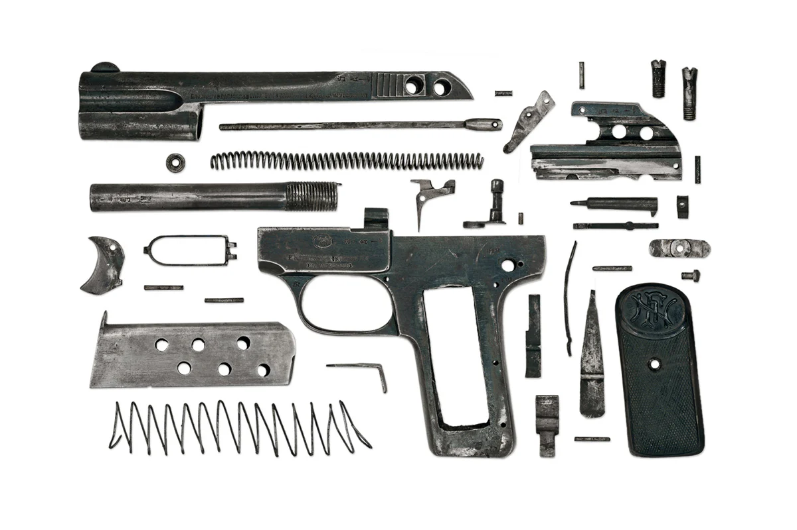
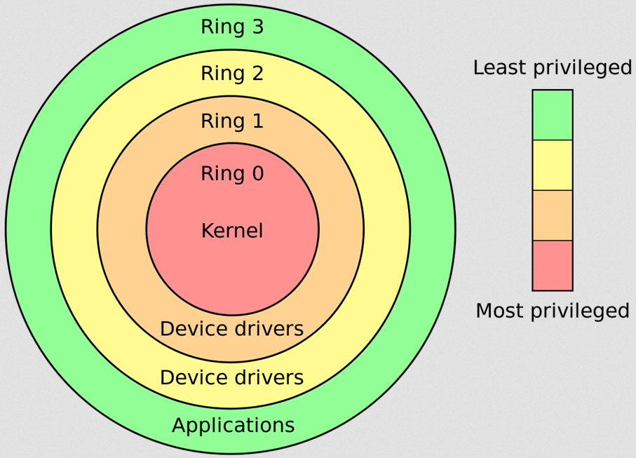
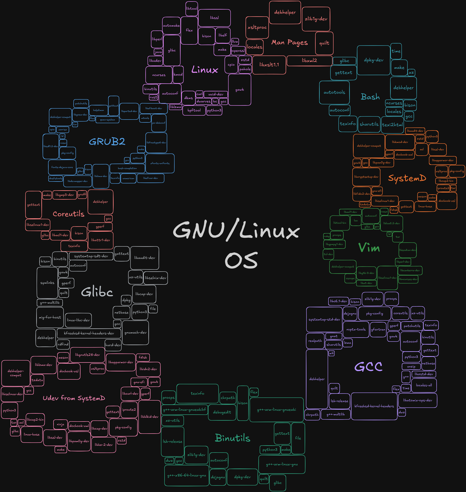

# ft_linux
Eğer bir kimse Linux işletim sisteminden bahsediyorsa aslında bu anılan şey GNU/Linux'tur. GNU/Linux bir işletim sistemidir. Linux ise onun çekirdeğidir. GNU kısmı isimlendirmesi bu işletim sisteminin GNU araçları ile donatılarak oluşturulmuş olmasıdır. Bu iki şey bir araya geldiğinde temel bir işletim sistemi ihtiva olmuş oluyor. Ancak Linux çekirdeği yalnızca işletim sistemi çekirdeği olmak üzere tasarlanmış bir tür-spesifik bir şey değildir (hikaye öyle başlamış olsada). Linux çekirdeği genel amaçlı bir çekirdektir ve herhangi bir alanda kullanılabilir bir yapıdadır/tasarımdadır. Kendisini diğer işletim sistemi çekirdeklerinden ayıran önemli niteliklerinden biri budur.

Bu not bir hayli uzun olacaktır. Bunun sebebi konunun inanılmaz ölçüde hem **soyutlama** içermesi hem **deterministik** yapı da olması hem de **bağımlılığın** artık cılkının çıkarılmasındandır. Aslında bu üç faktörün her biri birbirinin sebebidir. Konunun **deterministik** yapı da olmasının sebebi her bir öğenin başka bir öğeye bağımlı ve nedeni olmasıdır. Öğelerin birbilerine bağımlı olmasının sebebi ve gereği **bağımlılıklar** bütününün düzenli (deterministik) çalışan bir yapı ihtiva etmesidir. Ve bağımlılıklardan meydana gelen bu yapı beraberinde soyutlamayı da içerir. Çünkü yeni bir öğe meydana gelmiştir ve bu öğe evvelinde düzenli gözüken bağımlılık karmaşasını **soyutlayarak** bütünün kendisini oluşturur. Örneğin konuyla alakalı herhangi bir soru soralım; "Neden sistem bileşenleri (araçlar (bash, cp, mv) ve kütüphaneler (glibc)) uygun konumlarına yüklenmelidir?" Bunun cevabını öğrenmeden bileşenlerin uygun konumlarına yerleştirilmesi gerektiği dogması sorgusuz kabullenilebilir. Ancak cevap vermek gerektiğinde uygun konumların neler olduklarının tespiti yapılabilir örneğin `/usr`, `/bin`, `/sbin`, `/lib` vb. ardından bunların ne oldukları, neden bu kategorilerin yapıldığını, tarihsel olarak bu dizinlerin nasıl evrildiği,  bu kategorilerin neden standartlaştırılmak istendiği,  içlerinde ne barındırıldığı, içlerinde nelerin barındırılması gerektiği, barındırılan içeriklerin sistem içerisinde ki davranışlarının nasıl olması gerektiği, bu davranışların neden standartlaştırılmak istendiği gibi konunun bir parçasının aslında pek çok nedene yani parçaya dayandığını ve bu yüzden de soyutlamanın bir noktadan sonra kompleks nedenleri basitleştirebilmek için gerekli bir olgu olduğunun farkına varılabilir. Aksi taktirde derine inildikçe inilir ve konu için sorulan sorudan sapılabilir. Ancak bu sapma da konuyu genişlemesine daha iyi kavrayabilmek için bir nokta da gereklidir. Bu yüzden buradan çıkarım olarak soyutlamanın öğrenmeye etkisinin hem yararlı hem de zararlı olduğu söylenebilir. Ayrıca deterministik ve bağımlılık içerikli yapıların da en büyük zaafı sistemi meydana getiren bir parçanın noksanlığında yapının tümden meydana gelememesidir. Bir yapının arzu edilen biçimde çalışması beklendiğinde ve sistemi meydana getirecek olan en ufak bir parçanın eksikliğinde bunun mümkün kılınamayacağı bilinmelidir. Bu yüzden bir parça ne kadar ufak öğelerden meydana geliyorsa o kadar hassaslaşır ve bekleneni gerçekleştirebilmesi yine o kadar hassaslaşır.

## İçindekiler
_İçindekiler Kısmı_

## İşletim Sistemi
İlk defa içerisinde işletim sistemi barındıran bir bilgisayar ile tanışan bir kimse işletim sistemini bilgisayar ile özdeşleştirebilir ve bilgisayara benzeyen bir şey gördüğünde ve çalıştırdığında beklentisi daha önce görmüş olduğu işletim sistemi olabilir. Bu normaldir çünkü işletim sistemi ardında çalıştırdığı onca şeyi öyle bir soyutlar ki neredeyse somut bir hal alarak bir kimsenin onu "bilgisayar ile özdeşleştirilebilir" zannetme potansiyelitesini açığa çıkarır. Hal böyle olduğunda artık `bilgisayar = işletim sistemi`olur. Ancak "bilgisayar makinesi" kavramı başkadır. "İşletim sistemi programı" kavramı başkadır. İşletim sistemi temelde iki parçadan meydana gelir; **kernel (linux, bsd, vb.) + userspace (bash, ls, cp, mv vb.)**. Bunlar bilgisayarların evrimleşme süreci tarihine bakılarak veya işletim sistemlerinin evrimleşme tarihine bakılarak anlaşılabilir.

### İşletim Sisteminin Doğuş Nedeni
Yüzeysel olarak eski dönemlerde ki bilgisayarların nasıl çalıştıkları hakkında bilgiye sahip bir kimsenin şuan ki dönem de bilgisayarların nasıl çalıştığı ile ilgili bilgisini kıyaslarsak o kimse için arada çok büyük bir boşluğun kaldığını görebiliriz. Bunun sebebi teknolojinin acayip hızda gelişmesi ve bir şeyin nasıl çalıştığı ile ilgili bir araştırmaya girilmesi teşebbüsüyle başka bir gelişmenin gelmesinin an meselesi olduğudur. Bu yüzden bir şeyin ilk başlangıcına yani temeline çapa atılırsa ondan sonra gelecek veya gelişecek gelişmelerin anlamlandırılmasında kolaylık sağlanmış olur. Bu yüzden geriye bakmalıyız. Bilgisayarın erken dönemlerinde (1950’ler–1970’ler civarı) ortada henüz **işletim sistemi kavramı yoktu** veya çok sınırlıydı. Tarihsel olarak bilgisayar donanımları kişisel hale gelmeye başladığı zamanlar da bilgisayarların yapabilecekleri mahiyetler sınırlıydı. Bundan mütevellit bir bilgisayarın bir şey yapması arzu edildiğinde bilgisayarın donanımına ve mimarisinin anlayacağı dilde uygun programlar yazılması gerekliydi. Yani bilgisayar birbirlerinden farklı programları çalıştırabilme potansiyeline sahipti. Ancak bunu aktüelleştirebilmesi yani mümkün hale getirelebilmesi için her farklı programın o bilgisayar donanımına ve mimarisine özgü olarak geliştirilmesi gerekiyordu. Farklı programları çalıştırabilme potansiyeli o bilgisayarın aynı anda birden fazla programı çalıştırabilme mahiyeti olarak algılanmasın. Yalnızca tek bir görevi yerine getirebiliyor yani aynı anda sadece tek bir program çalıştırabiliyor. İçerisine yüklendiği şeye bağlı olarak form kazandırılabilme potansiyeline sahip bir makineden söz edilmek isteniyor (ideal bir Turing Machine). Bu bilgisayara bir şey "yüklemek" demek o bilgisayara özgü çalışabilecek bir disk veya kartın içerisine derlenerek kaydedilmiş bir programın yine o bilgisayarın belleğine (RAM) bir şey yazmak ve işlemcisinin (CPU) de onu oradan okuyup yorumlaması yani çalıştırması demek oluyor. **Floppy disk** (ve daha da öncesinde delikli kartlar, manyetik bantlar vb.) bir bilgisayara takılıp çalışmasının adımlarını ele alırsak;

1. Sen programını yazıp bir assembler ile derliyorsun,
2. Çıktıyı (binary output) diske (ya da karta) yazıyorsun,
3. Bilgisayara takıyorsun,
4. Makine açıldığında BIOS (veya o zamanki firmware) disketten **programın ilk birkaç bytet'ını belleğe** yüklüyor,
5. CPU o byte'lardan itibaren çalışmaya başlıyor.

İlk dönemlerde floppy diskler (örneğin 1980’ler PC dönemi):
- BIOS, disketin **boot sektörünü (ilk 512 bayt)** okur ve çalıştırırdı.
- Bu kod (bootloader), disketin devamındaki alanlardan işletim sistemini yüklerdi.
- Örneğin:
    - MS-DOS → disketten yüklenir,
    - Commodore, Amiga, Atari gibi makinelerde her oyun kendi mini-OS’ini içerirdi.
Yani floppy disketler hem:
- _bare-metal program taşımak için_  
    hem de
- _işletim sistemini başlatmak için_  
    kullanılıyordu.

| Dönem                      | Ne olurdu                                                                | Floppy’nin rolü                              |
| -------------------------- | ------------------------------------------------------------------------ | ------------------------------------------   |
| 🕹️ İlk dönem (bare-metal)  | Tek bir program RAM’e yüklenir ve çalışır                                | Programı taşır ve başlatır                   |
| 💾 MS-DOS dönemi           | Basit bir işletim sistemi disketten yüklenir, sonra program çalıştırılır | OS’yi ve programı yükler                     |
| 💻 Modern dönem            | BIOS → Bootloader → Kernel → User-space                                  | Artık çok katmanlı, genellikle HDD/SSD’den   |

Bu açıdan bakıldığında bilgisayar resmen **bare-metal** düzeyinde program çalıştıran bir makineydi. Program ekrana bir şey basacaksa kendi ekran sürücülerini yazmalı, diske bir şey kaydecek ise diskin sürücülerini yazmalı yani bilgisayarın donanımıyla ilgili bir şey gerçekleştirilecekse programın bunları da bilmesi ve yapması gerekliydi. Sanki her programın geliştirilmesinde bir de yanında mini bir işletim sistemi geliştiriliyor gibiydi programın çalışması için çünkü donanım kaynaklarını kullanıyor ve donanımla ileteşime geçiyordu. Bu sebeplerle bare-metal modelin bazı ciddi eksiklikleri vardı:

| Sorun                       | Açıklama                                                               |
| ---------------------------| ----------------------------------------------------------------------- |
| **1️⃣ Tek program sınırı**  | Her defasında yalnızca _bir program_ çalışabiliyor.                     |
| **2️⃣ Zaman kaybı**         | Program bitince yeni programı yüklemek çok uzun sürüyor.                |
| **3️⃣ Donanım karmaşası**   | Her program kendi sürücülerini yazmak zorunda (disk, ekran, klavye...). |
| **4️⃣ Kaynak yönetimi yok** | Bellek paylaşımı, süreç zamanlaması, hata izolasyonu yok.               |

Bu yüzden şöyle düşünüldü:

> “Bu işleri sürekli baştan yapmayalım.  
> Donanımı yöneten bir _ara yazılım_ olsun, programlar onun üzerinde koşsun.”

İşte **işletim sistemi fikri** tam buradan doğdu.

Bu **ara yazılım** denilen şey aslında bir nevi bir **programdır.** Programları yöneten program. Bu program diğer programların kendisinin üstünde koşmasına olanak tanır, ihtiyaçlarını giderir vb.

- BIOS (veya UEFI) bir önyükleyici aracılığıyla (bootloader) çekirdeği belleğe yükler,
- CPU o kodu çalıştırmaya başlar,
- O kod (kernel) belleği, CPU’yu, diskleri, aygıtları hazırlar,
- Ve sonunda “kullanıcı programlarının” koşabileceği ortamı oluşturur.

```go
+-------------------------+
| Kullanıcı programları   |  ← (Chrome, Steam, Dosya Yöneticisi)
+-------------------------+
| İşletim sistemi (kernel)|
+-------------------------+
| Donanım (CPU, RAM, Disk)|
+-------------------------+
```
Burada işletim sistemi (teknik anlamda kernel):
- Donanımı doğrudan kullanan tek programdır.
- Kullanıcı programlarına “soyutlama” sağlar:
    - Dosya sistemleri,
    - Bellek yönetimi,
    - G/Ç (I/O),
    - Süreç yönetimi,
    - Ağ iletişimi,
    - Zamanlayıcı vb.

Yani OS aslında bir **aracı** veya **orkestra şefi** gibidir.

İşletim sistemi genelde iki katmandan oluşur:

1. **Kernel (çekirdek):**  
    Donanımla doğrudan konuşan “yönetici” program.
2. **User space (kullanıcı alanı):**  
    Shell, GUI, servisler, uygulamalar, vs.

Kernel “altyapıyı sağlar”, diğer programlar o altyapı üstünde koşar. Diğer tüm programların, donanımın detaylarını bilmeden düzgün çalışabilmesini sağlar.

#### Paralel Olarak İşletim Sistemlerinin Evrimsel Süreci
Aslında tam olarak periyodik yani düzenli bir evrim denilemez çünkü erken dönem bilgisayar donanımları son kullanıcı yani ev kullanıcısı için pahalıydı. Bu yüzden bilgisayarlar daha çok akademik, laboratuvar veya kurumsal alanlarda kullanılıyordu. Kişisel bilgisayarlar temin edilinebiliyordu ancak temin edilmiş bilgisayarın kapasitesi ve mahiyeti de ortadaydı bu yüzden değişim her alanda gerçekleşti ancak bilgisayarın kapasitesine paralel olarak;
##### Son Kullanıcıya Yönelik
1970'lerin sonuna doğru kişisel bilgisayarlar ortaya çıkmaya başladı. Commodore PET (1977), Apple II (1977), Commodore 64 (1982) gibi makineler. Bunlar çok daha basit sistemlerdi ve gerçek bir işletim sistemine sahip değillerdi. Apple II açtığınızda bellekte zaten bir BASIC yorumlayıcısı vardı, ROM'da saklanıyordu. Siz de ona komutlar veriyordunuz. Bir disket takıp bir program yüklemek isterseniz, o program belleğe yükleniyor ve tüm makineyi kontrol ediyordu. Commodore 64 de benzerdi. Açılışta Commodore BASIC görüyordunuz. Oyun kaseti takıyordunuz, o oyun makinenin her şeyini kontrol ediyordu. Bu makinelerde "multitasking" diye bir şey yoktu, aynı anda sadece bir şey çalışabiliyordu. Aslında ilk ciddi kişisel bilgisayar işletim sistemi CP/M idi (Control Program for Microcomputers). Gary Kildall tarafından 1974'te geliştirildi. CP/M, dosya yönetimi sağlıyordu, farklı programları yükleyip çalıştırabiliyordunuz. Tek kullanıcılı, tek görevli bir sistemdi ama en azından programlar standart bir şekilde dosya sistemine erişebiliyordu. CP/M, Intel 8080 ve Zilog Z80 gibi 8-bit işlemcilerde çalışıyordu ve dönemin iş bilgisayarlarında oldukça popülerdi.

> [!NOTE]
>
> **Konudan Sapmaya Çalışan Bilgi** 
>
> Bu makinelere BASIC konulmasının sebebi insanlara programlamayı sevdirmek ve öğretmekti. BASIC dilinin basit yapısı buna çok müsaitti ve bu yüzden bilgisayar ilk açıldığında bir BASIC yorumlayıcısı ile karşılaşılıyordu.

##### Kurumsal
1981'de IBM, IBM Personal Computer'ı (IBM PC) piyasaya sürdü. Bu makine için bir işletim sistemine ihtiyaç vardı. IBM başlangıçta Gary Kildall'ın CP/M sistemini kullanmayı düşündü ama anlaşma gerçekleşmedi. Bunun üzerine genç bir şirket olan Microsoft'a gittiler. Microsoft'un Bill Gates'i, Tim Paterson'un yazdığı QDOS (Quick and Dirty Operating System) isimli bir sistemi satın aldı. QDOS aslında CP/M'den ilham almıştı, hatta bazı yönlerden onu taklit ediyordu. Microsoft bunu MS-DOS (Microsoft Disk Operating System) olarak IBM'e sattı. IBM kendi versiyonunu PC-DOS olarak piyasaya sürdü. MS-DOS da CP/M gibi tek kullanıcılı, tek görevliydi. Ama çok önemli bir özelliği vardı, IBM, PC standardına bağlıydı ve IBM PC klonları piyasaya çıktıkça MS-DOS her yerde yaygınlaştı. DOS, 1980'lerde ve 1990'ların başında kişisel bilgisayarların baskın işletim sistemi oldu. DOS'ta bir komut satırı vardı. Programları çalıştırırdınız, dosyaları kopyalardınız. Ama yine de aynı anda tek bir program çalışabiliyordu. Bir oyun başlattığınızda, o oyun sistemin tüm kaynaklarını kontrol ederdi. DOS bir işletim sistemiydi ama çok minimal bir işletim sistemiydi. Bellek koruması yoktu, process izolasyonu yoktu, çoklu görev yoktu. MS-DOS daha çok kurumsal işletmeler ve ciddi yazılım geliştirenler tarafından kullanıldı.

##### Akademik
Bu alanda ki bilgisayar donanımları daha güçlü olduğundan buna dair geliştirilecek sistem de daha kapsamlı ve kompleks oldu. Bell Labs, MIT ve GE 1960’larda **Multics** projesini başlattı. Multics'in ardından ondan ilham alan **Unix** ortaya çıktı. Aslında her şey Unix ile başladı. 1969 yılında Bell Labs'ta Ken Thompson ve Dennis Ritchie, Unix işletim sistemini geliştirmeye başladılar. Bu, büyük bilgisayarlar (mainframe ve minicomputer) için tasarlanmış, çok kullanıcılı, çok görevli gerçek bir işletim sistemiydi. Unix o zamanlar devrim niteliğindeydi çünkü taşınabilir bir işletim sistemi konseptini getirdi. C dilinde yazılmıştı ve farklı donanımlara uyarlanabiliyordu. Unix'in temel felsefesi vardı. Her şey bir dosyadır, küçük programlar yazın ve bunları birleştirin, metin tabanlı arayüzler kullanın. Bu fikirler o kadar güçlüydü ki bugün bile Linux ve BSD sistemlerinde yaşamaya devam ediyor. Ama Unix pahalı, kurumsal sistemlerde çalışan bir şeydi. Üniversiteler ve büyük şirketler kullanabiliyordu. Ancak yine de bu sırada Unix büyük sistemlerde gelişmeye devam ediyordu. 1977'de Berkeley Üniversitesi Unix'in kendi versiyonunu geliştirmeye başladı ve buna BSD (Berkeley Software Distribution) adını verdi. BSD zamanla Unix'ten ayrı bir dal haline geldi ve ağ özellikleri, sanal bellek gibi önemli yenilikler getirdi. BSD akademik dünyada ve araştırma kurumlarında çok popülerdi. Ticari Unix versiyonları da vardı. AT&T'nin kendi Unix'i, Sun Microsystems'in SunOS'u, HP-UX, AIX... Bunlar güçlü, çok kullanıcılı, çok görevli sistemlerdi. Ama pahalıydılar ve özel donanım gerektiriyorlardı.

#### Kronolojik Özet
1969-1970 yıllarında Unix doğdu, büyük bilgisayarlarda çalışan çok kullanıcılı sistem. 1974'te CP/M geldi, ilk kişisel bilgisayar işletim sistemi, basit ama dosya yönetimi vardı. 1977'de Apple II ve Commodore PET çıktı, bunlarda işletim sistemi yoktu, BASIC vardı. Aynı zamanda BSD de Berkeley'de başladı, Unix'in akademik versiyonu. 1981'de IBM PC ve MS-DOS geldi, CP/M'den etkilenmiş basit bir sistem. 1982'de Commodore 64 çıktı, çok popüler oldu ama yine işletim sistemi yoktu. 1980'ler boyunca MS-DOS kişisel bilgisayarlarda dominant oldu, Unix büyük sistemlerde devam etti.

#### Paralel Değişim ve Birleşim
Bu sistemler aslında paralel şekilde geliştiler. Unix dünyası, büyük bilgisayarlar, üniversiteler, araştırma merkezleriydi. Güçlü, karmaşık, pahalı sistemler. Commodore ve Apple dünyası ise ev kullanıcıları, oyun oynayan çocuklar, hobi programcılarıydı. Basit, ucuz makineler. MS-DOS dünyası ise ofisler, işletmeler, ciddi yazılımlar geliştiren insanlardı.
Unix'in özellikleri (çoklu görev, kullanıcı izinleri, dosya koruması, sanal bellek) o zamanlarda lüks sayılıyordu ve ancak güçlü donanımlarda mümkündü. Commodore 64'ün sadece 64KB belleği vardı. Böyle bir sistemde Unix çalıştırmak imkansızdı. 1990'larda iki önemli şey oldu. Birincisi, donanım güçlendi ve ucuzladı. 386 ve 486 işlemciler geldi, megabaytlarca bellek normal hale geldi. Artık kişisel bilgisayarlarda Unix benzeri sistemler çalıştırmak mümkündü. İkincisi, Linux doğdu. 1991'de Linus Torvalds, kişisel bilgisayarlarda çalışabilen, ücretsiz, açık kaynaklı bir Unix benzeri kernel yazdı. Bu iki dünyayı birleştirdi. Artık Unix'in gücü ev bilgisayarlarında da vardı. Aynı dönemde Microsoft da Windows NT ile gerçek bir işletim sistemi geliştirmeye başladı. Windows 95 ve sonrası, DOS üzerine kurulu bir kabuk olmaktan çıkıp gerçek işletim sistemi özelliklerine kavuştu. Bellek koruması, önleyici çoklu görev gibi Unix'in yıllardır sahip olduğu özellikler artık Windows'ta da vardı. Commodore ve Apple II gibi sistemler bir geçiş dönemiydi. Gerçek işletim sistemi yoktu ama insanlar bilgisayarla tanışıyordu. DOS bir adım öteye geçti, dosya sistemi ve program yükleyicisi vardı ama hala çok basitti. Unix ise başından beri modern bir işletim sistemiydi, sadece donanım henüz hazır değildi.

## Kernel
İşletim sistemini "işletim sistemi" yapan ve onun bileşenlerinden biri olan şeylerin başında kernel gelir. İşletim sistemi bölümünde bahsedilen bare-metal programlama sorununa ara katman sağlayan aynı zamanda soyutlayan çözüm kernel'dir. Kernel, programcıların programlarını geliştirme sürecinde her seferinde donanımsal bağlamda yapması gereken tekrarlanan işi üstüne alır ve program geliştirmenin yükünü hafifletir. Bu şekilde artık program geliştiricisi bir program geliştireceğinde donanım seviyesinde düşünmesine gerek kalmadan kernel'in sunduğu kapsam ve imkanlar dahilinde klavyeden girdi, ekrana çıktı basma vb. işlemleri daha kolay yapabilir. Kernel API'si (syscalls) bu imkanları programcıya sağlar. Ayrıca bununla sınırlı kalmayıp donanım kaynaklarını yönetme, aynı anda yalnızca tek bir programın çalıştırılması yerine çoklu görevlendirme (multi-tasking), hata yönetimi (segfault, bus error), dosya yönetimi ve sanal bellek adresleme yani bir program çöktüğünde tüm sistemi çökertmesindense ona özel olarak sağlanan izole alanda güvenli bir şekilde çökmesi ve böylelikle aynı anda çalıştığı diğer programları etkilememesi ve benzeri pek çok niteliğe sahiptir.
### Kernel'in Varlık Nedeni
Çekirdek (kernel) aslında verimlilikten (optimizasyon ve performans odaklı olarak değil) çok, **yönetim ve soyutlama** amacıyla ortaya çıktı. İlk bilgisayarlar zaten _bare-metal_ düzeyindeydi, tek bir program, doğrudan donanım üzerinde koşuyordu. Bu basitti ama inanılmaz derecede sınırlıydı. O dönemde şu fark edildi, donanımı doğrudan kontrol eden her program, aynı şeyleri **tekrar tekrar** yapmak zorunda kalıyor:

- Belleği yönetmek
- Disk sürücüsüne veri yazmak
- Ekrana çıktı vermek
- Klavyeden girdi almak
- Zamanlayıcıyı ayarlamak
- vs.

Yani her program bir “mini işletim sistemi” gibi davranmak zorunda kalıyordu. Bu inanılmaz karmaşık ve hataya açık bir durumdu.

O yüzden dendi ki:

> “Donanımın karmaşasını yöneten **tek bir katman** olsun,  
> diğer programlar onun üzerinden rahatça çalışsın.”

İşte o katman **kernel** oldu. Kernel’in varlık nedeni: soyutlama + çoklu görev + güvenlik;

Bir işletim sistemi _bare-metal_ üzerinde yazılsaydı (kernel olmadan), şunlar imkânsız veya çok zor olurdu:

| Sorun                                                               | Kernel’in Çözümü                                                |
| ------------------------------------------------------------------- | --------------------------------------------------------------- |
| **Donanım farkları:** Her CPU, ekran kartı, disk sürücüsü farklıdır | Kernel, donanım sürücülerini yönetir, programlara tek API sunar |
| **Bellek yönetimi:** Programlar birbirinin belleğini ezebilir       | Kernel, sanal bellek ve koruma sağlar                           |
| **Çoklu görev:** Birden fazla program aynı anda çalışamaz           | Kernel, zamanlayıcı (scheduler) ile süreçleri yönetir           |
| **Kaynak paylaşımı:** Disk, ağ, bellek erişimleri çakışır           | Kernel, erişimleri senkronize eder                              |
| **Güvenlik:** Her program donanımı doğrudan kontrol eder            | Kernel, erişim izinlerini yönetir                               |

Yani kernel sadece “verimli” değil, **mümkün kılan** bir katmandır. Onsuz karmaşık sistemler neredeyse sürdürülemez hale gelir. Ancak kernel'siz bir işletim sistemi olabilir mi? Kısmen olabilir ancak bu soru "işletim sistemi = kernel" olarak düşünülmemesi için olumlu olarak yanıtlanmalı. Aksi taktirde bu "bilgisayar = işletim sistemi = kernel" durumuna dönüşebilir. Sistemin karmaşıklığının yoğunluğuna bağlı olarak, bu karmaşıklık öğelerinin her birini idare edecek bir kontrol mekanizmasının ihtiva olması mantıken kaçınılmaz olduğundan bazı istisna sistemler harici (gömülü sistemler vb.) o sistem için kernel gerekli olur. Farklı sistemleri düşünelim; örneğin oyun konsollarını. Aynı şekilde oyun konsollarının da belirli kapasite de donanımları vardır ve onlarda bir çeşit bilgisayardır ve oyunları çalıştırmak, diske veri yazmak veya okumak ve oyunları ekrana yansıtmak vb. pek çok şeyi yapan yani donanımla iletişime pek çok kez geçen bir yapı vardır. Bu yüzden oyun konsollarında da işletim sistemi vardır ve birden fazla farklı oyun konsolu olduğunu düşünürsek bu makineler için de mimari (x86_64, MIPS, arm, s390X, cris, mipsel vb.) farklılıklarından ötürü (eğer mimari farklılıkları varsa) özel bir işletim sistemi tasarlanmalıdır ve yine aynı şekilde işletim sisteminin "işletim sistemi" olabilmesinin bir parçası da kernel'den geçtiğinden kernel ihtiyacı da beraberinde ortaya çıkar ve doğal olarak geliştirilir. Yani kernel kelimesi sadece isim değiştirir, ortadan kalkmaz. Bunu şöyle düşün:

> “Kernel = donanım yöneticisi”  

Yani;

> Kernel kavramı yapısal bir gereklilik ihtiyacı, isimsel bir tercih değil.

Kernel’i “ortak temel” olarak düşünebiliriz. Düşün ki bir bilgisayarda yüzlerce farklı program çalışıyor:

- Tarayıcı,
- Müzik çalar,
- Terminal,
- Dosya yöneticisi,
- vs.

Hepsi diske, ekrana, belleğe erişmek istiyor. Eğer kernel olmasaydı, her biri donanımla doğrudan konuşmak zorunda kalacaktı. Bu;

- **Çakışmalara** yol açardı (aynı anda diske yazma),
- **Güvenlik açıklarına** yol açardı (biri diğerinin belleğini ezebilir),
- **Taşınabilirliği yok ederdi** (her donanım için ayrı kod gerekirdi).

Kernel bunların hepsini ortadan kaldırarak:

> “Ben donanımı yönetirim, siz sadece benimle konuşun.”  
> der.

Yani kernel bir **ortak arayüzdür** (interface).

1970'lerin başlarında, hatta 1980'lerde, birçok kişisel bilgisayar işletim sistemi olmadan çalışıyordu. Commodore 64, Apple II, erken dönem IBM PC'ler... Bu makineleri açtığınızda direkt olarak BASIC yorumlayıcısına düşerdiniz. Ya da bir oyun kaseti takardınız ve o oyun makinenin tüm kaynaklarını doğrudan kontrol ederdi. Bu sistemlerde bir program yazdığınızda, donanıma doğrudan erişirdiniz. Ekrana bir şey yazmak için video belleğinin tam adresini bilmeniz gerekirdi. Disk okumak için disk kontrolcüsünün register'larına direkt yazmak zorundaydınız. Her donanım parçası için tam olarak hangi bellek adresine, hangi I/O portuna yazacağınızı bilmeliydiniz.

```asm
; Örnek: Commodore 64'te ekrana karakter yazmak
LDA #$41        ; 'A' karakteri
STA $0400       ; Ekranın ilk karakteri bu adreste
LDA #$01        ; Beyaz renk
STA $D800       ; Renk belleği bu adreste
```

Bu yaklaşımın sorunları vardı. Her program donanımın her detayını bilmeliydi. Farklı mimarili bir bilgisayara geçtiğinizde programınızı o mimariye özgü yazmanız gerekirdi. İki program aynı anda çalışamazlardı. Bir program çökerse tüm sistem çökerdi. İşte kernel bu sorunları çözmek için ortaya çıktı. Kernel, donanım ile programlar arasına girerek iki kritik hizmet sunar. 
**Birincisi**, soyutlama yapar. Program artık "disk kontrolcüsünün 0x1F0 portuna yaz" demek yerine, kernel'e "dosya aç" der. kernel bu isteği alır, donanımla ilgilenir, sonucu programa geri döndürür. Programcı ve program donanımın detaylarını bilmek zorunda değildir.
**İkincisi**, kaynakları yönetir ve paylaştırır. Birden fazla program aynı anda çalışabilir çünkü kernel her birine sırayla CPU zamanı verir. Her program kendi bellek alanına sahiptir, birbirlerinin belleğine karışamazlar. Dosya sistemini kernel yönetir, böylece iki program aynı dosyayı aynı anda silmeye çalışmaz.

İşletim sistemi bağlamında düşünüldüğünde kernel tanımlaması hemen hemen bu şekilde olabilir ve bu "işletim sistemi kernel'i" davranışı olur. Halbu ki bazı kernel'ler sadece işletim sistemine özgü bir tasarım değildir ancak bazıları içinse özgü bir tasarımdır. 

### Kernel ve İşletim Sistemleri Yapı Tipleri

#### Bütünleşik Sistem ve Modüler Sistem
Bütünleşik sistemler (FreeBSD, OpenBSD, NetBSD) bütünleşik bir yaklaşım benimser. BSD'de kernel ve temel sistem araçları (shell, dosya yönetimi araçları, ağ araçları) tek bir proje olarak geliştirilir. Hepsi aynı kaynak kod deposundadır, aynı ekip tarafından yönetilir, birlikte test edilir ve birlikte yayınlanır. Bir BSD versiyonu yüklediğinizde, tam ve tutarlı bir sistem elde edersiniz. Kernel, ls, cat, sh, gcc... hepsi uyumlu olacak şekilde birlikte gelir.

 Örneğin (GNU/Linux) modüler bir yaklaşımdır. Örneğin GNU/Linux'un Linux'u aslında sadece kernel'dir. Linus Torvalds ve topluluk geliştiricileri sadece kernel'i geliştirir. GNU/Linux üzerinde çalışan diğer her şey ayrı projelerdir. GNU araçları (bash, coreutils), systemd veya başka init sistemleri, masaüstü ortamları, paket yöneticileri... Bunların hepsi bağımsız projelerdir. Linux dağıtımları (Ubuntu, Fedora, Arch) bu parçaları bir araya getirerek tam bir işletim sistemi oluşturur. Yani örneğin bir işletim sistemi meydana getirilmek isteniyorsa işletim sistemini meydana getiren her bir parça (kernel, bash, zsh, fish, glibc, systemd, systemv, udev vb.) ayrı projeler olduğunundan her bir parça bir araya getirilip işletim sistemi oluşturulabilir. Ayrıca bu parçaları muadilleriyle de değiştirebilirsiniz. Bu da zaten Linux dağıtım kavramına tekabül ediyor her bir dağıtımın kendi meydana getirdiği sistem Linux distro'su oluyor. (Debian, Fedora, Arch vb.) hepsi GNU/Linux sistemi çünkü hepsinde Linux kernel'i kullanılıyor ancak geri kalan işletim sistemi parçalarında/araçlarında farklılıklar gösterebilirler. 

Bu farkın pratik sonuçları vardır. BSD'de tutarlılık daha yüksektir çünkü her şey birlikte tasarlanmıştır. Dokümantasyon daha homojendir, davranışlar daha öngörülebilirdir. Ama esneklik daha azdır, çünkü bileşenler sıkı şekilde bağlıdır. Linux'ta ise inanılmaz bir esneklik vardır. İstediğiniz init sistemini, istediğiniz shell'i, istediğiniz araçları kullanabilirsiniz. Binlerce farklı Linux kombinasyonu mümkündür. Raspberry Pi'den süperbilgisayarlara, Android telefonlardan sunuculara kadar her yerde farklı şekillerde kullanılır. Ama bu esneklik bazen karmaşıklığa yol açar, çünkü bileşenler arasında uyumsuzluklar olabilir.

FreeBSD kaynak kodunu indirdiğinizde tek bir ağaç yapısı görürsünüz. İçeriğinde `sys` dizini vardır, çekirdek burada bulunur. `bin` dizini temel komutları içerir, `sbin` sistem yönetim araçlarını içerir, `usr/bin` kullanıcı araçlarını içerir. Hepsi aynı depoda, aynı sürüm kontrolünde, birlikte derlenir. FreeBSD ekibi yeni bir özellik eklediğinde, hem çekirdeği hem de gerekli araçları birlikte günceller. Dolayısıyla sistem her zaman tutarlıdır. Şimdi Debian Linux'a bakalım. Debian bir bütünleşik sistem gibi görünse de, aslında binlerce bağımsız projenin bir araya getirilmesidir. Debian'ın kendi kaynak kod deposu yoktur. Linux çekirdeği Linus Torvalds ve topluluk geliştiricileri tarafından geliştirilir, kernel.org'da yayınlanır. GNU araçları (bash, coreutils) GNU projesi tarafından geliştirilir, gnu.org'da yayınlanır. systemd ayrı bir projedir, kendi GitHub deposunda geliştirilir. GNOME masaüstü ayrı bir projedir, yine başka bir ekip geliştirir. Debian ekibi ne yapar? Tüm bu bağımsız projeleri alır, Debian'ın paket formatına çevirir, birbirleriyle uyumlu olacak şekilde yapılandırır ve bir araya getirir. Dolayısıyla Debian bir bütünleşik proje değil, bir entegrasyon projesidir. Debian geliştiricileri çoğunlukla upstream projelere katkıda bulunur, paket bakımı yapar, hata düzeltir, ama temel bileşenleri sıfırdan geliştirmezler. Her bir bileşen bağımsızdır. Bu yaklaşımın avantajı inanılmaz esnekliktir. İstediğiniz bileşenleri seçebilirsiniz. systemd yerine OpenRC veya systemV kullanmak ister misiniz? Yapabilirsiniz. bash yerine zsh kullanmak ister misiniz? Kolayca değiştirebilirsiniz. Her parça birbirinden ayrılabilir ve değiştirilebilir. BSD'de ise böyle bir esneklik yoktur. FreeBSD'nin init sistemi kendi init sistemidir, başka bir şey kullanamazsınız. FreeBSD'nin temel araçları BSD tarzıdır, GNU araçlarına değiştiremezsiniz. Ama bunun karşılığında çok daha tutarlı bir deneyim elde edersiniz. FreeBSD'nin dokümantasyonu tüm sistemi kapsar çünkü tüm sistem aynı ekip tarafından yazılmıştır. Bir komutun davranışı tahmin edilebilirdir çünkü sistemin geri kalanıyla birlikte tasarlanmıştır. Bir benzetme yapayım. BSD'yi Apple'ın yaklaşımına benzetebilirsiniz. Apple hem donanımı hem yazılımı kontrol eder, her şey birlikte tasarlanır, sıkı entegrasyon vardır. Donanım ve yazılım birbirine kenetlidir ve uyum içinde çalışır. Linux dağıtımlarını ise Android ekosistemine benzetebilirsiniz. Google Android'i geliştirir ama her telefon üreticisi kendi sürümünü yapar, farklı bileşenler ekler, sonuç çok çeşitli ama bazen tutarsız bir ekosistem olur.

#### İşletim Sistemi Kernel Mimari Tipleri

##### Monolitik
**Monolitik** çekirdek mimarisinde, işletim sisteminin temel fonksiyonlarının hepsi çekirdek içinde, kernel mode'da çalışır. Linux monolitik bir çekirdektir. Linux çekirdeğinin içinde sürücüler vardır, dosya sistemleri vardır, ağ protokol stack'i vardır, bellek yöneticisi vardır, process scheduler'ı vardır. Hepsi kernel space'te çalışır, hepsi aynı bellek alanını paylaşır, birbirlerinin fonksiyonlarını doğrudan çağırabilir. Tek bir büyük programdır aslında. Monolitik çekirdekte bir sürücü çalıştığında, kernel mode'dadır. Donanıma direkt erişebilir, belleğin her yerine erişebilir, CPU'nun tüm özelliklerini kullanabilir. Dosya sistemi kodu da kernel mode'dadır, network stack'i de kernel mode'dadır. Hepsi aynı adres alanında, aynı ayrıcalık seviyesinde çalışır. Bu yaklaşımın büyük avantajı performanstır. Bir fonksiyondan diğerine geçmek çok hızlıdır çünkü normal bir fonksiyon çağrısıdır, context switch gerekmez. Örneğin network stack'i bir veri paketi aldığında dosya sistemine yazmak isterse, direkt olarak dosya sistemi fonksiyonunu çağırır. Bu çok hızlıdır. Ama dezavantajları da vardır. Çekirdekte bir hata tüm sistemi çökertebilir. Bir sürücüde bug varsa ve o sürücü belleği bozarsa, çekirdek çöker, sistem durur. Ayrıca çekirdek büyüktür. Linux çekirdeğinin kaynak kodu milyonlarca satır koddur. Dosya sistemleri, sürücüler, network kodu, ses sistemi, grafik sürücüleri, her şey dahildir. Bu büyüklük karmaşıklığa yol açar ve bakımı zorlaştırır.

##### Mikrokernel
**Mikrokernel** mimarisinde ise tasarım tamamen farklıdır. Çekirdek mümkün olduğunca küçük tutulur. Sadece en temel görevleri yapar, process'ler arası iletişim, bellek yönetimi, CPU zamanlaması gibi. Diğer her şey userspace'te (kullanıcı alanı) ayrı process'ler olarak çalışır. Sürücüler userspace process'leridir, dosya sistemleri userspace process'leridir, network stack'i bile userspace process'idir (yani arkaplan servisi, daemon). Minix ve GNU Hurd gibi sistemler mikrokernel mimarisini kullanır. Örneğin Minix'te bir disk sürücüsü normal bir userspace process'idir. User mode'da çalışır, kendi izole bellek alanına sahiptir. Bir program dosya okumak istediğinde, çekirdeğe bir mesaj gönderir. Çekirdek bu mesajı dosya sistemi server'ına iletir. Dosya sistemi server'ı diske erişmek için disk sürücüsü process'ine mesaj gönderir. Disk sürücüsü diski okur, sonucu geri gönderir. Dosya sistemi veriyi alır, orijinal program'a iletir. Her adım process'ler arası mesajlaşma ile gerçekleşir. Bu yaklaşımın büyük avantajı güvenlik ve stabilite'dir. Bir sürücü çökerse sadece o sürücü yeniden başlatılır, sistem ayakta kalır. Her process izole edilmiştir, birbirlerinin belleğine karışamaz. Çekirdek çok küçük olduğu için daha az bug içerir, daha kolay doğrulanabilir. Hatta **seL4** gibi projeler çekirdeğin matematiksel olarak doğru olduğunu kanıtlamışlardır, bu monolitik çekirdeklerde imkansızdır. Ama dezavantajı performanstır. Process'ler arası mesajlaşma pahalıdır. Her mesaj bir context switch gerektirir, CPU user mode'dan kernel mode'a geçer, sonra tekrar user mode'a döner. Veriler bir process'in belleğinden diğerine kopyalanmalıdır. Tüm bunlar zaman alır. Aynı işlemi monolitik çekirdekte yapmak çok daha hızlıdır çünkü her şey aynı adres alanında olduğu için sadece pointer'lar paylaşılır.

##### Hibrit
Gerçek dünyada bu iki yaklaşımın hibrit versiyonları da kullanılır. Örneğin modern Windows ve macOS hibrit çekirdekler kullanır. Bazı kritik bileşenler çekirdek içinde performans için, bazı bileşenler userspace'te güvenlik için çalışır. Linux da modüler bir yapı kullanır, sürücüleri çalışma zamanında yükleyebilir veya çıkarabilirsiniz, ama yüklendiğinde kernel space'te çalışırlar. Bu bir tür esneklik sağlar ama hala monolitik mimaridedir.

##### Hangisi Daha iyi?
Bu sorunun cevabı yoktur çünkü her yaklaşımın avantajları ve dezavantajları vardır. Monolitik çekirdekler daha performanslıdır, bu yüzden masaüstü ve sunucu sistemlerinde tercih edilir. Linux, Windows, macOS hepsi monolitik veya hibrit çekirdekler kullanır. Microkernel'ler daha güvenlidir, bu yüzden kritik sistemlerde tercih edilir. Uçak kontrol sistemleri, medikal cihazlar, askeri uygulamalar microkernel kullanabilir. Bütünleşik projeler daha tutarlıdır ve kullanımı daha öngörülebilirdir. BSD sistemleri bu yüzden sunucularda popülerdir, Netflix ve WhatsApp gibi büyük şirketler FreeBSD kullanır. Modüler projeler daha esnektir ve daha hızlı yenilik yapabilir. Linux ekosistemi bu yüzden çok çeşitlidir, Android'den süperbilgisayarlara kadar her yerde kullanılır. Siz bir sistem tasarlıyorsanız, kullanım senaryonuza göre karar vermelisiniz. Maksimum performans mı istiyorsunuz? Monolitik çekirdek seçin. Maksimum güvenlik mi istiyorsunuz? Microkernel seçin. Tutarlı bir sistem mi istiyorsunuz? BSD gibi bütünleşik bir proje seçin. Esneklik mi istiyorsunuz? Linux gibi modüler bir ekosistem seçin. Her yaklaşım farklı ihtiyaçlar için optimize edilmiştir.
#### Farklı İşletim Sistemi Çekirdekleri

- **Illumos** çekirdeği vardır, bu OpenSolaris'in devamıdır. Oracle Solaris kapalı hale geldiğinde, topluluk kodu fork'layıp Illumos'u oluşturdu. Bu çekirdek de Unix tarzı bir çekirdektir ve benzer boot mekanizmaları kullanır. ZFS dosya sisteminin asıl evi burası olduğu için çok ilginç özelliklere sahiptir.
- **Minix** çekirdeği vardır, Andrew Tanenbaum tarafından eğitim amaçlı yazılmıştır. Minix bir microkernel'dir ve çok temiz bir tasarıma sahiptir. Minix 3'te neredeyse her şey ayrı bir process olarak çalışır, hatta sürücüler bile. Minix eğitim amaçlı olduğu için kaynak kodu okumak ve değiştirmek çok kolaydır.
- **Zircon** çekirdeği, Google'ın Fuchsia işletim sistemi için geliştirdiği yeni nesil bir microkernel'dir. Bu çekirdek Unix mirasından tamamen kopmaya çalışır ve her şeyi yeniden tasarlar. Zircon'da dosya sistemi kavramı bile farklıdır, her şey "capability" tabanlıdır.
- **seL4** çekirdeği, matematiksel olarak doğrulanmış ilk microkernel'dir. Avustralya'da akademik bir proje olarak başladı. Kritik sistemlerde kullanılır çünkü güvenliği kanıtlanmıştır. Bu çekirdek de çok minimal bir çekirdektir ve userspace'te çalışan process'lere bağımlıdır.
- **Redox OS** çekirdeği, tamamen Rust dilinde yazılmış, Unix benzeri ama modern bir çekirdektir. Microkernel prensiplerine yakındır. Rust ile yazılmış olduğu için bellek güvenliği garantilidir.

### Linux
**ft_linux** projesinde bir Linux kernel derlenmesi istendiğinden burada onun ile alakalı açıklamalar yapılacaktır. Linux kernel, genel amaçlı ve bağımsız bir çekirdektir. Onu genel amaçlı çekirdek olabilme niteliği çok çeşitli donanım ve mimarilerin tercümanlığını yapabilecek kapasiteye mazhar olmasından kaynaklıdır. Yani arm, x86 vb. pek çok makinenin donanımı ve mimarisinin üstünde çalışabilir. Bu yüzden yalnızca işletim sistemi bazında değil aynı zaman da farklı alanlarda farklı jeneriklerle Linux çekirdeği kullanılabilir. Bu da onu genel amaçlı ve jenerik bir sistem çekirdeği yapar. Bağımsız olmasının nedeni bir tür-spesifik amaç için geliştirilmiş olmamasıdır. Yani salt belirli bir şeyi çalıştıracak bir şey üzerine yönelik değildir. Pek çok şey üzerine yönelik olduğundan bağımsızdır, bağımsız olarak geliştirilir ve entegre edilir.

Linux çekirdeği bir soyutlama katmanıdır. Altta donanım vardır (CPU, RAM, diskler, ağ kartları). Ortada kernel vardır, donanımı yönetir ve standart bir arayüz sunar. Üstte userspace vardır, init programınız, shell'iniz, uygulamalarınız. Kernel olmadan programlar donanıma direkt erişmek zorunda kalırdı, bu hem tehlikeli hem de pratik olmazdı. Bu yüzden Linux teknik olarak bir işletim sistemi değil, bir kernel'dir. Tam işletim sistemi, kernel artı userspace araçlarının toplamıdır. Bu yüzden bazı insanlar "GNU/Linux" terimini kullanır, çünkü GNU araçları olmadan Linux kernel'i tek başına işe yaramaz.

BSD sistemlerinde ise bu ayrım daha bulanıktır çünkü kernel ve sistem birlikte gelir. "FreeBSD işletim sistemi" dediğinizde, hem kernel'i hem de ona eşlik eden tüm sistem araçlarını kastediyorsunuz. BSD sistemleri bu katmanları birlikte uyum içinde çalışacak şekilde tasarlar ve sunar. Linux ise sadece ortadaki kernel katmanını sağlar, üstteki katmanı dağıtımlar ve kullanıcılar oluşturur. İkisi de geçerli yaklaşımlardır, farklı tasarım yaklaşımları ve farklı kullanım senaryoları için optimize edilmişlerdir.

#### Linux Kernel'in Farklı Alan ve Amaçlarda Kullanımları
Burada Linux'un genel amaçlı kullanım alanlarını ve jenerikliği serimlenecektir;
##### İşletim Sistemleri
Klasik olarak bu amaç için kullanılabilir;

| Örnek                                         | Açıklama                                                                                              |
| --------------------------------------------- | ----------------------------------------------------------------------------------------------------- |
| **Debian / Ubuntu / Fedora / Arch / Android** | Bunlar Linux kernel + kullanıcı alanı (user-space) araçları ile oluşturulmuş _işletim sistemleridir._ |
| **Alpine Linux (container bazlı)**            | Minimal user-space, ama yine Linux çekirdeği üzerinde.                                                |

Ama bunların dışında da Linux çekirdeğini kullanan _işletim sistemi olmayan_ birçok sistem var.

##### Gömülü sistemler (Embedded Systems)
Bu sistemler genelde tek bir iş yapar yani aslında “işletim sistemi” sayılmazlar, ama bir Linux kernel barındırabilirler;

> [!NOTE]
>
> **Konudan Sapmaya Çalışan Bilgi** 
>
> Gömülü Sistemler bağlamında eski Commodore PC'ler ve Apple II gibi makineler de gömülü sistem olarak düşünülebilir. Bu makineler de tek bir iş yapıyor ve doğrudan donanımı programlayarak (bare-metal programlama) programlar üretiliyordu. Yani bir çeşit onlarda gömülü sistemdir denilebilir.

- **Wi-Fi router’lar:** OpenWrt, DD-WRT, AsusWRT Linux kernel üzerinde koşar ama klasik bir “OS” değildir. 
	- Sadece ağ yönlendirme, DHCP, firewall gibi görevler yapar.
- **Akıllı TV’ler:** LG’nin webOS’u, Samsung’un Tizen’i — her ikisi de Linux kernel üzerinde.
- **Otomotiv sistemleri:**
    - Android Automotive
    - Automotive Grade Linux (AGL),
    - Tesla’nın araç yazılımı (özelleştirilmiş Linux kernel).
- **Akıllı saatler:**
    - WearOS (Android tabanlı)
    - Garmin veya bazı Samsung saatler.
- **Endüstriyel cihazlar:**  
    - PLC’ler, robot kollar, ağ switch’leri genellikle özel, tek amaçlı Linux çekirdekleri.

Bu cihazlarda **kullanıcı alanı (user space)** genellikle çok minimaldir bazen sadece tek bir program. Yani Linux kernel, burada _"tek bir uygulama platformu"_ sağlar; Sadece kendi içindeki birkaç süreç var, kullanıcı etkileşimi yok. Ama donanım, bellek, ağ vs. yönetimini linux kernel yapar.

##### Hypervisor’lar (Sanal Makine)
Linux kernel bazen bir **işletim sistemi yerine sanallaştırma katmanı** olarak çalışır.

- **KVM (Kernel-based Virtual Machine):**
    - Linux kernel’in içine entegre edilmiş bir hypervisor’dur. Yani Linux burada “diğer işletim sistemlerini çalıştıran işletim sistemi” gibidir.
- **QEMU + KVM kombinasyonu:**
    - KVM (kernel kısmı) donanımı sanallaştırır, QEMU (user-space kısmı) arabirim sağlar. Linux burada OS değil, “hipervizör” işlevi görür.
- **Xen dom0:**
    - Xen sanallaştırmasında, Linux çekirdeği “ana kontrol domain” (dom0) olarak çalışır.

Burada Linux, kullanıcı programı çalıştırmaz **diğer işletim sistemlerini** (misafir OS’leri) çalıştırır.

##### Konteyner Altyapıları
Burada Linux kernel, **konteynerlerin izolasyon mekanizmasını** (OS üzerinde ama üst katman olarak) sağlar:

- `cgroups`, `namespaces`, `seccomp`, `capabilities` → bunların hepsi kernel özellikleri.

Ama ilginç olan şu:

> Container ortamında, genellikle “gerçek bir işletim sistemi” yoktur.

Örnekler;
- **Docker / Podman konteynerleri**
- **Kubernetes node’ları**
- **Serverless (FaaS) altyapıları**

Konteyner içindeki sistemler genellikle **kernel’den sistem çağrıları (syscalls)** alır ama kendi kernel’leri yoktur. Yani Linux burada bir “çoklu sanal ortam yöneticisi” olarak davranır.

##### Bilimsel, Deneysel ve Sanatsal
Linux çekirdeği o kadar genel amaçlı ki, bambaşka alanlarda da kullanılıyor:

- **Uzay sistemleri:** NASA’nın bazı rover’ları ve uydularında (örneğin Mars Ingenuity helikopterinde) Linux kernel kullanılıyor.  
    - Orada tam işletim sistemi yok görev kodu doğrudan kernel üzerinde.
- **Synthesizer’lar / Audio cihazları:**  
    - Özel ses işleme platformları (örneğin MOD Devices, Zynthian) Linux kernel kullanır ama user space minimaldir.
- **Retro konsollar / oyun kutuları:**  
    - Linux çekirdeği, tek bir emülatör veya oyun başlatıcısı için çalışır.    
- **Robotik kontrol üniteleri:**  
    ROS (Robot Operating System) genelde Linux kernel üzerine kurulu, ama kendi başına OS değildir.

##### Sonuç
Linux kernel:
- **işletim sistemine özel olarak geliştirilmiş bir çekirdek değildir hikaye bu bağlamda başlamış olsa da zamanla evrilmiştir,**
- bu yüzden **birçok türde sistemin temeli** olabilir.

Onun üstünde koşan şey:
- bir tam işletim sistemi olabilir (Ubuntu),
- bir sanallaştırma katmanı olabilir (KVM),
- bir cihaz firmware’i olabilir (router),
- veya bir robotun kontrol kodu olabilir.

**Linux kernel, genel amaçlı bir sistem çekirdeğidir;** “işletim sistemi” de dahil, pek çok farklı üst katman onun üzerinde koşabilir. Tabii burada "işletim sistemi" kavramının nasıl tanımlandığına bağlı olarak anlayışlar değişebilir. "İşletim sistemi" geniş anlamlı bir anlama sahip olduğundan bağlama göre form değiştirir.

#### Linux Kernel ile İlk İlkel Temas
Kernel'in soyutlama görevini üstlenmesi sayesinde programların ve programcıların geliştirme süreçlerini bir hayli hafiflettiğinden bahsedilmişti. Bu pratikte Kernel'in API'leri yani sistem çağrılar sayesinde mümkün kılınıyor.

##### Kernel API'leri (Sistem Çağrıları)
Programlar kernel'den hizmet almak için sistem çağrılarını kullanır. Bunlar kernel'in programların donanıma (low-level) güvenli şekilde erişebilmesi için sunduğu işlevlerdir. Örneğin:

```c
// Kullanıcı programı - C kodu
int fd = open("/tmp/test.txt", O_RDONLY);  // Dosya aç
read(fd, buffer, 100);                      // Oku
close(fd);                                  // Kapat
```

Bu satırlar çalıştığında, aslında arka planda şunlar olur. Program CPU'ya özel bir instruction (Assembly talimatları) verir (x86'da `syscall` veya `int 0x80`). CPU kernel mode'a geçer ve kernel kodunu çalıştırır. Kernel, dosya sistemine gider, dosyayı bulur, disk sürücüsüne komut verir, veriyi okur, programın belleğine kopyalar. Sonra CPU tekrar user mode'a döner ve program çalışmaya devam eder.

Program hiçbir zaman doğrudan diske dokunmaz. Her şey kernel aracılığıyla olur. Bu soyutlama sayesinde, program aynı kodla hem SSD'de, hem HDD'de, hem de network üzerindeki bir dosyada çalışabilir. Detaylar kernel'in sorumluluğundadır.



#### Bir Sistemin Ayaklanma Adımları ve Linux Kernel'in Devreye Girdiği Pozisyon
##### Kabaca Boot Süreci

1. **Firmware:** Bilgisayarın çalıştırma tuşuna basıldıktan sonra anakartın ürün yazılımı (firmware) UEFI/BIOS devreye girer. Bu firmware donanımınızı kontrol eder, RAM çalışıyor mu, işlemci sağlıklı mı, diskler erişilebilir mi gibi testler yapar. Sonra önyükleme öncelik sırasına göre hangi diskten başlatılacağına karar verir. Yani, bilgisayar çalıştığında ilk çalışan şey anakartın ürün yazılımıdır yani BIOS veya UEFI/BIOS. Bunların endüstri standartları vardır ve donanım üreticilerin bunu baz alarak bir BIOS veya UEFI tasarlaması beklenir. BIOS veya UEFI disk sıralamaları verisini ve diğer verileri CMOS (BIOS pili) veya NVRAM isimli küçük bellekte tutulur. Böylelikle sıralanan disklerin liste verisi (Boot Entry olarak anılırlar) bu kısımda saklanır ve BIOS veya UEFI, belirlenen ilk aygıtın MBR (Master Boot Record) veya GPT (GUID Partition Table) yapısına bakar. 
   
2. **Bootloader:** Firmware (BIOS/UEFI), geleneksel BIOS sistemlerinde seçilen diskin ilk sektöründe (MBR sistemlerde 512 byte'lık alan) veya UEFI sistemlerinde EFI System Partition'da (ESP) bulunan `.efi` dosyasını bulup RAM'e yükler ve bu örneğin bir GRUB (`/EFI/ubuntu/grubx64.efi` vb.) bootloader ise bunu belleğe (RAM'e) yükler ve GRUB çalıştırılır. Linux sistemlerde en yaygın bootloader GRUB (Grand Unified Bootloader) kullanılır. GRUB, LILO'nun devamı niteliğinde kabul edilir. GRUB size hangi işletim sistemini veya hangi kernel versiyonunu başlatmak istediğinizi seçme imkanı verir. GRUB'ın görevi oldukça kritiktir çünkü kernel'ı belleğe yüklemekten sorumludur. GRUB yüklendiğinde karşınıza bir menü gelir birden fazla işletim sistemi veya farklı kernel versiyonları arasından seçim yapılabilir. GRUB'a, genelde `/boot` dizininde bulunan kernel imajını (genellikle `vmlinuz` gibi bir isimle veya vb.) ve mount edilecek VFS file system'in bilgisi geçirilir (Bu otomatik olarak GRUB araçlarıyla bulunabilir veya manuel olarak GRUB command line prompt'dan elle de verilebilir). Kernel sıkıştırılmış haldedir ve GRUB bunu kernel parametreleriyle belleğe yükler.
> [!NOTE]
>
> **Konudan Sapmaya Çalışan Bilgi** 
>
> Disk bölümlendirilmesinde `/boot` bölümünü ayırmak bu yüzden mantıklıdır. Bu opsiyonel de olsa `/boot` bölümü, önyüklenecek olan sisteme özgü bir bölüm değildir. Örneğin bir disk üzerine birden fazla işletim sistemi kurulmuş bir makineyi ele alırsak (yani dualboot gibi) `/boot` bölümü bu iki işletim sisteminin önyüklenebilmesinin sağlandığı ve buna ilişkin verilerin depolandığı ortak bir bölüm olacaktır bu yüzden `/boot` bölümünü ortak bir havuz gibi yapmak için disk bölümlendirmesinde ona özel bölüm ayırmak mantıklıdır.

3. **Linux Kernel:** GRUB, Linux kernel'ini ve bir VFS (Virtual File System) file system'i ona verilen parametrelere müteakip RAM'e yükler. Kernel çalışmaya başlar ve önce kendi kendini açar (decompress eder) çünkü kernel imajı disk alanından tasarruf için sıkıştırılmış halde tutulur, sonra temel donanım kontrollerini yapar. İşlemci, bellek yönetimi birimlerini, kesme denetleyicilerini başlatır (interups) ve temel sistem yapılarını kurar. Çekirdek, PCI cihazlarını tarar, diskleri, ağ kartlarını, grafik kartlarını algılar. Her algılanan donanım için uygun sürücüler (driver'lar) yüklenir. Eğer bir donanım için gerekli sürücü çekirdeğe derlenmiş (built-in) değilse, bu sürücüler modül olarak kernel'e initramfs tarafında yüklenebilir. Her şey tamamlandıktan sonra GRUB tarafından belleğe yüklenen VFS file system, hem RAM'de bir adrese yüklenmiştir hem de kernel'e bu adresin değeri argüman olarak verilmiştir. Bu sayede kernel davranışı gereği topu bu adreste ki şeye devreder (eğer bu VFS bir initramfs ise initramfs'in görevini yerine getirebilmesi için kernel onu mount eder yani geçici olarak bir root file system olur ve geçici alan içerisinden asıl rootfs'i mount etme görevi gerçekleştirilir bir init betiği tarafından).

4. **initramfs - initrd (opsiyonel):** Kernel modülleri ilk başta derlenirken kernel'e dahil edilmemiş olabilir (bilinçi veya bilinçsiz olarak). Ancak daha sonra sistemin bu modüllere ihtiyacı olmuş olabilir veya kernel'in yapacağı işin minimal tutulması istenebilir (sadece şu modülleri yükle tarzında). Böyle bir halde asıl rootfs'in düzgün şekilde meydana gelmesi için kernel'in yapamadığı işlemlerin geçici bir alanda uygulanması gereklidir ve bu alan, bu işlemleri yapabilecek modüller ve araçlar ile donatılmalıdır. Kernel'in çok fazla şişirilmemesi ve gerekli olmayan modülleri ayrıştırarak minimal tutma isteği initramfs gibi ara bir köprüyü opsiyonel olarak devreye sokar. Ama o olmadan da asıl rootfs'e yani userspace alanına doğrudan bir geçiş sağlanabilir. initramfs kabaca geçici bir mini kök dosya sistemidir ve bellekte tutularak çalışır. İçinde temel komutlar, modüller ve betikler bulunur. Kernel, önce bu geçici sistemi kök olarak bağlar (mount eder) ve içindeki `init` betiğini çalıştırır. Bu betik, asıl kök dosya sistemine erişmek için gerekli olan tüm modülleri yükler, disk şifresini açar, RAID dizilerini aktif hale getirir şayet bu `init` (geçici yani bellekte çalışan alanda ki program) betiği bu işlemleri yapması gerektiğine dair yazılmışsa. Tüm hazırlıklar tamamlandığında, gerçek kök dosya sistemi bağlanır ve `pivot_root` veya `switch_root` adlı bir sistem çağrısıyla sistemin kökü değiştirilir (`chroot` gibi ama daha etkili). Artık geçici initramfs yerine asıl kök dosya sistemi kullanılır. Ek bir bilgi olarak `init` bu sistemin `PID1`'idir. Daha sonra rootfs'e geçişte bu `PID1`'in yaptığı iş systemD veya systemV gibi initer'ların işine ikame edilir.

5. **Init/systemD veya systemV Başlatma:** Kernel işini bitirdiğinde, kullanıcı alanında (userspace) çalışacak ilk programı başlatır `init` (asıl kök dosya sisteminde ki program). Bu program geleneksel olarak PID (Process ID) 1'e sahiptir ve sistemdeki tüm diğer process'lerin atası konumundadır. Modern Linux dağıtımlarında bu genellikle **systemd**'dir, ancak SysVinit, Upstart veya OpenRC gibi alternatifler de vardır. Systemd başladığında, hedef tabanlı (target-based) bir başlatma modeli kullanır. Örneğin, default.target (genellikle graphical.target veya multi-user.target'a bir sembolik bağdır) hedefine ulaşmak için gerekli tüm bağımlılıkları analiz eder. Bu bağımlılıklar grafiğine göre, paralel olarak servisleri başlatmaya başlar. Bu sayede sistem daha hızlı başlar çünkü birbirinden bağımsız servisler aynı anda başlatılabilir. Systemd, unit dosyaları aracılığıyla yapılandırılır. Her servis, soket, cihaz veya mount noktası bir unit dosyasına sahiptir. Bu dosyalarda servisin nasıl başlatılacağı, hangi servislere bağlı olduğu, başarısız olursa ne yapılacağı gibi bilgiler yer alır.

6. **Oturum Açma Öncesi Servisler:** Systemd çeşitli servisleri sırayla veya paralel olarak başlatırken, önce kritik sistem servislerini çalıştırır. Bunlar arasında udev (donanım yöneticisi), journal servisi (loglama için), networkd veya NetworkManager (ağ bağlantısı için), dbus (servisler arası iletişim için) gibi temel bileşenler bulunur. Udev özellikle ilginçtir çünkü dinamik cihaz yönetimini sağlar. Kernel bir donanım algıladığında, udev bu bilgiyi alır ve uygun cihaz dosyalarını /dev altında oluşturur, gerekli izinleri ayarlar ve kurallara göre işlemler yapar.

7. **Kullanıcı Oturumu:** Sistemin yapılandırmasına bağlı olarak, en sonunda ya bir grafik giriş ekranı (display manager - GDM, SDDM, LightDM gibi) başlar ya da basit bir terminal giriş ekranı (getty) görürsünüz. Grafik ortamlar için önce X Server veya Wayland compositor başlatılır, ardından display manager bu grafik sunucu üzerinde çalışır. Getty ise sanal konsollarda (virtual terminal) çalışan ve kullanıcının kullanıcı adı girmesini bekleyen bir programdır. Kullanıcı adını girdiğinizde, getty bu bilgiyi /bin/login programına iletir. Login, şifreyi kontrol eder ve doğruysa kullanıcının shell'ini (bash, zsh vb.) başlatır. Tüm bu süreç, güç düğmesine bastığınızdan oturum açma ekranına kadar birkaç saniye ile bir dakika arasında sürer. Modern SSD'ler ve systemd'nin paralel başlatma kabiliyeti sayesinde bu süre oldukça kısalmıştır. Her aşama bir öncekinin üzerine oturur ve sorun çıktığında, sistemin hangi aşamada takıldığını anlamak için bu bilgi çok değerlidir.

##### BIOS/UEFI ve Bootloader Aslında Nedir?
###### Firmware
Firmware, bilgisayar makinesinin ilk çalıştırdığı yazılımdır. Anakart donanım üreticisi belirli endüstri standartlarına uyarak BIOS veya UEFI ürün yazılım ortamını meydana getirir. Anakarta bağlı donanımların (Fan, CPU, Disk vb.) ayarları buradan yapılabilir. Ancak bu bir bilgisayarın yapabileceği mahiyeti ortaya çıkarmaz. Burada yalnızca anlamsızca anakarta bağlı donanımların birtakım ayarlarını ayarlama imkanı sağlar. Anlamlı kılabilmek için, bir amaç için bir araya getirilmiş bu sistemin donanımının anlayabileceği dilde bir iş yaptırılabilir. Örneğin bir hesap makinesi işi yapan bir makine yapabilirim veya makinenin çalıştırma tuşuna bastığımda bana her gün sadece "I am Deus Mecanicus!" diyen bir ekran çıktısı verdirtebilirim. İşte bunların her birini ele aldığımızda aslında bir düzine işi yerine getiren yani belirli bir "programa" uyan ve gerçekleştiren her bir işe program deniliyor. Ancak bunların yapılabilmesi için bir araya getirdiğim makinenin donanımının her birinin özel talimat bilgisine hakim olmam gerekli. Yani bir gitar veya keman enstrümanını çalabilmek için onun tellerinin hangi sesi kalın hangi sesi ince çıkardığının bilgisine sahip olmam gerekli ki bunların belirli kombinasyonlarıyla ahenkli kulağa hoş gelen bir ses üretiyim. Bir araya getirilmiş bu makine sistemi (yani bilgisayar) bir orkestra gibi düşünülürse ve bu orkestranın pek çok farklı enstrümandan bir araya getirildiğinin bilincindeysek, her bir müzik aletinin de farklı bir biçimde çalınması gerektiğinin bilincindeyizdir. Orkestranın müzik notalarından oluşan ve onu çaldığı müzik parçası da aslında çalışan bir programdır. Müzik notaları da programı meydana getiren talimatlar dizisidir. Her bir talimat dizisi de birbirinden farklı donanımların ne şekilde ve nasıl çalıştırılabileceğinin özerk kurallarıdır. Ancak her donanımın farklı talimat kurallarının oluşu ve birlikte uyum içinde çalışmasının sağlanmasıyla bir program üretimi orkestra şefliği gerektirir. Ve orkestra şefliği beraberinde pek çok farklı davranışın ahenkli bir birliktelik için de nasıl çalışacağının bilgisini gerektirir. Ve bu kolay bir iş değildir. Bare-metal, low-level, embedded programlama işte budur. Bunu basit hale getirebilmek için bu durumu soyutlamak gereklidir ve bunu kernel ile sağlamak gereklidir ancak kernel'in yüklenmesini ve çalışabilmesini sağlayan ara bir yazılıma ihtiyaç vardır ve o da bir bootloader'dır. Bootloader'da tıpkı yukarıda bahsedilen hesap makinesi veya "I am Deus Mecanicus!" çıktısı veren bir program olduğuna göre ve işi bir takım şeyleri (kernel'i) belleğe yüklemek olduğuna göre öncelikle bunun hazırlanması gereklidir. Yani soyutlamadan önce ki manuel olarak son bir orkestra şefliği.. Çünkü henüz ortada bir işletim sistemi olmadığından, işin bir işletim sistemini ayağa kalkındırmak amacı olmasından ötürü bu donanım enstrümanlarının anlayacakları dilden programcının bir program hazırlaması gereklidir yani bu programın (bootloader) bare-metal olarak programlanması ve firmware'ın bunu diskten alarak ve buna müteakip belleğe yükleyerek çalıştırması gereklidir.

###### Bootloader
Donanım soyutlamasının gerçekleştirilebilmesi yani önce ki analojiden ilerlersek yeni ve otomatik orkestra şefinin sahneye gelebilmesi (kernel) için bootloader programının ilgili makineye özgü olarak programlanması gereklidir. Bu işlemci mimarisinin sunduğu talimat seti olan Assembly ile mümkün kılınabilir. İşlemci mimarisi x86 ise buna göre bootloader programı arm mimarisi ise buna göre geliştirilmelidir. Yani bu noktada bir işletim sistemi, dosya sistemi, ve kernel yoktur, yalnızca CPU ve RAM vardır. 

Bilgisayar açıldığında (BIOS tabanlı sistemlerde);

1. BIOS (veya UEFI) anakarttaki ROM’da kayıtlı.
2. BIOS, donanımı ilklendirir (RAM, klavye, ekran, disk kontrolcüsü vs.).
3. BIOS boot order sırasına göre ilk diskin ilk 512 baytını (MBR Master Boot Record) okur.
4. Bu 512 baytı belleğin **0x7C00** adresine yükler.
5. Ve CPU’ya _“buradan itibaren kodu çalıştır”_ der.

Dolayısıyla bootloader'ın ilk aşaması olan 512 baytlık kod, CPU’nun doğrudan anlayacağı dilde yazılması gerekir ve çalışması içinse hiçbir işletim sistemi, kernel, veya dosya sistemi gerekmez. Tamamen **bare-metal** bir programdır;

| Bootloader Geliştirme         | Araç / Dil                                           |
| ----------------------------- | ---------------------------------------------------- |
| İlk aşama (MBR, 512 byte)     | x86 Assembly                                         |
| Genişletilmiş aşama (Stage 2) | C + biraz Assembly                                   |
| Derleme aracı                 | `nasm` veya `gas`                                    |
| Disk’e yazma                  | `dd if=boot.bin of=/dev/sdX`                         |
| Sanal test                    | `qemu-system-x86_64 -drive file=boot.img,format=raw` |

Özetle burada vurgulanmak istenen şey bootloader'ı işletim sistemi değil daha ortada bile olmayan işletim sistemini bootloader ayağa kaldırır ve çalıştırır. Bu yüzden her şeyden önce bare-metal olarak bir bootloader programı yazılması gereklidir. Ardından BIOS/UEFI firmware bootloader'ı çalıştırsın ve bootloader işi olan kernel'i belleğe yüklesin ve ardından gerekli işletim sistemi araçları hazır hale getirilsin ve ortaya çalışan bir işletim sistemi meydana çıksın. Bilgisayar makinemizin bir işletim sistemi amacıyla çalışmasını istediğimiz için.

> [!NOTE]
> **Konudan Sapmaya Çalışan Bilgi**
>
> Çünkü tek görevli, tek bir programı çalıştıran sistemler (Commodore 64, Apple II vb.) geride kaldı. Artık her tekil programı üzerinde koşturabilen yani programları çalıştıran program olan işletim sistemi gereklidir işleri daha işlevli ve basit kıldığı için. Ve işletim sistemi de bir nevi program olduğuna göre bir işletim sistemi içerisinde yine bir işletim sistemi çalıştırılabilir yani;
>
> - Sanal makineler (VM’ler),
> - Docker konteynerleri,
> - Emülatörler,
> - vb.
>
> gibi sistemlerde (bir işletim sisteminin nasıl anlaşıldığına bağlı olarak), başka bir işletim sisteminin üzerinde çalışan bir program haline gelebiliyor.

Kısaca tipik ve temel olarak iki iş yaptığı söylenebilir ve bu ona verilen argümanlara bakılarak anlaşılabilir; bunlardan ilki kernel'in diskte ki konumunun bilgisi diğeri ise kernel yüklendikten sonra devreye girecek yani mount edilecek VFS file system'in diskte ki konum bilgisidir. Bu iki parametre bootloader tarafından belleğe yüklenir ve kernel kendi iş bölümünü bitirdikten sonra ona argüman olarak verilir ve kernel VFS file system bellek adres bilgisini kullanarak kendisini arkaplana çekicek şekilde VFS file system'i yüzeye yani önplana çıkartır.

##### Kernel ve Bootloader İlişkisi, Kernel Parametreleri ve Kernel'in VFS rootfs Safhası
###### Kernel ve Bootloader İlişkisi
Bootloader ve onun kernel ile olan ilişkisinin daha iyi anlaşılabilmesi için herhangi bir bootloader'ın interaktif komut satırı istemcisinden ilerlenmesi akla daha yatkın olacaktır. Bu yüzden bir bootloader interaktif komut satırı istemcisindeyken her bootloader'ın ilk girdi olarak beklediği ve varsaydığı şey bir linux kernel dosyasının diskte ki konum girdisidir. Ve onun ardından gelen tüm girdiler kernel'in parametreleridir (argümanları) ve bunlar bootloader tarafından kernel'e string olarak verilir. Kernel bunları alıp işler (parse ve yorumlama) ve buna müteakip kendisini çalıştırır. Bu tipik olarak parametreli bir program gibi düşünülebilir örneğin programı çalıştırmak için öncelikle ismini ardından parametreleri (argümanları) girilir. Yanlış anlaşılabilirliği önlemek adına kernel'den sonra girilen kernel parametre girdileri bootloader tarafından yorumlanmaz çünkü bunlar bootloader'ın parametreleri değil kernel'e iletilmesi gereken kernel parametreleridir. Bootloader bu parametreyi sadece taşıyıcıdır, yorumlayıcı değil. Bootloader kendisinin formatasyonuna özgü girilen girdileri kernel'e iletmek ile mükelleftir. Bu yüzden birbirinden farklı bootloader'ların command line'nına girilen girdilerin giriliş formatı farklıdır. Örneğin GRUB'da şöyle yazarsınız:

```
grub> linux /vmlinuz root=/dev/sda1 ro init=/bin/bash
```

Burada `linux` komutu GRUB'ın bir komutudur ve "bu kernel'i yükle" demektir.
Sonrasında gelen her şey ise kernel'e geçirilecek parametrelerdir. GRUB burada ki `root=/dev/sda1` veya `init=/bin/bash` parametrelerinin ne anlama geldiğini bilmez çünkü bunlar GRUB'un işlemesi gereken değerler değildir bunlar kernel parametreleridir (`root=`, `initrd=`, `panic=`, `init=`). O sadece bu string'i olduğu gibi kernel'e iletir kernel'in bu string'i parse edip ve işleyip ona uygun olarak kendisini çalıştırması için. 

Syslinux'ta ise linux kernel'in dosya konum bilgisi ve ardından gelen kernel parametrelerinin girdisi doğrudan girilebilir;

```
boot: /vmlinuz initrd=/initram.cpio panic=3
```

LILO'da ise `append=` satırı kullanılır. Yine aynı mantık, farklı format;

```
append='root=/dev/sda1 ro init=/bin/bash' 
```
 
Her bootloader'ın girdi formatı farklı olsa da mantık aynıdır hepsi ilk girdi olarak bir linux kernel'i bekler ve ardından gelenleride kernel'in parametreleri olarak kernel'e geçirir. Bootloader bu parametreleri anlamaz ve yorumlamaz, sadece iletiminden sorumludur. Kernel kaynak kodunda `Documentation/admin-guide/kernel-parameters.txt` dosyasında tüm kernel parametreleri listelenmiştir. Bu parametreler kernel'in bir parçasıdır ve bootloader'lardan bağımsızdır. Bootloader geliştiricileri ise kernel'e parametre geçirme standardına uygun çalışan bootloader'lar yaparlar. Tabii bu kapsam dahilinde mantık aynı kalsa da kendi özel iç komut girdi formatınıda geliştirebilirler (GRUB'ta ki `linux` vb.). Bu yüzden Syslinux'ta yazdığınız komutu aynen GRUB'da yazamazsınız. Bu bootloader'ın kendi iç komutlarıdır ve her bootloader'ın kendi sözdizimi formatı vardır. Bu yüzden şu anki tasarımda siz Syslinux'dan GRUB'a geçtiğinizde (yukarıda gösterildiği gibi) sadece girdi komut formatını değiştirmeniz yeterlidir, genel mantık ve kernel parametreleri aynı kalır.

Peki yine de bootloader ilk girilen girdi değerinin kernel dosyası olduğunu nasıl varsayabilir veya öyle olduğunu anlar ki onu çalıştırır? Bootloader bu ilk girilen dosya konum bilgisinin doğru olduğunu doğrulamaya çalışır, şayet doğruysa okur ve belleğe yükler. Dosyayı okur, dosya başlığına bakar ve eğer bu geçerli bir Linux kernel imajı ise onu yükler. Eğer geçerli bir kernel değilse hata verir. Kernel imajlarının belirli bir formatı vardır. Linux kernel, `bzImage` veya `zImage` formatında derlenmiş bir raw binary dosyadır ve bu dosyanın başında özel bir header yapısı bulunur. Bu header içinde kernel'in boyutu, sıkıştırma bilgisi, yükleme adresi gibi önemli bilgiler vardır. Bootloader bu header'ı okur ve bu şekilde teyit eder. Bu standart bir formattır ve tüm bootloader'lar bu formatı okuyabilir. Peki ardından gelen kernel parametrelerini bootloader yorumlamıyor, parse etmiyor ve işlemiyorsa iletmek için bunlar nasıl tutuluyor ve ardından kernel'e bunların işlenmesi için string olarak teslim ediliyor? Bootloader kernel'i belleğe yükledikten sonra kernel'e kontrolü geçirmeden önce bellekte özel bir veri yapısı hazırlar. Bu veri yapısına **boot protocol** denir ve _x86_ mimarisinde tanımlanmış bir standarttır. Bu yapı içinde kernel komut satırı parametreleri için özel bir alan vardır. Bootloader sizin yazdığınız parametre string'ini bu alana kopyalar ve kernel'e bu alanın bellek adresini söyler. Kernel başladığında bu adresi okur ve parametre string'ini alır. İşte o noktadan sonra kernel bu string'i kendi başına parse eder ve her parametreyi yorumlar.

###### Kernel Parametreleri
Temel bir işletim sistemi ayağa kaldırma senaryosunda aslında çok az parametre gerçek anlamda zorunludur. Tabii bu zorunluluk kendi tasarımsal sürecine bağlı olduğundan böyledir. Yani kast edilmek istenen kernel kendi hazırlıklarını bitirdikten sonra bir VFS rootfs başlatacağından sistemin ayağa kalkma biçimi nasıl düşünüldüyse buna nazaran bazı parametrelerin verilmesi gerekir. Örneğin doğrudan asıl kök dizini mount edilmek isteniyorsa en temel ve en kritik parametre `root=` parametresidir. Bu parametre kernel'e gerçek kök dosya sisteminin nerede olduğunu söyler. Örneğin `root=/dev/sda1` derseniz kernel birinci SATA diskin birinci bölümünü kök dosya sistemi olarak mount etmeye çalışır. Bu parametre özellikle initramfs kullanmadığınızda zorunludur çünkü kernel bir yerden kök dosya sistemini bilmek zorundadır. Eğer initramfs (veya initrd'de denilebilir) kullanıyorsanız `root=` parametresini vermeyebilirsiniz. Çünkü initramfs zaten bellekte mount edilmiş bir dosya sistemidir ve kernel bunu geçici kök olarak kullanabilir. İnitramfs içindeki `init` script'i daha sonra gerçek kök dosya sistemini mount edebilir ve temel hazırlıkların bitiminden sonra `pivot_root` veya `switch_root` komutlarıyla ona geçiş yapabilir. Bu durumda gerçek kök dosya sisteminin yeri initramfs içinde ki `init` betiği tarafından belirlenir. Bu yüzden initramfs kullanımının opsiyonel olması tamamen işletim sisteminizin ayağa kalkmasının nasıl seçildiğine bağlıdır. Eğer kernel'iniz  gerçek kök dosya sisteminize erişmek için gereken tüm sürücülere built-in (yani tüm sürücüler ve gereklilikler kernel'e gömüldüyse) olarak sahipse ve özel bir hazırlık gerektirmiyorsa initramfs olmadan da boot edebilirsiniz. Bu durumda sadece `root=/dev/sda1` gibi bir parametre verirsiniz ve kernel doğrudan o bölümü mount edip oradaki `init` (sysD, sysV, openrc vb.) dosyasını çalıştırır. Diğer yaygın kullanılan parametrelere bakalım. `ro` veya `rw` parametreleri kök dosya sisteminin salt okunur mu yoksa yazılabilir modda mı mount edileceğini belirtir. Genellikle `ro` kullanılır çünkü sistem başlangıcında dosya sistemi kontrolü yapılması gerekebilir ve bu kontroller için dosya sisteminin salt okunur olması daha güvenlidir. Daha sonra `init` sistemi tarafından dosya sistemi remount edilerek yazılabilir hale getirilir. `console=`parametresi kernel mesajlarının hangi konsola gönderileceğini belirtir. Örneğin `console=ttyS0` seri port üzerinden konsol erişimi sağlar. Bu özellikle sunucu sistemlerinde veya gömülü sistemlerde önemlidir. Eğer bu parametre verilmezse kernel varsayılan konsolu kullanır ki bu genellikle birinci sanal konsoldur. `quiet` parametresi kernel'in boot sırasında ayrıntılı mesajlar vermemesini sağlar. Tersi olarak `debug` veya loglevel değerleri vererek daha fazla mesaj alabilirsiniz. Örneğin `loglevel=7` çok ayrıntılı kernel log'ları verir ki bu sorun giderme sırasında çok faydalıdır. `panic=` parametresi de ilginçtir. Örneğin `panic=10` derseniz kernel panic olduğunda on saniye bekleyip sistemi otomatik olarak yeniden başlatır. Bu özellikle uzaktan erişilen sunucularda faydalıdır çünkü sistem takılı kalmaz. Initrd veya initramfs parametrelerinden de bahsedelim. Bootloader'a göre bunlar farklı şekillerde belirtilir. Syslinux'ta `initrd=` parametresi kullanılırken GRUB'da `initrd` veya `initramfs` ayrı bir komut olarak belirtilir (GRUB'un özel formatasyonu). Ama her iki durumda da amaç aynıdır: bootloader'a "bu dosyayı oku ve belleğe yükle, sonra kernel'e bu bellek bölgesini kullanmasını söyle" demektir. Önemli bir teknik detay daha var. Bootloader initramfs'i belleğe yüklediğinde kernel'e iki bilgi geçirir: initramfs'in bellekte başladığı adres ve boyutu. Kernel bu bilgileri kullanarak o bellek bölgesini okur ve içeriğini _tmpfs_ veya _ramfs_ olarak mount eder. Bu işlem tamamen bellekte olur, diske hiç dokunmaz. Bir diğer önemli parametre `rootfstype=` parametresidir. Bu kernel'e kök dosya sisteminin türünü söyler, örneğin `rootfstype=ext4`. Normalde kernel bunu otomatik tespit edebilir ama bazı durumlarda açıkça belirtmek gerekebilir. `rootdelay=` parametresi de faydalıdır. Özellikle USB disklerden veya ağ üzerinden boot ederken cihazların hazır olması zaman alabilir. `rootdelay=5` derseniz kernel kök dosya sistemini mount etmeye çalışmadan önce beş saniye bekler. Özetle, gerçekten zorunlu olan çok az parametre var. Kernel çok esnek tasarlanmıştır. Ama pratik bir sistem için en azından kök dosya sisteminin yeri belirtilmelidir. İnitramfs kullanımı tamamen opsiyoneldir ve sisteminizin karmaşıklığına bağlıdır. Basit bir kurulumda initramfs olmadan da boot edebilirsiniz ama modern dağıtımlar karmaşıklık ve esneklik nedeniyle neredeyse her zaman initramfs kullanır.

###### Linux Kernel'in VFS rootfs Safhası
Kernel'in tasarımında temel bir gerçek var: kernel bir işletim sistemi çekirdeğidir ve işletim sistemi kavramı dosya sistemi üzerine kuruludur. Unix felsefesinde _"her şey bir dosyadır"_ ilkesi vardır ve bu sadece bir slogan değil, gerçekten mimarinin temel taşıdır. Programlar dosya sisteminde dosyalar olarak durur, cihazlar dosya sistemi üzerinden erişilir, pipe'lar ve soketler bile dosya sistemi namespace'inde yaşar. Şimdi kernel'in boot sürecini düşünelim. Kernel başlatıldığında belleğe yüklenmiş durumda ve kendi iç yapılarını kurmuş, donanımı tanımış, temel alt sistemlerini hazırlamıştır. Ama bu noktada kernel hala tek başına bir şey yapamaz çünkü kullanıcı seviyesinde çalışacak hiçbir program yoktur. Kernel'in yapabileceği şey, kullanıcı alanında çalışacak ilk programı başlatmaktır ve işte burada kritik nokta geliyor: bu programı başlatabilmek için o programın bir dosya sistemi içinde erişilebilir olması gerekir. İşte bu da linux kernel'in kendi hazırlık sürecini bitirdikten sonra bir VFS rootfs'in mount edilmesi anlamına gelir. Şayet parametrelerde (`root=`, `initrd=`)  ona belirtilenler bunun nedenidir. Neden böyle bir şey var? Çünkü kernel bir programı çalıştırmak için o programı okumak, parse etmek, bellekte uygun yerlere yerleştirmek ve program için gerekli yapıları kurmak zorundadır. Bu işlem _**exec**_ sistem çağrısı ailesi tarafından yapılır ve _exec_ çağrıları bir dosya yolu alır. Dosya yolu demek dosya sistemi demektir. Kernel bir dosya sistemi olmadan bellekte duran raw bir binary'yi doğrudan _"şimdi sen çalış"_ diye tetikleyemez çünkü bu onun tasarımına aykırıdır. Düşünün ki kernel bellekte bir yerlerde duran `hello_world` programınızın binary kodunu görebiliyor. Ama kernel bu kodu çalıştırabilmek için önce onu bir process olarak yapılandırmalı, yani bir process tablosu girdisi oluşturmalı, bellek alanı ayırmalı, program header'larını okumalı, segmentleri doğru yerlere map etmeli, dinamik linker varsa onu da hazırlamalı. Bütün bu işlemler _exec_ sistem çağrısının içindedir ve _exec_ bir dosya yolu bekler. Raw bellekteki bir adresi kabul etmez (yani burada bir dosya sistemi olmadan diskte ki bir raw binary dosyasyı doğrudan kernel çalıştıktan sonra çalıştırabilir mi sorusu yanıtlanıyor). İşte tam bu yüzden kernel her zaman bir kök dosya sistemini mount etme davranışı sergiler. Bu davranış opsiyonel değil, zorunludur. Kernel ya kendi parametreleri tarafından sağlanan initramfs'i mount eder (`initrd=`) ya da gerçek bir disk bölümünü mount eder (`root=`). Her iki durumda da kernel mutlaka bir VFS kök noktası oluşturur ve bu kök üzerinden ilk programı çalıştırır. Aksi taktirde panic olur. Burada şu soru akla gelebilir: peki initramfs farklı değil mi, o da bellekte duruyor? Evet, initramfs de bellekte durur ama kernel onu bir dosya sistemi olarak mount eder. Yani kernel initramfs arşivini açar, içinde ki dosya ve dizin yapısını bellekte bir _tmpfs_ veya _ramfs_ olarak oluşturur ve bunu kök dosya sistemi yapar. Artık bu noktadan sonra kernel için initramfs'teki dosyalar geçici gerçek dosyalardır. Peki kernel neden böyle tasarlanmış? Çünkü işletim sistemi aslında soyutlama katmanlarından oluşur. En altta donanım var, onun üstünde kernel, onun üstünde dosya sistemi soyutlaması, onun üstünde process yönetimi ve en üstte kullanıcı programları. Her katman bir altındakine dayanır ve belirli garantiler sunar. Dosya sistemi katmanı olmadan üst katmanlar çalışamaz çünkü hepsi dosya sisteminin sunduğu soyutlamalara güvenir. Bu yüzden kernel kendi hazırlıklarını tamamladıktan sonra mutlaka bir dosya sistemini mount etme davranışı sergiler. Bu davranış isteğe bağlı değildir, kernel'in çalışma mantığının temel bir parçasıdır. Ve bu mount işlemi başarısız olursa kernel _panic_ olur çünkü kernel artık ilerleyemez, kullanıcı alanına geçiş yapamaz. 

###### Erken (Early) Userspace
Şayet sistemin ayağa kaldırış modeli initramfs'li biçim de olacak ise kernel bu ortama, `initrd=` parametresinde belirtilen değerle birlikte erken kullanıcı alanına geçiş yapar.`initrd=` kernel parametresi kısaca initramfs gibi bellekte çalışacak bir mini dosya sistemi argümanı bekleyen bir parametredir. Bu yüzden bu parametreye verilecek değer, kernel'in decompress edebileceği belirli bir formatta (`.cpio, .img` vb.) dosya sistemi argüman değeri olmalıdır. Ve bu dosya sistemi, içinde hangi amaçla kullanılacağına bağlı olarak araçlar barındırır. Kernel'in hazırlıkları tamamlandıktan sonra, `initrd=` de ki mini arşiv dosya sistemi geçici VFS rootfs olarak (early userspace) mount edildikten sonra kernel, mount ettiği bu mini dosya sistemi arşivi içinde `/init` dosyasını çalıştırır. Standart bir `/init` işleminin sonlarına doğru init sistem `pivot_root` veya `switch_root` işlemi yaparak asıl kullanıcı alanı olan gerçek kök dosya sistemine geçiş yapar. Ek olarak deneysel amaçlar için `/init` betiğinin veya programının davranışı değiştirilebilir ancak isminin yine `init` olması şartıyla. Çünkü kernel bu alanda yalnızca `/init` isimli çalıştırılabilir bir dosya çalıştırır. Ne çalıştırdığına bakmaz bu yüzden `init` isimli kendi özel programlarınızı deneysel amaçlarla bu alanda çalıştırabilirsiniz. Tabii bu programların ihtiyaçları halihazırda initrams (early userspace) ortamında mevcut bulunmalıdır. Örneğin kendi yazdığınız özel program statik olarak değil de dinamik olarak derlendiyse ve link'lendiyse/bağlandıysa (diyelim ki `printf()` kullanıldı), initramfs ortamın da C kütüphaneleri mevcut bulunmalıdır. Veya `python3` örneğine dönecek olursak ve bununla oyun programlamak veya yapay zeka ile ilgili bir program geliştirilecekse yine initramfs ortamında bu kütüphaneleri veya paketleri barındırması gerektiği unutulmamalıdır. Ancak rust, go, c vb. statik olarak derlenebilen programlar herhangi bir bağımlılık gereksinimi olmadan doğrudan çalıştırılabilir. 

###### Asıl Userspace
Gerçek kök sistemine veya asıl kullanıcı alanına geçiş initramfs ile veya doğrudan gerçekleştirilir. Burada da bir `init` (SystemD, SystemV, OpenRC vb.) süreci vardır. Ve kernel sırasıyla bu alanda ki dizinler arasında bu `init` dosyasını arar. Kernel kaynak koduna baktığınızda bu sıranın açıkça tanımlandığını görülebilir. Kernel varsayılan olarak şu sırayla dosyaları aramaya çalışır: önce `/init` dosyasını arar, bulamazsa `/sbin/init` dosyasını arar, o da yoksa `/etc/init` dosyasına bakar ve en son olarak `/bin/init` dizinine bakar. Şayet bu dizinlerde herhangi bir `init` dosyası bulunamazsa son çare olarak eğer mevcutsa `/bin/sh` dizinine bakıp bir kabuk programı çalıştırır. Bunun mantığı şudur, eğer sistemde düzgün bir `init` programı yoksa, en azından kullanıcıya bir shell vererek sistemle etkileşime geçme imkanı sunulur. Shell açılırsa, kullanıcı manuel olarak komutlar çalıştırabilir, sorunları teşhis edebilir ve belki de eksik olan `init` programını başka bir yerden çalıştırabilir. Ancak dikkat edilmesi gereken önemli bir nokta var: eğer bunların hiçbiri de bulunamazsa, kernel _"Kernel Panic"_ durumuna girer ve sistem tamamen durur. Bu `init`, daemonları veya servisleri başlatır, gerekli hazırlıkları yapar ve sistemi artık kullanılabilir duruma getirir. Bu varsayılan bir akıştır. Ancak bu varsayılan davranış geçersiz kılınabilir. Yani asıl kullanıcı alanına geçildikten sonra burada ki  standart `init` betiğinin şayet çalıştırılması istenmiyorsa yani varsayılan fallback listesi arama mekanizması yerine doğrudan `init=` kernel parametresinde ki değerin belirtilmesiyle varsayılan davranış geçersiz kılınabilir. Yani tipik bir `init` programı sistemi kullanılabilir duruma getirmek için çok fazla hazırlık yapar ancak bu hazırlıklar yapılmadan doğrudan bir program çalıştırılmak isteniyorsa, örneğin en basitinden sadece python yorumlayıcısı çalıştırılacaksa kernel'in parametresine `init=/usr/bin/python3` verilerek süreç asıl kök sistemine geçtiğinde varsayılan davranışı olarak `init`'i değil daha baştan peşinen belirtilen `/usr/bin/python3` programını başlatır. Tabii bu durumda diğer servisler veya daemon'lar başlamayacağı için sistem bütün olarak kullanılabilir olamayacaktır. Sadece çalıştırılan program özelinde (o programın mahiyeti ne ise) işlemler yapılabilecektir. Ve bu program sonlandığında yine bütün sistem sonlanmış olacaktır. Çünkü bu program `PID1`'dir. Ayrıca sadece sisteme yüklü hazır programları değil kendi özel programlarınızda yazarak ve bunu `init=` kernel parametresinde belirterek çalışıtrabilirsiniz. Tabii bu programların ihtiyaçları halihazırda asıl kök sisteminde mevcut bulunmalıdır. Örneğin kendi yazdığınız özel program statik olarak değil de dinamik olarak derlendiyse ve link'lendiyse/bağlandıysa (diyelim ki `printf()` kullanıldı), asıl kök sisteminin uygun konumlarında C kütüphaneleri mevcut bulunmalıdır. Veya `python3` örneğine dönecek olursak ve bununla oyun veya yapay zeka ile ilgili bir program geliştirilecekse yine asıl kök sisteminin bu kütüphaneleri veya paketleri barındırması gerektiği unutulmamalıdır. Ancak rust, go vb. statik olarak derlenebilen programlar herhangi bir bağımlılık gereksinimi olmadan doğrudan çalıştırılabilir.

###### Aslında `PID1` ve Geçiş Süreci
Şayet sistemi ayağa kaldırma modeli aşamalıysa (early/after userspace) kernel'ın çalıştıracağı ilk program initramfs arşivi içinde ki `init`'tir. Veya eğer sistemi ayağı kaldırma modeli doğrudan asıl userspace veya gerçek kök sistemine geçişle sağlanan modelse çalışacak ilk program `init` (systemD/V, openRC vb.) sistemi programı veya `init=` parametresinde belirtilen değer olacaktır. Evet, bu aslında `PID1` olan süreçtir. Kernel'ın çalıştırdığı bu program, işletim sistemindeki tüm süreçlerin atası olacaktır. `PID1` özeldir çünkü asla sonlandırılamaz (normal yollarla) ve ebeveyn süreci olmayan tüm süreçler `PID1'e` bağlanır. Sistemi ayağa kaldırma biçimi ne olursa olsun (doğrudan gerçek rootfs mount'u veya initramfs'li geçiş) Kernel'in çalıştırdığı ilk program ne ise `PID1` o olur. Ancak initramfs'li standart geçişte iki ayrı `init` betiğinin çalıştırıldığı gerçeği göz ardı edilemez bir durumdur. Yani initramfs'te modüllerin ve birtakım hazırlıkların gerçekleştirilebilmesi için çalıştırılan standart `init` betiği ile initramfs'ten asıl kök dosya sistemine geçişten (`pivot_root` veya `switch_root`) sonra systemD veya systemV tarafından çalıştırılan iki ayrı `init` betiği vardır. Böylece sistemde aslında iki ayrı `init` süreci devreye giriyor ve bunları birbirinden ayırt etmek gerekli. İlk `init`, initramfs içindeki `init` betiğidir. İkinci `init` ise gerçek kök dosya sistemindeki `init` programıdır, yani sistemin asıl `init` sistemi. Bunlar tamamen farklı programlardır ve farklı zamanlarda farklı işler yaparlar. Bu geçiş nasıl sağlanıyor diye sorulacak olursa burada minik bir trick ile aslında `PID1` sürecinin içeriği değiştiriliyor. Bir ikame işlemi gerçekleştiriliyor denilebilir. Kernel ilk olarak initramfs'i belleğe açar ve onu geçici kök dosya sistemi olarak bağlar. Sonra initramfs içindeki `init` programını çalıştırır. Evet, bu program `PID1` olarak başlar. Bu ilk `init`'in görevi çok spesifiktir: gerçek kök dosya sistemine ulaşmak için gerekli hazırlıkları yapmak. Modülleri yükler, varsa disk şifresini açar, RAID dizilerini aktif eder ve nihayet gerçek kök bölümünü bir dizine mount eder, genellikle kendi dosya sisteminde ki`/root` veya `/newroot` dizinleri gibi bir yere. Şimdi trick kısmı geliyor. İnitramfs içindeki `init` betiği, tüm hazırlıkları tamamladıktan sonra, `switch_root` veya `pivot_root` adlı özel bir işlem gerçekleştirir. Bu işlem, sistemin kök dizinini değiştirir. Yani artık `/` kök dizini eski initramfs geçici kök dosya sistemi dizinini değil, gerçek disk üzerindeki kök dosya sistemini gösterir. Ancak burada `PID1` hala initramfs'teki `init` betiğidir, henüz değişmedi. `switch_root` veya `pivot_root` işleminden sonra, initramfs'teki `init` betiği son bir işlem daha yapar: _exec_ sistem çağrısını kullanarak kendini gerçek kök dosya sistemindeki `/sbin/init` (SystemV veya SystemD'nin `init`'in genelde bulunduğu konum) ile değiştirir. _exec_ çağrısının özel özelliği şudur: yeni bir süreç oluşturmaz, mevcut sürecin içeriğini tamamen değiştirir. PID numarası aynı kalır ama çalışan program tamamen değişir. Bunu şöyle düşünün: `PID1`'de çalışan bir kabuk var, bu kabuk `switch_root` yaptı ve kök dizini değiştirdi. Sonra bu kabuk `exec /sbin/init` komutu çalıştırdı. Bu anda, o kabuk süreci yok olur ve yerine `/sbin/init` programı gelir. Ancak işletim sistemi açısından hala aynı süreçtir, PID numarası 1'dir, hiçbir şey değişmemiştir. Sadece o sürecin bellekteki kod kısmı ve veri kısmı başka bir programla değiştirilmiştir. Dolayısıyla, gerçek rootfs'e geçtikten sonra o rootfs içindeki `init` başlatılır ve o program `PID1` olmaya devam eder. Aslında teknik olarak söylemek gerekirse, `PID1` asla değişmez, sadece içeriği değişir. Kernel'ın bakış açısından, baştan beri aynı süreçtir. Bu süreç önce initramfs'ten bir `init` çalıştırıyordu, sonra kendini gerçek `init` ile ikame etti.

Standart bir initramfs içindeki `init` betiğine bakarsanız, sonlara doğru şuna benzer bir satır görebilirsiniz;

```sh
exec switch_root /newroot /sbin/init "$@"
```

Bu komut üç şey yapar: `switch_root` aracı, kök dizini `/newroot`'a değiştirir, eski initramfs'i bellekten temizler ve sonra `exec` sayesinde kendini `/sbin/init` ile değiştirir. Tüm bu işlem atomik bir şekilde gerçekleşir ve `PID1` hiç değişmez. Kernel'dan bakarsanız, `PID1` sürekli orada, hiç ölmedi, hiç yeni süreç yaratılmadı. Sadece o sürecin çalıştırdığı program değişti. İşte bu yüzden şayet sistemin ayağa kaldırılma biçimi olarak initramfs kullanmıyorsanız, yani kernel doğrudan gerçek kök sistemi mount edebiliyorsa, o zaman bu karmaşık geçiş olmaz. Kernel direkt olarak gerçek kök sistemdeki `/sbin/init`'i `PID1` olarak başlatır ve iş biter. Bu durumda sadece tek bir `init` vardır ve baştan beri o çalışıyordur. Bu tasarımın nedeni oldukça pratiktir. `PID1`'in özel bir anlamı vardır işletim sisteminde. Ebeveyn süreçleri ölen tüm süreçler `PID1`'e bağlanır, sinyaller özel şekilde işlenir ve `PID1` asla sonlandırılamaz (normal yollarla). Eğer initramfs'teki `init` bitip yeni bir `init` süreci başlatılsaydı, `PID1` değişirdi ve bu çok karmaşık sorunlara yol açardı. _exec_ kullanarak, `PID1`'i koruyup sadece içeriğini değiştiriyoruz, böylece tüm özel özellikler ve ilişkiler korunmuş oluyor. Özetle, initramfs içindeki `init` geçicidir ve sadece hazırlık yapar. Gerçek `init`, asıl rootfs'teki `/sbin/init`'tir ve o da `PID1` olarak çalışır. Aralarındaki geçiş, _exec_ sistem çağrısı sayesinde PID numarasını koruyarak gerçekleşir. Bu sayede sistem tutarlı kalır ve kernel açısından `PID1` hiç değişmez, sadece hangi programın çalıştığı değişir. İki ayrı `init` var ama ikisi de aynı PID'yi kullanıyor, çünkü biri diğerinin yerine geçiyor. Bu mekanizmayı anlamak, sistemi sorunu giderme açısından inanılmaz değerlidir. Örneğin sisteminiz boot etmiyorsa ve `init` sisteminizde (systemD/V) bir sorun olduğundan şüpheleniyorsanız, bootloader'a `init=/bin/bash` parametresini ekleyerek doğrudan bir shell açabilirsiniz. Bu durumda systemd `init'`i veya başka bir init sistemi devreye girmez, sizi doğrudan root olarak sisteme eriştirir. Buradan log dosyalarını inceleyebilir, yapılandırmaları düzeltebilir veya bozuk paketleri onarabilirsiniz. Benzer şekilde, özel bir `init` sistemi geliştiriyorsanız veya minimal bir sistem oluşturuyorsanız, `init=` parametresiyle kendi yazdığınız herhangi bir programı çalıştırabilirsiniz. Bu program bir C programı, bir Python scripti veya basit bir shell betiği olabilir. Tek gereksinim, çalıştırılabilir olması ve asla sonlanmamasıdır, çünkü `PID1` ölürse kernel panik yapar. İlginç bir deneme senaryosu olarak, `init=/usr/bin/python3` gibi bir parametre verip Python interpreter'ı `PID1` olarak başlatabilirsiniz. Kernel'e `init=/özel/bir/program` gibi açıkça bir `init=` parametresi verildiğinde, kernel bu dosyanın varlığını kontrol eder ve çalıştırılabilir olup olmadığına bakar. Burada önemli olan nokta, kernel'in bu parametrenin verilmesi dahilinde özel bir şey aramadığıdır. Herhangi bir isim olabilir; `/bin/bash`, `/sbin/my_custom_init`, `/usr/bin/python3`, `/hello_world` gibi. Kernel sadece şu iki şeyi kontrol eder: Birincisi, belirtilen dosyanın gerçekten var olup olmadığı, ikincisi ise bu dosyanın çalıştırılabilir (executable) iznine sahip olup olmadığı. Kernel'in kaynak kodunda (özellikle `init/main.c` dosyasında) bu mantığı görebilirsiniz. Kernel, verilen `init=` parametresini basitçe bir dosya yolu olarak kabul eder. İsimde hiçbir özel karakter, uzantı veya format araması yoktur. Tek gereksinim, dosyanın Unix executable formatında olması (örneğin ELF formatında bir binary veya shebang ile başlayan bir script) ve uygun çalıştırma izinlerine sahip olmasıdır. Örneğin, troubleshooting yaparken `init=/bin/bash` parametresini kullanabilirsiniz. Bu durumda sistem açılır açılmaz root shell'e düşersiniz. Veya özel bir kurtarma betiği yazdıysanız `init=/root/repair_script.sh` şeklinde kullanabilirsiniz. Hatta bir konteyner ortamında `init=/usr/bin/python3` bile kullanabilirsiniz eğer Python betiğiniz `PID1` olarak çalışmaya uygunsa. Eğer açıkça belirtilen `init` programı bulunamazsa veya çalıştırılamazsa, kernel doğrudan kernel panic'e girer. Bu durum çok kritiktir çünkü kernel açıkça kendisine söylenen bir talimatı yerine getirememiştir. Bu esneklik aslında hem güçlü hem de potansiyel bir güvenlik noktasıdır. Fiziksel erişimi olan biri, bootloader'da `init=/bin/bash` parametresi ekleyerek sisteme root erişimi kazanabilir. Bu nedenle production sistemlerde bootloader'ın şifre korumalı olması önerilir. Tüm bu deneysel süreçlerde sistem tam tutarlılıkta olmayacağı için pek işlevsel olmaz, ancak mekanizmayı anlamak açısından eğiticidir. Gerçek bir `init` sistemi, süreç yönetimi, sinyal işleme, zombie süreç toplama gibi kritik görevleri yerine getirmelidir. Sonuç olarak, gerçek kök sisteminde veya asıl kullanıcı alanında `init=` parametresi ile başlayan bir program veya kernel'in _fallback listesinden_ sırasıyla arayıp bulup ve başlattığı `init` betiği  kernel'a _"bu programı `PID1` olarak çalıştır"_ demektir ve kernel bu talimatı, kernel modundan kullanıcı moduna geçişin en son adımında, geri dönüşü olmayan bir _exec_ çağrısıyla yerine getirir. Bu, işletim sisteminin çekirdeğinden kabuk katmanına doğru yaptığı en temel sıçramadır. 

##### initramfs Üzerine
initramfs basitçe kernel'in yapamadığı veya yapılması istenmeyen işleri yapan geçici ortamdır. Asıl kök dosya sistemine geçişte basamak olarak kullanabilir. initramfs'e gerçekten ihtiyaç duyulmasının temel sebebi, kök dosya sistemine erişmek için gerekli olan sürücülerin veya araçların kernel'a statik olarak derlenmemiş olmasıdır. Eğer kullandığınız disk kontrolcüsünün sürücüsü, dosya sistemi sürücüsü (ext4, xfs gibi) ve diğer tüm gerekli bileşenler kernel'a built-in olarak derlenmiş durumdaysa, initramfs'e hiç ihtiyaç duyulmaz. Kernel doğrudan `root=` parametresiyle belirtilen bölümü mount edebilir ve init sistemini (systemD/V) çalıştırabilir. Peki initramfs hangi durumlarda gerçekten gerekli hale gelir? Şöyle düşünelim: Eğer kök dosya sisteminiz LVM üzerindeyse, kernel'in LVM yapılarını anlayacak araçlara ihtiyacı vardır. Ya da kök sisteminiz LUKS ile şifrelenmişse, şifre çözmek için `cryptsetup` gibi araçlara ve gerekli modüllere ihtiyaç duyulur. İşte **tavuk-yumurta** problemi olarak bilinen bu sorun pratik açıdan dile getirilirse; kernel tasarımı gereği asıl kök sistemine geçmesi gereklidir ancak disk şifrelidir ama disk şifresini çözme araçları da asıl kök sistemindedir. Bu çıkmaz bir döngüye girdiğinden sorunun çözümü olarak bu iki ortam arasına/ortasına geçici bir ortamın (ihtiyaca yönelik bileşenler ile donatılmasıyla) yerleştirilerek geçişin sağlanmasıdır. Bu yüzden initramfs'in (veya initrd) içerisine bir kabuk ile girip bakıldığında çalıştıracağı betik veya programın sadece ihtiyaçlarına göre en minimal şekilde donatılmıştır. Çünkü bu ortam sadece nihai gerçek kök dosya sistemine geçişte köprü olarak kullanılacaktır (deneysel amaçlar için kullanılmayacaksa). Bu yüzden en hafif şekilde tasarlanması önerilir. İşte böylece initramfs bu şekilde doğmuş, ihtiva olmuş oluyor. Devam edilirse RAID yapıları, iSCSI üzerinden bağlanan uzak diskler, NFS root gibi senaryolar işte bu yüzden initramfs'i zorunlu kılar. Modern dağıtımlar genellikle esneklik ve taşınabilirlik için her zaman initramfs kullanır, çünkü hangi donanım üzerinde çalışacağını önceden bilemezler. Aslında geleneksel gömülü sistemlerde veya özel yapılandırılmış sunucularda initramfs kullanmadan çalışmak oldukça yaygındır. Kernel'ı özel olarak derlersiniz, ihtiyacınız olan her şeyi içine dahil edersiniz ve sistem doğrudan root bölümünden başlar. Bu yaklaşım hem daha hızlı boot süresi sağlar hem de sistem daha basit ve anlaşılır hale gelir. Embedded Linux sistemlerinde bu yaklaşımı sıkça görürsünüz.

#### Linux Kernel'i Derleme ve Onu Anlamlandırabilmek İçin Deneyler
Teori kısmı ile öğrenilmek istenen şeye yalnızca temaşa edilebilir. Onu tanımak için praksis gereklidir. Linux kernel'in davranışlarını gözlemek kernel'i anlamlandırmayı daha verimli kılar. Pratikte Linux kernel'in davranışlarını incelemek için boot sürecine daha yakından bakılması gereklidir. Aşağıda ki egzersizler duruma daha yakından temas etmeye ve anlamdırmaya yardımcı olacaktır. 
Burada sanal bir disk dosyası üzerinden kademeli olarak eklemli bir yapı ilerleyişi ile konu daha pekiştiricili hale getirilmeye çalışılacaktır.

##### Hazırlık ve Deney Ortamlarının Belirlenmesi
Yapılacak egszersizleri izole ve steril bir ortamın sağlanmasıyla ve o ortamın dağıtılarak gerçekleştirmek ve daha pratiksel yani seri ve basit şekilde işlemlerin uygulanabilmesi için ideal araçlar `docker` ve `qemu` araçları olacaktır. Docker, bir atölye misali gerekli araç ve gereçler ile donatılacak ve buna müteakip bu atölyeden çıkan ürünlerin testi qemu üzerinden sağlanacaktır. Bu yüzden ana makineye uygun şekilde `docker` ve `qemu` araçlarını indirin. Bunlar tamamlandıktan sonra öncelikle bare-metal programlamayı (aslında embedded veya low-level'da denilebilir) daha iyi kavrayabilmek için qemu'nun BIOS'u ([SeaBIOS](https://www.seabios.org)) üzerinden doğrudan çalıştırılacak raw binary programlar çalıştıralım.
##### Bare-Metal Program Hazırlama ve BIOS'un Bunu Çalıştırması
BIOS'un doğrudan bir program çalıştırabilmesi için donanımın anlayabileceği dilden bir program yani Assembly ile binary bir programlar yazalım (_programların hepsi LLM Chatbot tarafından hazırlanmıştır. :/_;

###### Hello World
Assembly ile ekrana (512 byte'ı aşmayan) _"Hello World!"_ yazan bir program yazalım;

```asm
; Bare-metal bootloader - SeaBIOS için
; BIOS interrupt'ları kullanarak ekrana Hello World yazdırır

[BITS 16]           ; 16-bit Real Mode
[ORG 0x7C00]        ; BIOS bootloader'ı 0x7C00 adresine yükler

start:
    ; Segment register'larını ayarla
    xor ax, ax
    mov ds, ax
    mov es, ax
    mov ss, ax
    mov sp, 0x7C00

    ; Ekranı temizle
    mov ah, 0x00
    mov al, 0x03
    int 0x10

    ; Mesajı yazdır
    mov si, msg
    call print_string

    ; Sonsuz döngü
    jmp $

; String yazdırma fonksiyonu
print_string:
    mov ah, 0x0E
.loop:
    lodsb
    cmp al, 0
    je .done
    int 0x10
    jmp .loop
.done:
    ret

; Mesaj
msg:
    db 13, 10, 13, 10
    db "  ********************************", 13, 10
    db "  *                              *", 13, 10
    db "  *       HELLO WORLD!           *", 13, 10
    db "  *                              *", 13, 10
    db "  *   Bare-Metal Programming     *", 13, 10
    db "  *   Running on SeaBIOS/QEMU    *", 13, 10
    db "  *                              *", 13, 10
    db "  ********************************", 13, 10
    db 13, 10
    db "  System halted successfully.", 13, 10
    db 0

; Boot sector imzası
times 510-($-$$) db 0
dw 0xAA55
```

Bir assembler ile derleyerek binary çıktı alın;
```bash
nasm -f bin hello.asm -o hello.bin
```

Ardından çıktıyı qemu'ya vererek sonucu test edin;
```bash
qemu-system-i386 hello.bin
```

veya

```bash
qemu-system-x86_64 -drive format=raw,file=hello.bin
```

###### Sayı Tahmin Etme Oyunu
Programın 1-100 arası tuttuğu sayıyı tahmin etmeye çalışan bir program yazalım;

```asm
[BITS 16]
[ORG 0x7C00]

start:
    ; Video modu ayarla (80x25 text)
    mov ax, 0x0003
    int 0x10
    
    ; Rastgele sayı üret (1-100 arası)
    xor ax, ax
    int 0x1A          ; Zaman tick'ini al
    mov ax, dx
    xor dx, dx
    mov cx, 100
    div cx
    inc dx            ; 1-100 arası yap
    mov [secret], dl  ; Gizli sayıyı sakla
    mov byte [tries], 0

game_loop:
    ; Başlık mesajı
    mov si, msg_title
    call print_string
    
    ; Deneme sayısını göster
    mov si, msg_tries
    call print_string
    mov al, [tries]
    add al, '0'
    mov ah, 0x0E
    int 0x10
    
    ; Tahmin iste
    mov si, msg_prompt
    call print_string
    
    ; Sayıyı oku
    call read_number
    cmp ax, 0
    je game_loop      ; Geçersiz girdi
    
    ; Deneme sayısını artır
    inc byte [tries]
    
    ; Tahmini karşılaştır
    mov bl, [secret]
    cmp al, bl
    je win
    jb too_low
    
too_high:
    mov si, msg_high
    call print_string
    jmp game_loop
    
too_low:
    mov si, msg_low
    call print_string
    jmp game_loop
    
win:
    mov si, msg_win
    call print_string
    mov al, [tries]
    add al, '0'
    mov ah, 0x0E
    int 0x10
    mov si, msg_newline
    call print_string
    
    ; Yeniden oyna
    mov si, msg_again
    call print_string
    xor ah, ah
    int 0x16
    cmp al, 'e'
    je start
    cmp al, 'E'
    je start
    jmp exit_game

exit_game:
    mov si, msg_bye
    call print_string
    cli
    hlt

; String yazdırma fonksiyonu
print_string:
    push ax
.loop:
    lodsb
    or al, al
    jz .done
    mov ah, 0x0E
    int 0x10
    jmp .loop
.done:
    pop ax
    ret

; Sayı okuma fonksiyonu (1-2 basamak)
read_number:
    xor cx, cx        ; Sonuç
    mov di, 2         ; Max 2 basamak
.loop:
    xor ah, ah
    int 0x16          ; Tuş oku
    
    cmp al, 0x0D      ; Enter?
    je .done
    
    cmp al, '0'
    jb .loop
    cmp al, '9'
    ja .loop
    
    ; Tuşu ekrana yaz
    mov ah, 0x0E
    int 0x10
    
    ; Sayıya ekle
    sub al, '0'
    mov bl, al
    mov ax, cx
    mov cx, 10
    mul cx
    xor bh, bh
    add ax, bx
    mov cx, ax
    
    dec di
    jnz .loop
    
.done:
    mov ax, cx
    cmp ax, 0
    je .invalid
    cmp ax, 100
    ja .invalid
    ret
.invalid:
    xor ax, ax
    ret

; Veriler
secret: db 0
tries: db 0

msg_title: db 13, 10, "=== SAYI TAHMIN OYUNU ===", 13, 10, 10, 0
msg_tries: db "Deneme: ", 0
msg_prompt: db 13, 10, "Tahmin (1-100): ", 0
msg_high: db 13, 10, "Daha kucuk!", 13, 10, 0
msg_low: db 13, 10, "Daha buyuk!", 13, 10, 0
msg_win: db 13, 10, 10, "TEBRIKLER! Buldunuz! Deneme: ", 0
msg_again: db 13, 10, "Tekrar oyna? (E/H): ", 0
msg_bye: db 13, 10, "Gorusuruz!", 13, 10, 0
msg_newline: db 13, 10, 0

; Boot signature
times 510-($-$$) db 0
dw 0xAA55
```

Bir assembler ile derleyerek binary çıktı alın;
```bash
nasm -f bin guessnbr.asm -o guessnbr.bin
```

Ardından çıktıyı qemu'ya vererek sonucu test edin;
```bash
qemu-system-i386 guessnbr.bin
```

veya

```bash
qemu-system-x86_64 -drive format=raw,file=guessnbr.bin
```

###### Yılan Oyunu
512 byte'lık sınırdan sebeple klasik yılan oyununa benzemeye çalışan bir program yazalım;

```asm
[BITS 16]
[ORG 0x7C00]

start:
    ; Video mode 13h (320x200, 256 renk)
    mov ax, 0x0013
    int 0x10
    
    ; Başlangıç pozisyonu
    mov word [head_x], 160
    mov word [head_y], 100
    mov byte [dir], 'd'     ; Sağa başla
    mov byte [length], 5
    
    ; İlk yemi yerleştir
    call new_food

game_loop:
    ; Tuş kontrolü (non-blocking)
    mov ah, 0x01
    int 0x16
    jz no_key
    
    ; Tuşu oku
    xor ah, ah
    int 0x16
    
    ; Yön tuşları
    cmp ah, 0x48    ; Yukarı ok
    je set_up
    cmp ah, 0x50    ; Aşağı ok
    je set_down
    cmp ah, 0x4B    ; Sol ok
    je set_left
    cmp ah, 0x4D    ; Sağ ok
    je set_right
    jmp no_key
    
set_up:
    cmp byte [dir], 'd'
    je no_key
    cmp byte [dir], 'u'
    je no_key
    mov byte [dir], 'u'
    jmp no_key
set_down:
    cmp byte [dir], 'u'
    je no_key
    cmp byte [dir], 'd'
    je no_key
    mov byte [dir], 'd'
    jmp no_key
set_left:
    cmp byte [dir], 'r'
    je no_key
    cmp byte [dir], 'l'
    je no_key
    mov byte [dir], 'l'
    jmp no_key
set_right:
    cmp byte [dir], 'l'
    je no_key
    cmp byte [dir], 'r'
    je no_key
    mov byte [dir], 'r'
    
no_key:
    ; Hareketi uygula
    mov al, [dir]
    cmp al, 'u'
    je move_up
    cmp al, 'd'
    je move_down
    cmp al, 'l'
    je move_left
    ; Sağa
    add word [head_x], 4
    jmp check_bounds
move_up:
    sub word [head_y], 4
    jmp check_bounds
move_down:
    add word [head_y], 4
    jmp check_bounds
move_left:
    sub word [head_x], 4

check_bounds:
    ; Sınır kontrolü
    cmp word [head_x], 4
    jl game_over
    cmp word [head_x], 316
    jg game_over
    cmp word [head_y], 4
    jl game_over
    cmp word [head_y], 196
    jg game_over
    
    ; Yem kontrolü
    mov ax, [head_x]
    sub ax, [food_x]
    cmp ax, 4
    jg draw_snake
    cmp ax, -4
    jl draw_snake
    
    mov ax, [head_y]
    sub ax, [food_y]
    cmp ax, 4
    jg draw_snake
    cmp ax, -4
    jl draw_snake
    
    ; Yem yendi!
    inc byte [length]
    call new_food

draw_snake:
    ; Yılanı çiz (baş - yeşil)
    mov cx, [head_x]
    mov dx, [head_y]
    mov al, 2           ; Yeşil
    call draw_pixel
    
    ; Yemi çiz (kırmızı)
    mov cx, [food_x]
    mov dx, [food_y]
    mov al, 4           ; Kırmızı
    call draw_pixel
    
    ; Gecikme
    mov cx, 0x01
    mov dx, 0x0000
    mov ah, 0x86
    int 0x15
    
    ; Eski pozisyonu sil
    mov cx, [head_x]
    mov dx, [head_y]
    mov al, 0           ; Siyah
    call draw_pixel
    
    jmp game_loop

game_over:
    ; Ekranı temizle
    mov ax, 0x0003
    int 0x10
    
    mov si, msg_over
    call print_string
    
    cli
    hlt

; Piksel çizme (4x4 kare)
draw_pixel:
    push cx
    push dx
    push ax
    mov bh, 0
    mov ah, 0x0C
    mov di, 4
.y_loop:
    push cx
    mov si, 4
.x_loop:
    int 0x10
    inc cx
    dec si
    jnz .x_loop
    pop cx
    inc dx
    dec di
    jnz .y_loop
    pop ax
    pop dx
    pop cx
    ret

; Yeni yem konumu
new_food:
    ; X pozisyonu (8-312 arası, 4'ün katı)
    in al, 0x40         ; Zamanlayıcı oku
    and al, 0x7C        ; 0-124 arası, 4'ün katı
    add al, 8
    mov ah, 0
    mov [food_x], ax
    
    ; Y pozisyonu (8-192 arası, 4'ün katı)
    in al, 0x40
    and al, 0x7C
    add al, 8
    mov ah, 0
    mov [food_y], ax
    ret

; String yazdırma
print_string:
    push ax
.loop:
    lodsb
    or al, al
    jz .done
    mov ah, 0x0E
    int 0x10
    jmp .loop
.done:
    pop ax
    ret

; Değişkenler
head_x: dw 160
head_y: dw 100
food_x: dw 80
food_y: dw 80
dir: db 'd'
length: db 5

msg_over: db "GAME OVER!", 13, 10, 0

; Boot signature
times 510-($-$$) db 0
dw 0xAA55
```

Bir assembler ile derleyerek binary çıktı alın;
```bash
nasm -f bin snake.asm -o snake.bin
```

Ardından çıktıyı qemu'ya vererek sonucu test edin;
```bash
qemu-system-i386 snake.bin
```

veya

```bash
qemu-system-x86_64 -drive format=raw,file=snake.bin
```

###### Fake Bootloader
GRUB benzeri arayüze sahip ancak işlevsel olarak ona benzerliği bulunmayan bir program yazalım;

```asm
; Fake GRUB Bootloader - Bare-Metal SeaBIOS
; GRUB'a benzeyen sahte bir bootloader

[BITS 16]
[ORG 0x7C00]

start:
    xor ax, ax
    mov ds, ax
    mov es, ax
    mov ss, ax
    mov sp, 0x7C00

    ; Video modu
    mov ax, 0x0003
    int 0x10

    mov byte [sel], 0

menu:
    ; Ekranı temizle
    mov ax, 0x0003
    int 0x10

    ; Başlık
    mov dx, 0x0218
    call setcur
    mov si, title
    call prt

    ; Menü
    mov dx, 0x0614
    call setcur
    mov al, [sel]
    test al, al
    jnz .m1
    mov si, arrow
    call prt
.m1:
    mov si, item1
    call prt

    mov dx, 0x0814
    call setcur
    mov al, [sel]
    test al, al
    jz .m2
    mov si, arrow
    call prt
.m2:
    mov si, item2
    call prt

    ; Yardım
    mov dx, 0x0C0A
    call setcur
    mov si, help
    call prt

key:
    xor ah, ah
    int 0x16
    
    cmp ah, 0x48
    je up
    cmp ah, 0x50
    je down
    cmp al, 13
    je boot
    jmp key

up:
    mov byte [sel], 0
    jmp menu

down:
    mov byte [sel], 1
    jmp menu

boot:
    ; Temizle
    mov ax, 0x0003
    int 0x10

    mov dx, 0x0A19
    call setcur
    mov si, loading
    call prt

    ; Animasyon
    mov cx, 8
.anim:
    push cx
    mov al, '.'
    mov ah, 0x0E
    int 0x10
    mov cx, 0xFFFF
.dly:
    loop .dly
    pop cx
    loop .anim

    ; Fake mesaj
    mov ax, 0x0003
    int 0x10

    mov dx, 0x0A1A
    call setcur
    mov si, fake1
    call prt

    mov dx, 0x0C10
    call setcur
    mov si, fake2
    call prt

    jmp $

setcur:
    mov ah, 0x02
    mov bh, 0
    int 0x10
    ret

prt:
    mov ah, 0x0E
.l:
    lodsb
    test al, al
    jz .d
    int 0x10
    jmp .l
.d:
    ret

title:
    db "GNU GRUB version 2.06", 0
arrow:
    db " * ", 0
item1:
    db "Start GNU/Linux", 0
item2:
    db "Start GNU/Linux in Advanced Mode", 0
help:
    db "Press UP/DOWN to select, ENTER to boot", 0
loading:
    db "Booting...", 0
fake1:
    db "It's not REAL GRUB :)", 0
fake2:
    db "Please insert to REAL one and run to it..", 0

sel db 0

times 510-($-$$) db 0
dw 0xAA55
```

Bir assembler ile derleyerek binary çıktı alın;
```bash
nasm -f bin fakebootloader.asm -o fakebootloader.bin
```

Ardından çıktıyı qemu'ya vererek sonucu test edin;
```bash
qemu-system-i386 fakebootloader.bin
```

veya

```bash
qemu-system-x86_64 -drive format=raw,file=fakebootloader.bin
```

Herhangi bir işletim sistemi aracılığı olmadan doğrudan bare-metal üzerinde yani donanım seviyesinde rawbinary olan programlar çalıştırmış olduk. Bir nevi 1980'lerde ki duruma dönmüş olduk. Retrosal bir dönüş.

##### Sanal Disk Dosyasını Hazırlama
Şimdi ise bir docker konteyner ortamına girerek sanal disk oluşturalım;

```bash
$ docker run --privileged -it debian:stable
$ docker start <container_id>
$ docker exec -it <container_id> bash
```

Konteynerda paket listelerinin güncellemesi için;
```bash
apt update
```

İlk olarak mevcut dizinde (`/` kök dizinde) 50MB kadar içi sıfırlar ile doldurulmuş `boot` isminde bir sanal disk dosyasını oluşturalım;

```bash
dd if=/dev/zero of=boot.img bs=1M count=50
```

###### Diskten Salt Syslinux Bootloader Programını Çalıştırma
Bootloader'da BIOS'un çalıştıracağı bare-metal bir program olduğundan onu diske yazıp çalıştırabiliriz. Burada basitlik açısından konteynera `syslinux` aracı ve onu biçimlendirebilmek için `dosfstools` paketleri yüklenecektir. Bu araçlarla oluşturulan sanal disk biçimlendirilebilecek ve içerisine syslinux bootloader'ı yazılacaktır.

Paketleri konteynere indirmek için;

```
apt install syslinux dosfstools
```

Oluşturulan sanal diske `FAT` tipinde dosya sistemi ayarlaması için;

```bash
mkfs -t fat boot.img
```

Syslinux bootloader'ı `boot` isimli sanal disk dosyasına kurmak için;

```bash
syslinux boot.img
```

Ardından ana makineye bu sanal disk dosyasını docker konteynerdan kopyalayın ve qemu ile bu diski başlatın;

```bash
$ docker cp <container_name>:</path/of/file> </path/of/copy/file>
$ qemu-system-x86_64 -hda /path/to/boot.img
```

Qemu diski çalıştırdığında syslinux'un komut satırı arayüzü açılır. Ve doğal olarak beklediği şey bir kernel'dir. Ancak diskin içinde sadece bootloader programı olduğundan herhangi bir kernel dosyası yolu boot edilmek için verilemez. Bunun için kernel'in derlenmesi ve ele boot edilebilir bir kernel dosyası geçmesi ardından bunun diske atılması gerekir.


##### Linux Kernel'i Derleme ve Bootloader'dan Onu Çalıştırma
Linux kernel derlenmek için birtakım araçlara ihtiyacı vardır bunun için öncelikle docker konteynera bunları indirin;

```bash
apt install git vim make gcc flex bison bc cpio libncurses-dev libelf-dev libssl-dev
```

Ardından linux kernel'in kaynak kodunu indirin ve içine girin;

```bash
$ git clone --depth 1 https://github.com/torvalds/linux.git
$ cd linux
```

Kernel derlenmeden evvel `64-bit kernel` önayarının etkin olup olmadığını teyit etmek için;

```bash
make menuconfig
```

komutunu çalıştırın ve interaktif menüden bu ayarın işaretlendiğini teyit edin. Etkin değilse `SPACE` tuşu ile üzerine gelip etkinleştirin ve ardından `TAB` tuşu ile `Exit` üzerine gelip `ENTER`'a basıp konfigürasyonu kaydedin. Ardından Linux kernel'i derleyin bütün işlemci çekirdeklerini kullanarak;

Sistemin maksimum işlemci çekirdeğini teyit etmek için;

```
nproc
```

Ardından hepsi veya arzu edilen miktarda verilen çekirdek sayısı ile derleyin; 

```
make -j 8
```

Derlemeden sonra çıktı proje dizininin içerisinde belirli bir konumda duruyor. Bu sıkıştırılmış çekirdek ikili dosyası (binary file) yani `bzImage`'i sanal disk dosyasına atılması gereklidir. Bunun için onun bir dizine bağlanması gereklidir. Bu yüzden önce sanal disk dosyasının bulunduğu dizine gidip onu bir dizine bağlayalım ardından bağladığımız dizine `bzImage` dosyasını kopyalayalım. Hepsinin kök dizinde olduğu varsayılırsa sırasıyla şu işlemler gerçekleştirilebilir;

```bash
$ mkdir /boot-files
$ mount /boot.img /boot-files
$ cp /linux/arch/x86/boot/bzImage /boot-files 
```

Daha sonra `boot.img` diskinin bağlantısını kesin;

```bash
umount /boot-files
```

Ardından tekrar bu diski ana makineye kopyalayın.

###### Kernel ve Kernel Panic
Ana makineye diski kopyaladıktan sonra yeniden `qemu` ile bu diski başlatın. Artık diskin içerisinde derlenmiş bir binary kernel dosyası barındığından bu syslinux bootloader tarafından boot edilebilir bu yüzden komut satırına şu ifadeler girilebilir;

```
boot: /bzImage
```

Kernel boot edildikten sonra;

```
not syncing: VFS: Unable to mount root fs
```

tarzında VFS rootfs'in bulunamadığından mount edilemediğine dair bilgi verip panic durumuna geçecektir. Çünkü yine diskte mount edilecek bir VFS rootfs arşiv dosyası yoktur. Olmadığından `initrd=` kernel parametresi verilemedi ve bu yüzden bir sonra ki aşamaya geçilemedi.

###### Kernel Parametreleri ile Oynama
Bu VFS file system arşivi hazırlanmadan evvel kernel parametrelerinin daha iyi anlaşılması için biraz daha bootloader ortamında kalalım. Örneğin kernel boot edildiğinde panic durumuna düştüğünde birkaç saniye sonra kendini yeniden başlatması için `panic=` kernel parametresi verilebilir;

```
boot: /bzImage panic=3
```

Veya ayrıntılı kernel mesajları için `debug` veya `loglevel=` parametreleri kullanılabilir;

```
boot: /bzImage panic=5 debug loglevel=7
```

##### Userspace: VFS rootfs Arşivi Hazırlığı
Kernel'in anlamlı kılanabilmesi için onun bir sonra ki aşamaya geçmesini sağlayacak VFS rootfs arşivinin hazırlanması gereklidir. Bu ortam yalnızca bellekte çalışacak bir ortamdır. Bu yüzden geçicidir. Aslında bir initramfs/initrd (Early Userspace) oluşturuyoruz ancak bu deneysel amaçlı bir ortam.
Bu ortamın hazırlığı için docker konteynera geri dönelim ve kök dizinde olduğu varsayılarak `initram` isminde bir klasör oluşturalım;

```bash
mkdir /initram
```

Kernel bu ortamı bulduğunda onu mount edecek ve `init` isminde çalıştırılabilir bir dosya arayacaktır. Bu yüzden `initram` klasörünün yani VFS arşivi olacak bu klasörün içerisinde kernel'in bu davranışını görmek açısından C ile `init` isminde statik olarak derlenecek programlar yazalım veya hazır programları `init` isminde ayaralayıp çalıştırılacak şekilde düzenleyelim veya oluşturulacak bir sistem için `init` isminde çalıştırılabilir betikler yazalım. Programların statik olarak derlenip doğrudan çalıştırılamasının sebebi tamamen kolaylık sağlamasından ve bir programın kütüphane bağımlılıklarının ortadan kaldırılması istendiğinden dolayıdır. Aksi halde bir program için tüm bağımlılıklarında geçici userspace arşiv dosyamızın içerisinde bulunması gerekecekti ki bu da fazlasıyla süreci uzatacaktı.

> [!WARNING]
> Her bir örneğe geçişte `/initram` klasörünün içeriği boş olmalıdır. Ayrıca aşağıda belirtilen şekilde her örnek için içeriği doldurulan /initram klasörünün ardından aşağıda ki arşivleme işlemlerini uygulayın;
>
> `/initram` klasörünü arşiv dosyası haline dönüştürmek için `/initram` klasörünün içerisindeyken şu komutu çalıştırın;
>
> ```bash
> find . | cpio -o -H newc > ../initram.cpio
> ```
>
> Ve artık arşiv dosyası hazır. Şimdiyse bunu `boot.img` sanal diskimizin içerisine atmak. Bunun için (her şeyin kök dizininde olduğu varsayılırsa) yeniden `/boot-files` klasörüne `boot.img` diski bağlanmalıdır. Ardından içerisine `initram.cpio` arşiv dosyasını kopyalayın;
>
> ```bash
> $ mount boot.img boot-files
> $ cp initram.cpio boot-files
> $ umount boot.img 
> ```
>
> Ve yeniden ana makineye `boot.img` dosyası konteynerdan kopyalanarak `qemu` aracılığıyla diski başlatın;
>
> ```bash
> $ docker cp <container_name>:</path/of/file> </path/of/copy/file>
> $ qemu-system-x86_64 -hda /path/to/boot.img
> ```
>
> Şimdi syslinux command line'nındayken artık `initrd=` parametresi kernel'e girdi olarak verilebilir çünkü artık mini bir dosya sistemi arşivi sanal disk dosyasında mevcut durumda;
>
> ```
> boot: /bzImage initrd=/intiram.cpio
> ```

###### Hello World `init` Örneği
Öncelikle ilk `init` örneği olacak olan _HELLO WORLD_ retro art ascii stili ile ekrana çıktı basan `hello.c` isminde ki programı C ile yazalım;

```c
#include <stdio.h>
#include <unistd.h>

int main() {
    printf("\n");
    printf("  ██╗  ██╗███████╗██╗     ██╗      ██████╗ \n");
    printf("  ██║  ██║██╔════╝██║     ██║     ██╔═══██╗\n");
    printf("  ███████║█████╗  ██║     ██║     ██║   ██║\n");
    printf("  ██╔══██║██╔══╝  ██║     ██║     ██║   ██║\n");
    printf("  ██║  ██║███████╗███████╗███████╗╚██████╔╝\n");
    printf("  ╚═╝  ╚═╝╚══════╝╚══════╝╚══════╝ ╚═════╝ \n");
    printf("\n");
    printf("  ██╗    ██╗ ██████╗ ██████╗ ██╗     ██████╗ \n");
    printf("  ██║    ██║██╔═══██╗██╔══██╗██║     ██╔══██╗\n");
    printf("  ██║ █╗ ██║██║   ██║██████╔╝██║     ██║  ██║\n");
    printf("  ██║███╗██║██║   ██║██╔══██╗██║     ██║  ██║\n");
    printf("  ╚███╔███╔╝╚██████╔╝██║  ██║███████╗██████╔╝\n");
    printf("   ╚══╝╚══╝  ╚═════╝ ╚═╝  ╚═╝╚══════╝╚═════╝ \n");
    printf("\n");
    
    sleep(5);
    return 0;
}
```

Ardından bunu statik olarak derleyelim ve `init` isminde `initram` klasörünün içerisinde olduğundan emin olalım;

```bash
$ gcc hello.c -o init -static
$ ls /initram/init
```

Kernel bu arşiv dosyasını açıp içerisine attığımız `init` programımızı çalıştıracak. Ardından bu program ekrana _"HELLO WORLD"_ çıktısını vericek ve 5 saniye bekleyecek. Bu bekleyişin ardından program sonlanacak ve kernel panic verecek bunun sebebi `PID1` olan programımızın ölmesidir ve `PID1` öldüğünde de kernel doğal olarak panic durumuna geçecektir.

###### Snake `init` Örneği
Şimdiyse bir diğer `init` programı örneği olan  `snake.c` hazırlayalım;

```c
#include <stdio.h>
#include <stdlib.h>
#include <unistd.h>
#include <termios.h>
#include <fcntl.h>
#include <time.h>

#define W 20
#define H 10

int x[100], y[100], len = 3, fx, fy, dx = 1, dy = 0, game = 1;

int kbhit() {
    struct termios oldt, newt;
    int ch, oldf;
    tcgetattr(STDIN_FILENO, &oldt);
    newt = oldt;
    newt.c_lflag &= ~(ICANON | ECHO);
    tcsetattr(STDIN_FILENO, TCSANOW, &newt);
    oldf = fcntl(STDIN_FILENO, F_GETFL, 0);
    fcntl(STDIN_FILENO, F_SETFL, oldf | O_NONBLOCK);
    ch = getchar();
    tcsetattr(STDIN_FILENO, TCSANOW, &oldt);
    fcntl(STDIN_FILENO, F_SETFL, oldf);
    return ch != EOF ? ch : 0;
}

void draw() {
    printf("\033[H\033[J");
    for(int i = 0; i < H; i++) {
        for(int j = 0; j < W; j++) {
            if(i == 0 || i == H-1 || j == 0 || j == W-1) printf("#");
            else if(j == fx && i == fy) printf("@");
            else {
                int is_snake = 0;
                for(int k = 0; k < len; k++) {
                    if(x[k] == j && y[k] == i) {
                        printf(k == 0 ? "O" : "o");
                        is_snake = 1;
                        break;
                    }
                }
                if(!is_snake) printf(" ");
            }
        }
        printf("\n");
    }
    printf("Skor: %d  | WASD: Hareket  Q: Cikis\n", len - 3);
}

int main() {
    srand(time(NULL));
    x[0] = W/2; y[0] = H/2;
    x[1] = x[0]-1; y[1] = y[0];
    x[2] = x[1]-1; y[2] = y[1];
    fx = rand() % (W-2) + 1;
    fy = rand() % (H-2) + 1;
    while(game) {
        draw();
        int k = kbhit();
        if(k == 'w' && dy != 1) { dx = 0; dy = -1; }
        if(k == 's' && dy != -1) { dx = 0; dy = 1; }
        if(k == 'a' && dx != 1) { dx = -1; dy = 0; }
        if(k == 'd' && dx != -1) { dx = 1; dy = 0; }
        if(k == 'q') break;
        // Kuyruk hareketi
        for(int i = len-1; i > 0; i--) {
            x[i] = x[i-1];
            y[i] = y[i-1];
        }
        x[0] += dx;
        y[0] += dy;
        // Duvar çarpışması
        if(x[0] <= 0 || x[0] >= W-1 || y[0] <= 0 || y[0] >= H-1) {
            printf("\nOYUN BITTI! Skor: %d\n", len - 3);
            break;
        }
        // Kendine çarpma
        for(int i = 1; i < len; i++) {
            if(x[0] == x[i] && y[0] == y[i]) {
                printf("\nOYUN BITTI! Skor: %d\n", len - 3);
                game = 0;
                break;
            }
        }
        // Yem yeme
        if(x[0] == fx && y[0] == fy) {
            len++;
            fx = rand() % (W-2) + 1;
            fy = rand() % (H-2) + 1;
        }   
        usleep(150000);
    }
    return 0;
}
```

Bunu da `init` çıktısı alacak şekilde statik olarak derleyip `/initram` klasörü içerisinde barındığından emin olalım;

```bash
$ gcc snake.c -o init -static
$ ls /initram/init
$ rm -rf snake.c init.c // Gerek kalmayan dosyalar silinebilir.
```

Kernel bu arşiv dosyasını açıp içerisine attığımız `init` programımızı çalıştıracak. Ancak bu program sonlandırılmadığı müddetçe çalışmaya devam edecek. Programdan `Q` tuşu ile ayrılmak mümkündür buna basıldığı taktirde bu program da `PID1` olduğundan ölecek ve kernel panik durumuna geçecektir.


###### Ascii Doom `init` Örneği
Bu örnek ile çıta biraz yükseltilecek. Öncelikle projeyi github sayfasından indirin ve içine girin;

```bash
git clone https://github.com/wojciech-graj/doom-ascii.git
cd doom-ascii
```

Proje içinde sadece `Makefile` olduğundan derleme süreci kısa sürecek. Projeyi statik olarak derleyelim;

```bash
make PLATFORM=unix LDFLAGS="-static"
```

Derleme sonrası çıktı dosyası proje dizinin içinde belirli bir dizinin içerisine çıkarılıyor. Bu dizinden `doom-ascii` isimli dosyayı `/initram` isimli klasörün (kök dizinde olduğu varsayılarak) içerisine atalım ve ismini `init` yapacak şekilde değiştirelim;

```bash
$ mv _unix/game/doom-ascii /initram
$ cd /initram && mv doom-ascii init
```

Son olarak `/initram` klasörüne atılması gereken, doom oyununun çalışma prensibi gereği bir `.wad` dosyasına ihtiyaç vardır. Bu [Universal-Doom](https://github.com/nneonneo/universal-doom) github sayfasından proje indirilerek ve içinde ki `DOOM1.WAD` dosyası `doom1.wad` olarak değiştirilerek `/initram` klasörüne atılarak temin edilebilir.

Şimdi initram klasörüne içeriğine bakacak olursak şu içeriklerin mevcut olması gereklidir;

```
$ ls /initram
init doom1.wad
```
Kernel bu arşiv dosyasını açıp içerisine attığımız `init` programımızı çalıştıracak. Ve doom oyunu oynanabilir olacak. RTX değil ASCII grafikli.

###### Lua Yorumlayıcısı `init` Örneği
Lua yorumlayıcısı ile lua kodları çalıştırılabilir. Bunun için [Lua yorumlayıcısını](https://www.lua.org/download.html) `wget` ile konteynera indirin ve `tar` ile açıp projenin içine girin;

```bash
$ apt install wget
$ wget https://www.lua.org/ftp/lua-5.4.8.tar.gz
$ tar xvf lua-5.4.8.tar.gz && cd lua-5.4.8
```

İçerisinde yalnızca `Makefile` dosyası olduğundan derleme süreci kolay ve kısa olacak. Yorumlayıcı programı yine statik olarak derleneceğinden `make`'e bazı parametreler verilecek;

```bash
make generic CC="gcc -static"
```

Çıktı dosyası proje dizininin `src` klasörü içinde oluştuğundan onu oradan `/initram` klasörüne (kök dizinde olduğu varsayılarak) `init` isminde kopyalayalım;

```bash
cp src/lua /initram/init
```

Sistem açıldığında lua yorumlayıcısı çalışır halde olacak. Şu girdiler verilebilir;

```lua
> 2 + 2
> print "sa"
```

Lua yorumlayıcısıda ilk process `PID1` olduğundan `CTRL + D` yapıldığında kernel yine panic durumuna geçecektir.

###### Htop Programı `init` Örneği
Şimdi ise `htop` programı kaynak koddan derlenecek ve `/initram` klasörünün içerisine yerleştirilecek. Bu yüzden kaynak kodunu konteynera indirin ve onu `tar` ile açın ve içine girin;

```bash
$ wget https://github.com/htop-dev/htop/archive/refs/tags/3.4.1.tar.gz
$ tar xvf 3.4.1.tar.gz && cd 3.4.1
```

Proje build olabilmek için `autoconf` vb. araçlar kullanılması gerektiğini söylüyor. Bu yüzden konteynerda `autoconf` paketi kurulu olmalı;

```bash
apt install autoconf
```

Proje sayfasından nasıl build olacağına ilişkin bilgiyi temin ettikten sonra `autoconf` araçları kullanılarak mevcut sisteme uygun `Makefile` ve diğer gereklilikler hazır hale getiriliyor ve programın statik olarak derleneceği ve `/initram` klasörüne yükleneceği `./configure` betiğine verilen parametrelerde belirtiliyor;

```bash
$ autoreconf -i
$ ./configure --prefix=/boot-files/initram LDFLAGS="-static"
$ make
$ make install
```

`make install` komutu ile daha önceden belirtilen argümanlarımıza ilişkin içerikler `/initram` dizinine yükleniyor. Çalıştırılabilir dosyamız `/initram/bin` içinde `htop` isminde bunu `/initram` klasörünün köküne `init` isminde taşıyalım;

```bash
$ mv /initram/bin/htop /initram/init
$ rm -rf /initram/bin                      //artık gerekli değil
```

Herşey artık hazır ve sistem açıldığında muhtemelen direkt olarak kernel panic hatası alınacaktır. Bunun sebebi program statik olarak derlense de `ncurses` kütüphanesinin sistem terminalinden ihtiyacı olan gerekliliği temin edemeyişinden ötürü programı çalıştıramayıp sürecin sonlanmasından kaynaklıdır. Ama mühim değil bu örnekte vurgulanmaya çalışılan şey aslında `autotools` ile bir paketin nasıl derlendiğini ve yerleştirildiğini gözler önüne sermekti.

###### Temp-OS `init` Örneği
Bu örnekte ise yalnızca bellekte çalışacak bir işletim sistemi örneği gösterilecektir. Bunun için `busybox` araç paketi kullanılacaktır. Öncelikle `busybox`'ı kaynak koddan derleyebilmek için docker konteyner da `bzip2` paketinin indirilmesi gereklidir;

```bash
apt install bzip2
```

Ardından `busybox` kaynak kod paketini konteynera (her şeyin kök dizine indirildiği varsayılıyor) indirelim;

```bash
git clone --depth 1 https://git.busybox.net/busybox
```

Ve projenin içerisine girip derleme adımlarına başlayalım;

```
$ cd busybox
$ make menuconfig
```

Açılan interaktif menüden `Settings`'e girin. `Build Options` başlığı altında `Build static binary (no shared libs)` önayarını bulun ve etkinleştirin. Ardından ana menüye tekrar dönün ve buradan `Network Utilities` bölümünden `tc` komutunun derlmeye dahil edilmemesi için işaretini kaldırın.  Ardından `Exit` diyerek konfigürasyonu kaydedin ve çıkın ve derleme işlemini başlatın.

Sistemin maksimum işlemci çekirdeğini teyit etmek için;

```
nproc
```

Ardından hepsi veya arzu edilen miktarda verilen çekirdek sayısı ile derleyin; 

```
make -j 8
```

Derleme işlemi tamamlandıktan sonra derlenen dosyaların yükleneceği konumu `/initram` olarak belirleyin ve oraya yükleyin. `/initram` dizinine derlenen busybox dosyalarını, aşağıda ki komut ile belirtilen konuma yükleyin;  

```
$ make CONFIG_PREFIX=/initram install
```

Daha sonra `/initram` dizinine gidin ve bir `init` betiği yazın;

```
$ cd /initramfs
$ vim init
```

`init` dosyası;

```
#!/bin/sh

/bin/sh
```

Kernel, `init` dosyasında bir kabuk tarafından yorumlanması gereken az önce derlediğimiz busybox'ın `sh` kabuk dosyasını çalıştıracak. Yorumlamayı yapan da yine busybox'ı derledikten sonra `/initram/bin/sh` dizinine attığımız busybox'ın `sh`'ı yapacak. Yani burada kısaca `/initram` içerisine attığımız `sh`, `init` betiğinin yorumlamasını yapıyor shebang başlığı kendisine işaret ettiğinden. Yorumladığı şey de kendisini çalıştırması. Daha da özetle bu kendi kendisini çalıştıran bir `init` betiği.

Ardından dosyayı kaydedip çıkın ve dizinde bulunan gereksiz `linuxrc`'yi silin ve `init` dosyasına bütün izinleri verin;

```
$ rm linuxrc
$ chmod +x init
```

Sistem açıldığında doğal olarak bizi bir kabuk karşılayacak ve bizden girdi bekleyecek. `busybox`'ın imkanları dahilinde bize sunulan bütün komutlar buraya girilebilir. Dosya oluşturulabilir ve içerisine bir şeyler yazılıp kaydedilip çıkılabilir vb. Ancak herşey bellekte çalıştığından hiçbir şey kaydedilmeyecektir bu yüzden kaydedilen bir şey varsa sistemin bir daha ki açılışında bunlar olmayacaktır. Üstelik sistem tutarlı bir yapı sergilemediğinden `exit` komutunun verilmesi dahilinde `PID1` sürecimiz yine öleceğinden kernel panik olacaktır. 


##### Gerçek Senaryoda Deneyler
Bu bölümde gerçek bir initramfs (Early Userspace) ortamının az çok neye benzdediğini gözlemlemek için sanal makine üzerinde bir **Debian** imajı boot edilirken birtakım müdaheleler uygulanarak işlem gerçekleştirilecektir. Bunun için öncelikle herhangi bir sürümde Debian `.iso` imaj dosyasını resmi web sayfasından indirin ve sanal makinede bunu açın ve Debian'ı kurun.

###### initramfs (Early Userspace) Ortamına Girme
Kurulumun ardından Debian asıl userspace ortamına geçmeden evvel, boot aşamasında GRUB'tayken `e` tuşuna basarak GRUB'un konfigürasyonunu düzenleme bölümüne geçin ve burada `linux..` komut ismi ile başlayan satırı bulun ve bu satırın sonuna (muhtemelen en sonda `quiet` komutu var bundan sonra ki kısma) `break` komutunu yazın ve `CTRL + X` veya `F10` diyerek boot işlemine devam edin. Bu komut boot akışını kestiğinden kendimizi initramfs ortamında buluyoruz. Ortam biraz incelendiği taktirde bu ortamın tam teşekküllü bir ortam olmadığı anlaşılabilir. Yani ortamda ki herşey asıl userspace'i/gerçek kök dosya sistemini ihtiva etmek üzerine donatılmış. Komut satırına;

```
(initramfs) ps | less 
```

yazıldığında şayet ilk process yani `PID1` kontrol edilirse `break` komutuyla akışın kesildiği gözlemlenebilir. İncelemeye devam edilirse şayet kök dizinde bulunan `init` dosyasının içeriği biraz karıştırıldığı taktirde dosyanın sonlarına doğru asıl kök sistemin şuan ki mevcut ortamın yerine ikame edileceğinin satırları görülebilir. Hatta bunu `run-init` isimli bir komut ile yapıldığı teyit edilebilir.

```ash
(initramfs) run-init --help
```

Bu komut ile komutun ne yaptığına ilişkin açıklamaları görebiliriz. En basit haliyle `free initramfs and switch to another root fs:...` diyor. En son olarak sistemin boot akışına devam edebilmesi için `exit` yazarak kaldığı yerden devam etmesine izin verilebilir.
###### Doğrudan Gerçek Kök Sistemde ki Bir Programı Başlatma
Burada da `init=` parametresi ile sistemin gerçek dosya sistemine geçtiğinde başlatmasını istediğimiz programı belirterek çalştırmasını istiyoruz. Bunun için yine GRUB'tayken `e` tuşu ile konfigürasyon düzenleme bölümüne geçerek `linux..` komutunun olduğu satırın yine sonuna bu sefer `init=/bin/bash` yazalım ve `CTRL + X` veya `F10` diyerek sistemi boot edelim. Sistem gerçek kök sisteme geçtiğinde ilk başlatacağı program `/bin/bash` olacağından bizleri bir `bash` komut satırı arayüzü karşılar. Şayet; 

```
ps | less
```

komutları girilerek kontrol edilirse `PID1`'in `/bin/bash` olduğu gözlemlenebilir. Ayrıca bir dosyaya birşey yazılıp kaydedilmeye çalışılırsa sistem `Read-only file system` uyarısı verip dosyaya birşey yazılmasını engelleyebilir. Bunun sebebi kernel'e `ro` (Read-only) parametresinin verilmesindendir. Şayet bu parametre `rw` (Read-write) olarak değiştirilirse artık dosyaya yazılanlar kaydedilebilir hale de gelir. Sistem asıl `init` (SystemD/V vb.)  tarafından tam tutarlılıkla başlamasa da `init=/bin/bash` parametresiyle sisteme root olarak giriyoruz. Ve `rw` parametresinin verilmesiyle dosya sisteminde okuma ve yazma yetkilerine de sahip olduğumuzdan örneğin en basitinden root'un şifresini `passwd` komutu ile değiştirebiliriz. Bu yüzden disk şifreleme veya bootloader şifreleme kullanılması önerilir. Devam edersek sistemin tam tutarlılıkla başlamadığına ilişkin örnek olarak internet bağlantısı kontrolü yapılabilir bunun için sisteme bir IP atanıp atanmadığına dair kontrol için;

```bash
ip a
```

bir sunucuya ping atılabiliyor mu için;

```bash
ping 8.8.8.8
```

komutları girilebilir. `Network unreachable` tarzında hatalar görülebilir. Bu sistemin arkaplan servislerinin (daemon'lar), bizim `init=/bin/bash` parametremiz dolayısıyla  varsayılan `init`'in (SystemD/V vb.) başlamaması sonucu olarak başlatılamamasının neticelerinden biridir. Network servisi başlamadığından ne IP alabildik ne de ağa erişim sağlayabildik. Son olarak komut satırına `exit` yazılmasıyla ve buna mukabil `PID1`'in sonlanması sebebiyle kernel panic olur. Farklı `init=` değerleri parametreye verilecek olursa örneğin `htop` veya `cmatrix` gibi bu sefer `PID1` sonlanana kadar o programlar olacaktır. Bu yüzden önce sisteme normal girip içerisine şu paketleri yükleyelim;

```bash
$ apt update
$ apt install htop cmatrix
```

Ardından yine GRUB ekranındayken `e` tuşuna basılmasıyla birlikte konfigürasyon düzenleme bölümüne geçelim ve bu sefer `htop` için `init=/usr/bin/htop` veya `cmatrix` için `init=/usr/bin/cmatrix` değerleri verilerek bu programlar çalıştırılabilir. Böylece en azından önce ki bölümlerde kaynak koddan derlenerek çalıştırılamayan `htop` programının intikamı belki bu şekilde alınabilir. 

## LFS
Linux From Scratch kitabı Linux'tan bağımsız olarak geliştirilmiş bileşenleri ve bu bileşenlerin bağımlılıklarının mevcut bir sistem üzerinde kaynak koddan derleyerek, önceden derlenmiş sistem bileşenleri kullanılarak oluşturulmuş hazır işletim sistemleri yerine daha optimize ve temiz bir kurulum ile kendi Linux işletim sistemini inşa etme üzerine ve bu yapıyı kuraken Linux'u öğretmek için oluşturulmuş bir projedir.
Yukarıda bahsedilen bileşenler ve bunların bağımlılıkları özetle; kernel, shell, derleyici, ls, cp, mv yani temel sistem komutları, network araçları vb. ve bu araçların derlenebilmesi için gerekli olan bağımlılık paketleri. Bütün bu paketler sistemin oluşturulmasında manuel olarak tek tek derlenir.
Bir kimse bu türden uygulamalara şayet ısınık değilse aşina veya adapte olabilmek için Arch veya Gentoo kurulumu yapması önerilir. Şayet Arch veya Gentoo kurulumları da kompleks geliyorsa bir Debian kurulumu yapılması önerilir. Şayet bu da zor ise işe bir Windows cihaza format atma ile başlaması önerilir. Son öneri de alaycılık sezinlenebilir ve buna aldırış edilmemesi tavsiye edilir. Bazı terim, arkaplan da dönen işlemler ve yöntemleri öğrenmenin yolları buralarda kesişir.
LFS kılavuzu ile ilk kez bir sistem inşa etmenin ve Linux'u öğrenmenin en sağlıklı yolu bomboş bir PC teminidir. Bu cihaz ve kurulum kılavuzu ile LFS rahatlıkla kurulabilir. Ancak bazen bu türden bir fırsata veya imtiyaza sahip olunmayabilir. O yüzden elimizin altında ki mevcudiyet ile yetinmek gerekebilir yani kendi PC'niz üzerinde LFS'si hazırlamak. Ancak bazı kimseler pek titiz ve muntazam olabilirler bu yüzden bir diğer yöntem sanal bir PC'de açılan bir canlı ortam sistemi (Debian live vb.) üzerinde LFS kurulumu yapmak. Ancak bu yöntem de ana makinenin kaynaklarını bölüştürdüğünden sanal PC için tam performans sağlayamayarak LFS kurulum akışını yavaşlatabilir. Derleme işlemleri ana makinenin tam performanslı haline nazaran daha uzun sürebilir. Bu yüzden hem izolelik, hem düzen, hem sterilizasyon, hem tam performans, hem titizlik hem de kusursuzluk ve ihtişam arzu ediliyorsa kadim bir bilgenin ([ysay](https://profile-v3.intra.42.fr/users/ysay)) ikram ettiği şu muhteşem yüce hakikatin öz bilgisini sizlere sunmama müsade edin.. **𐌕𐌇𐌄 𐌃𐍉𐌂𐌊𐌄𐌓**. Bu varlık ana makinenin hakiki özünü yani tözünü yani kernel'ini paylaştığından tüm işlemci çekirdekleri derlemeler için kullanılabilir ve ayrıca izole ve steril bir alan sağladığından, kirlilikten muhafaza edebilir.

### Öndeyiş
Konu bölümlere ayrıldığından aşağıda bunlar ile alakalı açıklamalar dile getirilmiştir;

**Hazırlık** bölümü, LFS'in kurulmasına Docker ile karar verildikten sonra ana makinede yapılması gereken hazırlıkları serimler.
**İlk bölüm** klasik LFS kurulumudur. Bunun ile alakalı pek not tutulmamıştır. Sebebi kutsal kitap görevi gören LFS kitabıdır. Orada pek çok şey ayrıntısına kadar açıklanmıştır. Kitapta LFS kurulumu sıfır bir makineye kurulacağı varsayılarak buna göre betim ve anlatım yaptığından bu bölümde Docker ile LFS kurulumu yapanlara göre onun bir tercümesi yapılmıştır.
**İkinci bölüm** klasik LFS sisteminin paket bakımından baya sadeleştirilmiş bir kurulumudur. Hatta LFS bile denilemeyebilir. Onun yerine Mini-OS veya Temp-OS denilebilir. Bunun sebebi klasik LFS sistemi çok fazla eklektik bir yapı sergilediğinden ve temelin görünümünün dipte kalması yüzünden asıl kaynağın öğrenimini zorlaştırmasıdır. Bu yüzden bu bölüm de kelek de olsa bellekte çalışan bir Linux sistemi kurulumu yapılacaktır. Basit bir Docker konteyner rootfs'i veya bir canlı ortam sistemi gibi düşünülebilir. Hatta onlar daha iyidir. Bu yüzden bu sisteme en iyi isimlendirme olarak Kelek Linux denilebilir.  

### Hazırlık
LFS sisteminin kurulumu Docker yöntemi kullanılarak yapılacağından bu bölümde birkaç önhazırlık yapılacaktır. Klasik LFS kurulumu bir ana makinenin diskinin bir bölümünün kitap da belirttiği üzere belirlenmesi ile başlar. Bu alana disk bölümlendirmesi yapılır. Ardından da dosya sistemi ayarlaması yapılır. Daha sonra bu bölüme erişmek için ana makinenin kitapta belirttiği dizinine `/mnt/lfs` mount edilir. Bu işlemler kitabın Part II, Chapter 2'den Chapter 2.5'e kadardır. Bu Chapter'lar arasında ki adımlar Docker konteyner içerisinde uygulanmayacaktır. Docker için yapılacak önhazırlık, ana makinenin diskinin bir bölümünün sanal disk olarak ayarlanması ardından bu sanal diske disk bölümlendirilmesi ve dosya sistemi ayarlanması yapılması ve son olarak bir Docker konteynera volume kullanılarak bind edilmesidir. Docker konteynerında ki uygulamalar kitapta ki Chapter 2.6 dahil Chapter 10.4'e kadar devam edecektir. Chapter 11'e kadar geri kalan adımlar sanal diskin (`lfs.img`) bir sanal makineye ek bir disk olarak bağlanmasıyla devam edilecektir. Ardından artık hazır olan disk yine bir sanal makineye boot edilmesi için verilecektir.

1. Ana makine de bir sanal bir disk imajı oluştur;
   
```
dd if=/dev/zero of=lfs.img bs=1M count=10000
```

Bu işlem ana makinede ki mevcut bir dizinde ana makinenin diskinin kullanılmayan bir bölümünün içerisini `/dev/zero` aygıt dosyası girdi olarak kullanılarak 10GB kadar sıfırlarla doldurur ve `lfs.img` sanal disk dosyası olarak çıktı verdirir. Bir nevi sistemin kendi diskini kendisine yabancılaştırma işlemi ve ardından kullanabilmek için kendi dosya sistemine bağlama işleminin ilk adımı.

2. Bu sanal disk için bir bölümlendirme tablosu şeması belirlenmesi gerekli. Bunun için `fdisk` disk biçimlendirme aracı kullanılacaktır;
   
```bash
fdisk lfs.img
```

Komutun yazılmasıyla `fdisk` menüsü bizleri karşılar. `m` tuşu ile burada yapılabilecekler listelenir ve bir şema belirlemek için `Create a new label` bölümünden hangi şemanın seçileceğine ilişkin hangi tuşların menüye verilmesi gerektiği belirtilir. MBR şeması kullanılacağından bu da tarihsel açıdan DOS olarak adlandırıldığından `o` tuşu girdi olarak menüye verilir.

3. Sanal diskin bölümlendirmelerini (dilimlendirmede denilebilir) ve buna mukabil boyutlarını belirleyebilmek için menünün de belirttiği üzere `n` tuşuna basarak yeni bir bölümlendirme yapalım. MBR/DOS şemasının tasarımı gereği en fazla 4 tane primary bölüm oluşturulabildiğinden ve bu bize yeteceğinden extented bölüme gerek kalmıyor. `fdisk` varsayılan olarak primary seçeceğini belirttiğinden `ENTER` diyerek devam edelim. Bölümlendirme numarası istiyor ancak zaten `fdisk` varsayılan olarak sırayla gideceğini belirttiğinden yine `ENTER` diyerek devam edelim. Burası başlangıç sektörünün neresinden başlaması gerektiğini belirttiğimiz kısım bunu yine `fdisk` otomatik olarak hallettiğinden `ENTER` diyoruz. Son sektörün boyutunu vermemiz gerekiyor bu da bölümün boyutu olmuş oluyor yani burada First Sector - Last Sector aralığını belirterek bölümün kapasitesini ayarlıyoruz. İlk bölüm `/` kök bölüm olacağından;

```
Last Sector, +/- ...: +9G
```

diyerek 10GB'lık sanal diskin 9GB'lik bölümünü `/` kök dizin için ayırıyoruz. Aynı işlemi `/boot` alanı için de tekrar edin ancak 500MB'lık boyutu olacak şekilde;

```
Last Sector, +/- ...: +500M
```

Ve 10GB'lik sanal diskten geriye bölümlendirilmemiş olarak arta kalan kadar da `swap` alanı için bölümlendirme yapmak için yine yukarıda ki işlemleri tekrar edin ancak `Last Sector` bölümünde bir değer gitmek yerine doğrudan `ENTER`'a basın. Bu bölümlendirilmemiş alanın tamamını (geriye 500MB'lık alan kalmıştı ancak tam olarak değil) `swap` bölümü olarak ayarlanan bölüme boyut olarak verilecektir.

4. Diskin hangi bölümden boot olacağını belirtmeliyiz ki sistem boot olabilsin. Bu yüzden bir bölümü boot olarak ayarlamak için `fdisk` menüsünde `a` tuşu girdisini verin. Burada bir bölümü bootable olarak ayarlamak için bizden bir bölümlendirme numarası istiyor 2. olarak bölümlendirilen `/boot` bölümü bootable olarak ayarlanmalı ki BIOS veya UEFI diski bu bölümünden itibaren boot etsin ve sistem ayağa kaldırılsın bu yüzden girdi olarak `2` verilmelidir. 

5. Bölümlendirilen bölümlerin tiplerini ayarlamak için bu kez `fdisk` menüsünde `t` tuşuna basın. İlk iki bölüm `/` ve `/boot` Linux tipinde bir bölüm olacağından bunları `Linux` tipinde ayarlanması gereklidir. Ancak `fdisk` bölümlendirmelerimizi tamamladıktan sonra o bölümlerin tipini varsayılan olarak `Linux` tipinde ayarladığından bunların ayarlanmasına gerek yoktur. Ancak 3. bölüm yani `swap` bölümü için tipin `Linux Swap` olarak ayarlanması gereklidir. Bu yüzden `t` tuşuna bastıktan sonra bizden beklenen bölümlendirme numarsına `3` girdisini vermeliyiz en son `swap` bölümünün bölümlendirildiği anımsanırsa. Ardından tiplerin Hex kodlarını veya takma isimlerini bizden girdi olarak bekliyor. Girdi olarak direkt `swap` takma adı veya `82` hex kodu verilerek sanal diskin 3. bölümü olan swap bölümünün tipi `Linux Swap` olarak ayarlanabilir.
   
6. Herşey tamamlandıktan sonra sanal diske genel bir bakış için `p` tuşu `fdisk` menüsüne verilebilir. Herşey tamam ise `w` tuşu ile yapılan ayarlamalar diske kaydedilir ve uygulanır. Ayrıca yine biçimlendirilen diske genel bir bakış için farklı bir yol olarak `fdisk` menüsüne girmeden de şu komut kullanılabilir;

```bash
fdisk -l lfs.img
```

7. Ardından bu diski bir loop device ile ilişkilendir;
   
```bash
$ sudo losetup -f --show --partscan lfs.img
# Örnek çıktı: /dev/loop0
$ ls /dev/loop0*   # İlişkilendirmeyi kontrol et - /dev/loop0p1
$ losetup -a
$ lsblk /dev/loop0
```

Bir loop device Linux'ta **bir dosyayı blok cihazı gibi kullanabilmek** için kullanılan sanal bir aygıttır. Normalde Linux’ta diskler `/dev/sda`, `/dev/nvme0n1` gibi fiziksel cihazlar olur. Ama biz bir **dosya** (`lfs.img`) oluşturduğumuzda, bu dosya fiziksel bir disk değildir. **Loop device** sayesinde Linux’a: _"Bu dosya bir diskmiş gibi davran"._ deriz. Bu komut, boşta bir loop device bulur (örneğin `/dev/loop0`) ve `lfs.img` dosyasını onunla ilişkilendirir. Yani loop device, **sanal diski Linux’a tanıtmanın yolu**.

5. Bir loop device ile ilişkilendirilen sanal diskin bölümlerine dosya sistemi ayarlaması yapılması;
   
```bash
$ sudo mkfs.ext4 /dev/loop0p1 // 9GB'lik kök "/" dizin 
$ sudo mkfs.ext4 /dev/loop0p2 // 500MB'lik "/boot"
$ sudo mkswap /dev/loop0p3 // swap alanı
```

Bu işlem ile sanal diskin bir loop device ilişkilendirilmesinin aracılığıyla 9GB'lık ve 500MB'lik ve geri kalan alan swap alanı için bu bölümlere  `ext4` ve `swap` tipinde bir dosya sistemi ayarlaması yapar. `swap` alanının kullanıma aktif hale getirilmesi işlemi yani `swapon` komutunun uygulanması oluşturulacak sistemin inşasından sonra mevcut sistem içinde akitf hale getirilebilir. Ayaların uygulandığının teyidi için;

```bash
lsblk -f /dev/loop0
```

6. Şimdi ise bu aygıtı Docker'a volume olarak verebilmek için loop device'ın kök `/` ve `/boot` bölümlerini ana makinenin bir bölümüne mount et;
   
```bash
$ sudo mount /dev/loop0p1 /mnt/lfs
$ sudo mkdir /mnt/lfs/boot
$ sudo mount /dev/loop0p2 /mnt/lfs/boot
```

Burada önce kök dizinin mount edilip ardından içine oluşturulan boot klasörüne diğer boot bölümünün mount edilmesi işleminin sırası önemlidir.

7. Docker konteynerı başlatırken bu dizini bind'la;
   
```
docker run --privileged -it -v /mnt/lfs:/mnt/lfs debian:stable /bin/bash
```

### LFS Kurulum Mantığını Anlamak
Zihinde muhayyile edilen sistemi oluşturabilmek için öncelikle akıl da kurulan tasarımı parçalarına veya öğelerine bölmek ayrıştırabilmek gereklidir. Bu gerçekleştirildikten sonra bu öğelerin oluşturduğu manzara veya çerçeve dahilinde gerekli öncelik sırası dizilimi yapılmalıdır. Örneğin LFS'de nihai tasarımın arzu edilen bir özelliği olan "kendine yeten bir sistem olarak ihtiva olması isteği" için çapraz derleme (Cross Complitaion) yönteminin kullanılması gerektiği çıkarımı yapılabilir. Ve çapraz derlemenin gerçekleştirilmesi içinse bir araç zincirinin (toolchain) oluşturulması gerektiği çıkarımı yapılabilir. Ve araç zincirini oluşturan bileşenlerin temin edilmesiyle artık araç zinciri elde edilir. Araç zincirinin temin edilmesiyle birlikte çapraz derleme işleminin yöntemine uygun şekilde yani gerekli öncelik sırasının (gcc-pass1, binutils-pass1 vb.) kurgusuyla aşama aşama sistemin inşası yapılabilir. Böylelikle tümdengelim ve tümevarım methotlarının birbirlerini tasdikleyici senteziyle ve ahengiyle nihai tasarım elde edilir. Bu yüzden LFS kitabı kullanılarak oluşturulacak olan LFS sisteminin araç zinciri LFS sistemi türüne özel biçimde kurgulanmış ve dizayn edilmiş bir şemadır. Yani LFS'e yönelik bir kılavuzdur ve bu şemanın uygulanmasıyla ancak ortaya LFS sistemi meydana gelir. Ortaya çıkarılacak olan nihai LFS sistemin emellerine yönelik bir araç zinciri ve kurulum aşamaları tasarlanmıştır. Bu yüzden LFS için dizayn edilmiş olan araç zinciri (toolchain) ve buna mukabil oluşturulmuş olan geçici ortamın farklı bir sistem tasarımı için aynen kullanılması hedeflenen sistemin kararlılığını etkileyebilir. Özetle denmek istenilen LFS sisteminin bileşenlerinden farklı olarak farklı bir Linux sistemi ihtiva etmek için farklı bileşenler kullanmak (örneğin C kütüphanesi olarak **musl** ve temel araç paketi olarak **BusyBox** ve geri kalan paketlerin kurulumları için uygun bir araç zinciri, uygun yükleme aşamaları ve buna uygun konfigürasyonlar) buna spesifik bir kurgu şeması tasarımı gerektirir. LFS sistemi kendine has, kendi kendisini oluşturabilme kurulum yöntemine sahip olduğundan onun kurulum yöntemi generic bir yöntem değildir. Başka türde tasarlanacak sistemler için kullanılamaz. Başka türde tasarlanacak bir sistem için başka türde bir kurulum şeması düşünülmelidir.
#### Temel Sistem Malzemelerini Anlamak
Temel malzemeler (kernel, bash, coreutils, vb.) kullanılarak nasıl bir Linux sistemi oluşturuluyorsa aynı şekilde bu malzemelerin kendileride başka malzemelerin (bison, flex, m4, gcc, make, llvm, openssl, cpio, bc, xz-utils vb.) bir araya gelmesiyle oluşuyorlar/meydana geliyorlar. Bu yüzden yeni ihtiva olan bir şey beraberinde doğal olarak yeni bir kavramı getiriyor o da yukarıda bahsedilen **bağımlılık**. Yani bir şeyin meydana gelmesini sağlayan gereklilik. Bu yüzden sistem inşa edilirken sistemi meydana getiren malzemelerin de sistemi meydana getirebilmeleri için onları var eden malzemelerin de var olması doğal olarak bir gerekliliktir. Daha fazla laf salatası veya mekanik cümleler kurmadan ne denilmek istenildiğine geçelim;

1. Örneğin linux kernel en nihayetinde farklı bileşenlerin bir araya gelmesiyle bileşikleştiğinden doğal olarak onu meydana getiren münferit parçalardan oluşur. Bu şu şekilde incelenebilir (Debian vb. sistemlerde);

```bash
apt-cache showsrc linux | grep Build-Depends
```

2. Yine aynı şekilde Userspace alanının Userspace alanı olabilmesi için `bash`, `coreutils`, `diffutils` vb. parçalardan oluşur. Ve onlarda başka parçaların bir araya gelmesinden;
   
```bash
apt-cache showsrc bash | grep Build-Depends
```

```bash
apt-cache showsrc coreutils | grep Build-Depends
```

```bash
apt-cache showsrc diffutils | grep Build-Depends
```

##### Kabaca Eklektik GNU/Linux Haritası
Burada ki harita gerçeği olduğu gibi yansıtmasa da yukarıda ki bölümlerde vurgulanmak istenen ifadeyi zihinde canlandırmak için yardımcı olabilir bir çerçeve sağlayabilir;



### Bölüm 1 - Docker ile LFS Kurulumu
LFS'i ilk defa kuracakların şuan ki notu bırakıp LFS kitabından ilerleyek bir kereliğine bu deneyimi tatması önerilir. İlk kurulum da kitapta ki teori kısmından pek bir şey anlaşılmasa bile uygulanacak olan işlemler ile yüzeysel olarak pratikte nelerin uygulandığını görerek zihinde kaba da olsa bir örüntü canlandırabilir. Hazırlık bölümünde ki adımlar yani `lfs.img` sanal diski başarıyla uygunlandı ise Docker konteyner ortamında LFS kitabında ki Chapter 2.6'dan Chapter 10.4'e kadar ki adımlar tek bir oturuşta tamamlanabilir. 

#### Chapter 2.6 - Chapter 10.3
Belirtilen aralıkta ki adımlar LFS kitabından ilerlenerek tamamlanabilir. Chapter 10.4 **dahil değildir**. Bu kısmın işlemlerine ve sonrasına sanal makine de devam edilecektir.
Bunun sebebi `grub-install` komutu ile GRUB'un bir blok aygıtına kurulması gerekliliğidir. Docker'da bu mümkün olmadığından `lfs.img` sanal diski sanal bir makineye fiziksel bir diskmiş gibi bağlanıp GRUB kurulumu bu disk aygıtına yapılacaktır. 

#### Chapter 10.4 - Chapter 11
Chapter 10.3'ün adımları tamamlandıktan sonra Docker konteyner kapatılabilir. 

Ardından ana makine de `lfs.img` sanal diskini `umount` et;

```bash
$ sudo umount /mnt/lfs/boot
$ sudo umount /mnt/lfs
```

Ardından bir loop device ile ilişkilendirilmiş sanal diskin ilişkilendirmesini sonlandırmak için `lfs.img` hangi loop device'a bağlı bunu teyit et;

```
losetup -a
```

Örnek çıktı;
```
/dev/loop0: [2065]:123456 (/home/user/lfs.img)
```

Bu durumda `lfs.img` → `/dev/loop0`’a bağlı.

İlgili loop device bağlantısını kaldır ve teyit et;

```
sudo losetup -d /dev/loop0
losetup -a
```

Ana makineden `lfs.img` sanal diskinin bağlantıları koparıldıktan sonra sanal makinede Debian veya farklı bir işletim sistemi üzerinden LFS sisteminin son işlemleri gerçekleştirileceğinden `lfs.img` sanal diskini sanal makineye SATA disk aygıtı olarak ekleyin ve sanal makineyi boot edin. Ardından `lsblk` komutu ile eklenen SATA tipinde ki aygıtı tespit edin ve o aygıtın kök dizini `/` bölümünü (`/dev/sda1` olabilir) kitapta da belirttiği `/mnt/lfs` dizinine ve aynı şekilde (ilk bölüm mount edildikten sonra!) aygıtın diğer `/boot` bölümünü de (`/dev/sda2` olabilir) `/mnt/lfs/boot` dizinine mount edin. `chroot` ile bu dizine girilip kalan işlemler tamamlanacağından sanal makine için gerekli önayarların tekrardan hazırlanması unutulmamalıdır. Bunun ile alakalı bilgiye kitabın Chapter 2.3'te ki kısmından gerekli takip sağlanabilir.

Chapter 11.3'te aygıtlar `umount` edildikten sonra `/etc/fstab` dosyasının SATA diskinin bölümlendirmesine uygun olarak ayarlanması unutulmamalıdır bu önemlidir çünkü diskin bölümleri sistemin uygun konumlarına burada mount ediliyor `/boot` vb. gibi; 

```c
# Begin /etc/fstab

# file system  mount-point    type     options             dump  fsck
#                                                                order

/dev/sda1      /              ext4     defaults            1     1
/dev/sda2      /boot          ext4     defaults            0     2
/dev/sda3      swap           swap     pri=1               0     0
proc           /proc          proc     nosuid,noexec,nodev 0     0
sysfs          /sys           sysfs    nosuid,noexec,nodev 0     0
devpts         /dev/pts       devpts   gid=5,mode=620      0     0
tmpfs          /run           tmpfs    defaults            0     0
devtmpfs       /dev           devtmpfs mode=0755,nosuid    0     0
tmpfs          /dev/shm       tmpfs    nosuid,nodev        0     0
cgroup2        /sys/fs/cgroup cgroup2  nosuid,noexec,nodev 0     0

# End /etc/fstab
```

şeklinde örneğin `/dev/sda1`'in kök dizin `/`,  `/dev/sda2`'nin `/boot` dizini ve  `/dev/sda3`'ün de `swap` olduğu varsayılırsa buna göre düzenlenmelidir. Ayrıca son olarak şayet `/dev/sdX` şeklinde verilmek istenmez ise bu değerler `UUID=xxxx-xxxxx-xxxxx` şeklinde de verilebilir. Bir disk bölümünün UUID'sini tespit etmek için;

```bash
blkid
```

komutu kullanılarak bölümlerin UUID'leri tespit edilebilir ve `/etc/fstab` dosyasında bunlar verilebilir;

```c
# Begin /etc/fstab

# file system  mount-point    type     options             dump  fsck
#                                                                order

UUID=xx-xx-xx  /              ext4     defaults            1     1
UUID=xx-xx-xx  /boot          ext4     defaults            0     2
UUID=xx-xx-xx  swap           swap     pri=1               0     0
proc           /proc          proc     nosuid,noexec,nodev 0     0
sysfs          /sys           sysfs    nosuid,noexec,nodev 0     0
devpts         /dev/pts       devpts   gid=5,mode=620      0     0
tmpfs          /run           tmpfs    defaults            0     0
devtmpfs       /dev           devtmpfs mode=0755,nosuid    0     0
tmpfs          /dev/shm       tmpfs    nosuid,nodev        0     0
cgroup2        /sys/fs/cgroup cgroup2  nosuid,noexec,nodev 0     0

# End /etc/fstab
```

Ardından şayet LIVE bir ortamda değilseniz `reboot` komutu ile makineyi yeniden başlatmak yerine makineyi kapatıp boot seçeneklerinden `lfs.img` SATA aygıtını ilk sıraya alın ve boot edin. Sistem boot edildikten sonra GRUB ekranı karşılıyorsa nihai sistemi yükleyin ve sistem açıldığında diskin son bölümü `swap` alanını etkinleştirmek için (gerekli bilgilere kitabın Chapter 2.4 - 2.5 kısımlarından ulaşılabilir.);

```bash
swapon /dev/sda3
```

tarzında bu komutu kullanarak aktif hale getirmeyi unutmayın. 


### Bölüm 2 - Sokratik Yöntemle Linux Kurulumu
Bu bölüm mini bir Linux sistemi yapısı oluşturma gayesi taşımaktadır. Hem pratik hem de teorik olarak uygulama ve anlatımlarla ile en temel Linux sistemi irdelenip aslında bunun basit modüllerden oluşan bir yapı olduğu serimlenecektir.

#### Kelek Linux Kurulumu
Burada ki kullanılan yöntem LFS'in aşamalı derleme yönteminden farklıdır. Bazı derleme araçları ve gereklilikler/bağımlılıklar hazır olarak temin edilecektir. LFS'in yöntemi tam bağımsız ama kendine bağımlı olacak biçimde ihya edildiğinden kendi bağımsız bağımlılıklarını oluşturmak için ayrı bir geçici toolchain ortamına ihtiyaç doğuyor. Ve bununla gerekli işlemler yapılıyor. Ancak burada, derlenen paketlerin çıktıları ana makinenin kütüphanelerine bağımlı olmayacak şekilde programların içerisine **statik kütüphanelerin** (\*.a) materyalleri gömülerek oluşturulduğundan bu çıktılar aynı işletim sistemine sahip farklı makinelerde çalıştırılabilir anlamına geliyor. Yani statik derleme yapılacak.

**Yapının genel malzemeleri**;
1. Kernel - Linux
2. User Space - BusyBox
3. Bootloader - Syslinux

Bu malzemeler ile yapının işleyişi şu şekilde olacak;
```
Boot -> Kernel -> User Space
```

##### Kurulum
###### İzole Ortam Tedariği
Kurulum izole ve steril bir ortamda gerçekleştirilceğinden işlemler Docker konteyner içerisinde tam yetkilerle donatılarak yapılacaktır;

```
docker run --privileged -it debian:stable
```

Konteynerda paket listelerinin güncellemesi için;
```
apt update
```

Kernel ve BusyBox paketlerinin derlenebilmeleri için gerekli olan gereklilikleri veya bağımlılıkları, oluşturulan sistemi önyüklemek (boot) için `syslinux` paketini ve oluşturulan sisteme bir dosya sistemi ayarlaması için `dosfstools` paketini temin edelim;

```
apt install bzip2 git vim make gcc flex bison bc cpio dosfstools syslinux libncurses-dev libelf-dev libssl-dev
```

**Yüklenilen paketlerin gerekçeleri:**

- `bzip2` -> BusyBox için gerekli paket
- `syslinux` -> Sistemi önyüklemek için gerekli olan paket
- `dosfstools` -> Sistemin dosya sistemini ayarlamak için gerekli olan paket
- `cpio` -> initramfs sıkıştırması için gerekli paket
- `git`, `vim`, `make`, `gcc`, `libncurses-dev` -> Genel gerekli araçlar
- `flex`, `bison`, `bc`, `libelf-dev`, `libssl-dev` -> Kernel'in gereklilikleri

Paketler sisteme dahil edildikten sonra, Linux Kernel'ini ve BusyBox'i indirelim ve önce linux kernel'ini derlemek üzere `linux` dizinine gidelim;

```
$ git clone --depth 1 https://github.com/torvalds/linux.git
$ git clone --depth 1 https://git.busybox.net/busybox
$ cd linux
```

Kernel derlenmeden evvel `64-bit kernel` önayarının etkin olup olmadığını teyit etmek için;

```
make menuconfig
```

komutunu çalıştırın ve interaktif menüden bu ayarın işaretlendiğini teyit edin. Etkin değilse `SPACE` tuşu ile üzerine gelip etkinleştirin ve ardından `TAB` tuşu ile `Exit` üzerine gelip `ENTER`'a basıp konfigürasyonu kaydedin. Ardından Linux kernel'i derleyin bütün işlemci çekirdeklerini kullanarak;

Sistemin maksimum işlemci çekirdeğini teyit etmek için;

```
nproc
```

Ardından hepsi veya arzu edilen miktarda verilen çekirdek sayısı ile derleyin; 

```
make -j 8
```

Derlemeden sonra sıkıştırılmış çekirdek ikili dosyasını (binary file) yani `bzImage`'i daha sonrasında imajı alınacak olan bir dizine kopyalayın;

```
$ mkdir /boot-files
$ cp arch/x86/boot/bzImage /boot-files
```

Şimdi de BusyBox paketini derlemek için indirilen dizine gidelim ve BusyBox'ın statik ikili dosya çıktısı (static binary) vermesi için gerekli konfigürasyon önayarını ayarlayalım;

```
$ cd ../busybox
$ make menuconfig
```

Açılan interaktif menüden `Settings`'e girin. `Build Options` başlığı altında `Build static binary (no shared libs)` önayarını bulun ve etkinleştirin. Ardından ana menüye tekrar dönün ve buradan `Network Utilities` bölümünden `tc` komutunun derlmeye dahil edilmemesi için işaretini kaldırın.  Ardından `Exit` diyerek konfigürasyonu kaydedin ve çıkın ve derleme işlemini başlatın;

```
make -j 8
```

Derleme işlemi tamamlandıktan sonra ikili dosyaların yükleneceği konumu oluşturun ve yükleyin. `initramfs` dizini kernel yüklendikten sonra ki ilk dosya sistemi olacağından derlenen BusyBox, bu dizine yerleştirilecek;  

```
$ mkdir /boot-files/initramfs
$ make CONFIG_PREFIX=/boot-files/initramfs install
```

Kernel initramfs'i başlatacağı zaman bir `init` dosyası arayacağından bu dosyanın yazılması gerekli;

```
$ cd /boot-files/initramfs
$ vim init
```

`init` dosyası;

```
#!/bin/sh

/bin/sh
```

Kernel, init dosyasında bir kabuk tarafından yorumlanması gereken kabuk ikili dosyasını çalıştıracak.

Dosyayı kaydedip çıkın ve dizinde bulunan gereksiz `linuxrc`'yi silin ve `init` dosyasına bütün izinleri verin;

```
$ rm linuxrc
$ chmod +x init
```

Linux'da genel olarak initramfs gibi sistem başlatma dosyalarının arşivlenmesinde kullanılan `cpio` komutunu kullanarak bu dizini `initramfs` şu şekilde arşivleyin;

```
find . | cpio -o -H newc > ../init.cpio
```

Bu işlemin ardından içi 50MB'lık 0'lar ile dolu önyüklenebilir bir imaj dosyası oluşturalım;

```
dd if=/dev/zero of=boot bs=1M count=50
```

Ardından Syslinux'un desteklediği bu imaj dosyasını `FAT` tipinde bir dosya sistemi ile ayarlamasını yapalım;

```
mkfs -t fat boot
```

Şimdiyse önyükleme dosyasını önyüklenebilir hale getirmek için `syslinux` komutunu çalıştırın;

```
syslinux boot
```

Ancak imaj dosyasında henüz kernel ve initramfs dosyaları olmadığından bunun içine bunların atılması gerekli bunun için;

```
$ mkdir m
$ mount boot m
$ cp bzImage init.cpio m
$ umount m
```

İşlemlerini gerçekleştirin ve konteynerın içerisinden bu önyüklenebilir dosyayı (`boot`) ana makineye (host) atmak için ana makine tarafında şu komutu uygulayın;

```
docker cp <container_id>:/boot-files/boot .
```

Bu komut ile ana makinede bulunulan mevcut dizine bu önyüklenebilir dosya kopyalanacaktır.

Ardından bu dosyayı bir sanal makineye boot etmesi için verdikten sonra ve dosya açıldıktan sonra Syslinux açılacaktır. Syslinux bizden boot edilecek kernel'i ve initramfs'i istediğinden argüman olarak şunları verin;

```
boot: /bzImage -initrd=/init.cpio
```

Kernel başlatıldıktan sonra kernel initramfs'i başlatacaktır yani `init` dosyasını burada bir kabuğun başlatılması istendiğinden `sh` çalışacaktır ve böylelikle ilk kelek mini Linux sistemi bu şekilde hazırlanmış olacaktır.

Aslında burada ki sistem çok basit düzeyde RAM'de çalışan bir initramfs'dir. Bir Live USB sistemi. Şayet bir dosyaya bir şeyler yazıp kaydedip sistemden çıktığınızca ve yeniden başlattığınızda bu dosya kalıcı olmadığından sistemde gözükmeyecektir. Düzgün bir dosya hiyerarşisi ve gerekli sistem bileşenleri olmadığından sistem kesinlikle stabil değildir. Eğer `CTRL + D` veya `exit` komutu uygulanırsa kernel panic durumu oluşacaktır.

## ft_linux Süreci
Bu bölümde projenin bazı kısımlarının daha iyi ve oturaklı kavranabilmesi için proje için önemli olan ve göz atılması gereken konulara ilişkin, o konularda önemli olduğu düşünülen noktalar sunulacaktır.

### Önemli Konular

#### FHS ve LSB
[Filesystem Hierarchy Standard ve Linux Standard Base standartları](https://refspecs.linuxfoundation.org/) Linux'u sistemleri arası uyumluluğu ve taşınabilirliği sağlamak ve bir sistemin "Linux" bir sistem olduğunu tanımlamak için oluşturulmuş esnek kurallar bütünüdür. Bu spesifikasyonlara uyulmasıyla uyumlu ve tutarlı bir Linux sistemi temin edilebileceği vaad edilir. FHS zaten LSB'nin kapsamı içinde olan bir standarttır. Bu yüzden ondan ayrı bir standart değildir. Bu standartlar bazı Linux sistem geliştiricileri tarafından benimsenmiş bazılarınca kısıtlılık getirdiğini belirtilerek benimsenmemiş bazılarınca da kısmen benimsenmiştir. 

##### FHS
Bu standart Unix benzeri sistemler arası uyumluluğu, taşınabilirliği ve paylaşılabilirliği sağlamak ve ortak bir zemine oturtmak maksadıyla oluşturulmuş ilkelerin ve önerilerin açımlarını içeren kılavuzdur. Standard olarak belirlenmek istenen her bir dosya sisteminin ilkesi gerekçesiyle belirtilmiştir. Unix benzeri bir sistem veya bir dağıtım (distro) geliştiren sistem tasarımcısı için kılavuz niteliğindedir. 

Unix benzeri bir sistemin bazı dizinleri bu standart bağlamında **_paylaşılabilir_**, **_paylaşılamaz_** veya **_statik_**, **_değişken_** olarak belirlenir. Bu dizinler;

|          | shareable         | unshareable |
| :------- | :---------------- | :---------- |
| static   | `/usr`            | `/etc`      |
|          | `/opt`            | `/boot`     |
| variable | `/var/mail`       | `/var/run`  |
|          | `/var/spool/news` | `/var/lock` |

###### Paylaşılabilir - Paylaşılamaz Dizinler
Paylaşılabilir veya paylaşılamaz dizin tarihsel bir kökene dayanıyor. Kurumsal çalışma ortamlarında tekil terminaller (PC'ler) **NFS (Network File System)** kullanılarak güçlü bir iş istasyonu bilgisayar sunucusundan paylaşılabilir dizinleri kendi tekil sistemlerine `mount` komutu ile monte ediliyordu. Bu paylaşılabilir dizinler sisteme özgü içerikler barındırmadığından paylaşılabilirdir. Ancak `/etc`, `/boot` vb. dizinler tekil sisteme özgü yapılandırma ve önyükleme içerikleri barındırdıklarından paylaşılabilir olmamaları güvenlik açısından ve mantıken geçerli bir kuraldır. Ayrıca yalnızca kurumsal çalışma ortamlarında değil aynı zaman da akademik kurumlarda da bu şekilde kullanılabiliyordu.

###### Statik - Değişken Dizinler
**Statik** dosyalar, sistem yöneticisinin müdahalesi olmadan değişmeyen ikili dosyalar, kütüphaneler, belgeleme dosyaları ve diğer dosyaları içerir. **Değişken** dosyalar ise statik olmayan dosyalardır. O yüzden statik dizinlere örnek; `/usr`,`/etc`,`/opt`,`/boot` ve değişken dizinlere örnek ise; `/var/mail`, `/var/run`, `/var/spool/news`, `/var/lock`.

###### `/usr` Dizininin Varlığı Üzerine
Sanki bir filozofun eserinin başlığı edasıyla, `/usr` dizininin ontolojik sebebi tarihsel bir metodolojiye dayanıyor.  Tarihsel arkaplan olarak, bir Unix sisteminin boot edilebilmesi için en minimal biçim gerekliydi. Bunun sebebi, `/usr` dizini, yüksek kapasiteli kullanıcı uygulamaları, derleyiciler (`gcc`), kütüphaneler vb. içerikleri barındırabilecek alternatif bir kapsayıcı dizin olarak belirlendiğinden ve buna müteakip geçmişin donanımsal olarak disk kapasitelerinin yetersizliği de bu boyutu karşılayamayacağından `/usr` dizini sonradan mount ediliyordu. Bu yüzden kök  dizin (/) küçük tutuldu.  Boot için gerekli en kritik komutlar (`/bin`, `/sbin`, `/lib`) burada duruyordu. Böylece sistem açıldığında en azından dosya sistemini onarabilecek, diskleri mount edebilecek araçlar hep hazır oluyordu. `/usr` genellikle NFS ile _paylaşılan dizin_ olarak tasarlanırdı. Yani onlarca tekil sistem tek bir merkezi sunucudaki paylaşılabilir dizin olan `/usr`’u kullanabiliyordu. Böylece her makineye ayrı ayrı kopyalamak gerekmezdi. Root minimal kalır, kullanıcı uygulamaları ağdan sağlanırdı. 
Ancak modern sistemlerin donanımlarının kuvvetlenmesi hasebiyle artık çoğunlukla `/usr` dizini sonradan monte edilmiyor. Özellikle **systemd** tabanlı (Fedora, Ubuntu, Debian, Arch vs.) sistemlerde tek bir merkezi kapsayıcı dizin olarak kullanılıyor yani `/bin`, `/sbin`, `/lib` vb. geçmişte kök dizinde (/) barındırılan bu dizinler artık `/usr` altında barındırılıyor. Kök dizinde bu dizinlerin **FHS** ile uyumluluğu açısından genelde sembolik bağlantıları olur. Bu yüzden **fazlalık** olan ayrı dizinler birleşti → her şey `/usr` altında toplandı;

**Gerçek dizinler:**
```
/usr/bin
/usr/sbin
/usr/lib
/usr/lib64
```

**Kök dizindeki (/ altında) kopyalar:**
```
/bin    -> /usr/bin
/sbin   -> /usr/sbin
/lib    -> /usr/lib
/lib64  -> /usr/lib64
```

**Kök dizinde sembolik dizinlerin teyidi için;**
```
cd /
ls -l
```

**`/usr/local`**
İşletim sistemi güncellemesi veya bir paket yöneticisinin yapacağı veya yapmış olduğu değişikliklerden etkilenmemek için ayrı olarak belirlenmiş dizin. İşletim sistemi veya paket yöneticisi bir güncelleme veya bir değişilik yaptığında etkilenen dizinler `/usr/bin`, `/usr/lib` gibi dizinlerdir. Bir sistem yöneticisi veya kullanıcı, işletim sistemi veya paket yöneticisinden bağımsız olarak yüklemek, etkilenmemek, karışmamasını sağlamak ve kurmak istediği yazılımları barındırabilmek için kullanılan dizindir. Amaç;

- Paket yöneticisi ile karışmayı önlemek
- OS güncellemelerinden etkilenmemek
- Yerel kurulumları düzenli bir yerde tutmak

**`/usr/share`**
**Platformdan bağımsız veriler** ve paylaşılabilir dosyalar için. Sadece veri, çalıştırılabilir kod değil. İçerik **binary'den bağımsız** → CPU mimarisi veya işletim sistemi farklı olsa da aynı dosya kullanılabilir.

- Örnekler:
    - Man sayfaları: `/usr/share/man`        
    - Dokümantasyon: `/usr/share/doc`
    - Uygulama verileri: ikonlar, tema, locale dosyaları

 **`/usr/include`**
`/usr/include` dizini Linux ve Unix-benzeri sistemlerde **sistem genelinde kullanılacak C/C++ başlık dosyalarını (header files) depolamak** için vardır.

- C/C++ programlarının **derleme aşamasında** kullanacağı fonksiyon, makro ve tip tanımlarını içerir.
- Örnek: `stdio.h`, `stdlib.h`, `string.h` gibi standart kütüphane başlıkları.
- Derleyici bu dizini kullanarak `#include <stdio.h>` gibi ifadeleri çözer.

**`/usr/lib`**
`/usr/bin`, `/usr/sbin` içerisinde ki ve diğer programların çalışabilmesi için dinamik ve statik kütüphaneleri, kernel modülleri, uygulama özel dosyaları (örneğin `python3.10` gibi), obje dosyaları gibi içerikleri içerisinde barındırır.

**`/usr/lib32` - `/usr/lib64`**
Tarihsel olarak `/usr/lib` veya `/lib` (`/usr` dizininin merkezi toplanma dizini olarak belirlenmeden önce) 32-bit kütüphaneler içindi ancak genel olarak modern sistemler 64-bit olduğundan artık `/usr/lib` 64-bit kütüphaneleri destekliyor.
Tercihe bağlı olarak `/usr/lib64` dizini oluşturulabilir.
32-bit uygulamaların çalışabilmesi için gerekli kütüphanelerin `/usr/lib32` dizini içerisinde barındırılması gerekir. `/usr/lib64` ise aynı mantıkla 64-bit uygulamalar için gerekli kütüphaneleri içerisinde barındırır ancak mevcut sistem zaten 64-bit ise `/usr/lib64` dizini içerisinde ki kütüphaneler `/usr/lib`'e sembolik link yapılır.

###### `#!/bin/sh` FHS için Gerekçesi
Birçok yürütülebilir betikte (`.sh`), betiği yürütmek için çağrılacak yorumlayıcı, betiğin ilk satırında `#!yorumlayıcı_yolu` kullanılarak belirtilir. Bu tür betiklerin farklı sistemler arasında taşınabilir olmasını sağlamak için, yorumlayıcı konumlarını standartlaştırmak avantajlıdır. Şayet farklı kabuk programları kullanılıyorsa sistemde bunların `/bin/sh`'e sembolik bağlantı yapılması taşınabilirliği arttırır.

##### LSB
Linux Standard Base, bir linux sisteminin temelde nasıl bir yapıda olması gerektiği, sistemde en temel olarak hangi komutların bulunması gerektiği ve davranışlarının nasıl olması gerektiği ve yine sistem temelinde hangi kütüphanelerin bulunması gerektiği tarzında bunları gerekçeleriyle belirten standarttır. Detaylarına [buradan](https://refspecs.linuxfoundation.org/lsb.shtml) bakılabilir.

Örneğin sistemde;

```bash
$ lsb_release -a      # Dağıtım bilgilerini gösterir
$ lsb_release -d      # Sadece açıklamayı gösterir
$ lsb_release -c      # Kod adını gösterir
```

komutları kullanılarak sistemin ayrıntıları incelenebilir.

#### GNU Autotools
[GNU Autotools](https://www.gnu.org/software/automake/manual/html_node/index.html) bir yazılım paketinin kaynaklarını daha kolay şekilde yönetmek ve yönlendirmek için kullanılan araçlardır. Automake, Autoconf ve Libtool gibi araçları içinde barındırır. Bu araçların çalışabilmesi için perl ve benzeri bağımlılık bileşenleri gereklidir. Bir yazılım paketinin farklı platform veya mimarilerde de çalışabilmesi isteniyorsa projenin içerisinde ki Makefile tek başına yeterli olmuyor. Bunun sebebi farklı platformlar farklı derleme araçları kullanıyor olabilir. Bunun tespitinin yapılması ve ardında o sistemin araçlarına göre bir Makefile dosyasının oluşturulması yazılım paketinin o sisteme kurulabileceği anlamına gelir. Bunun için yazılım paketinin hedefi şayet pek çok platform üzerinde çalışacak şekilde planlanıyorsa bunun için GNU Autotools kullanabilir. Başka alternatifleri de vardır (CMake vb.). Pek çok Linux sistem aracı paketi geleneksel olarak Autotools kullandığından bu paketlerin içerisinde paketi sisteme kurmak ve yüklemek için `configure` betiği bulunur bu betik sistemi tanır ve hangi araçların kurulu olup olmadığını tespit eder ve buna mukabil bir Makefile oluşturulur. Ardında bu Makefile kullanılarak paket derlenir ve kurulur.

##### `./configure` Parametreleri
- `--prefix`  derlenen bileşenlerin hangi konuma yerleştirileceğinin dizin bilgisi.
- `with-sysroot` - Bir paketin derlemesinde kullanılacak olan header ve kütüphaneler için baz alınacak dizin konumu.
- `--host` - Oluşturulan programların ve kütüphanelerin çalışacağı sistemin triplet'i.
- `--build` - Derlemenin gerçekleştirildiği makine ortamının triplet'i.
- `--target` - Derleyici araçlarının hangi mimari için çıktı üreteceği triplet'i.
- `--disable-shared` - Her pakette olmayabilir ama varsa statik derleme yapar dinamik derlemeyi deaktif hale getirip.
- `CC=` - Hangi derleyici ile paketin derleneceğinin belirtilebilceği bir flag. Örneğin; `./configure CC=gcc-3`
- `LDFLAGS=` - Paketin hangi link'leme biçiminde link'lenmesi gerektiğinin belirtildiği flag. Örneğin `./configure LDFLAGS="-static"`

Örnek:
`x86_64` Linux bilgisayarınızda, `ARM` işlemcili bir sistem için çalışacak bir GCC derleyicisi oluşturmak istiyorsunuz. Bu derleyici daha sonra `MIPS` işlemciler için kod üretecek:

```bash
./configure --build=x86_64-linux-gnu --host=arm-linux-gnueabi --target=mips-linux-gnu
```

##### `make` Paremetreleri
- `make all` - Programlar, kütüphaneler, belgeler vb. buıild edin (yalnızca `make` demek ile aynı). 
- `make install` - Build olmuş, derlenmiş şeylerin `--prefix=` önayarında belirtilen konuma veya varsayılan olarak belirlenmiş (GNU Autotools bu şekilde varsayıyor) `/usr/local` dizin konumuna yerleştirmelerini yapar.
- `make uninstall` - `make install` komutunun tam tersini uygular. Yüklenen konumlardan bileşenleri siler. Derleme yapılan dizindeyken çalıştırılmalıdır.
- `make clean` - `make all` komutuyla oluşturulan dosyaları siler. 
- `make distclean` - `./configure` tarafından oluşturulan her şeyi siler. 
- `make check` - Varsa test paketini çalıştırır.
- `make installcheck` - Destekleniyorsa, yüklü programları veya kitaplıkları kontrol edin.
- `make dist` - Tüm kaynak dosyalardan package-version.tar.gz dosyasını yeniden oluşturun.
- `DESTDIR=` - Örneğin `make install DESTDIR=/tmp/pkg` denildiğinde `DESTDIR` `--prefix=` parametresinde önek olur ve paketler bu dizine yüklenir. Yani `--prefix` öneki belirtilmese bile varsayılan olarak paketlerin yükleneceği konum `/usr/local` olduğundan önek olarak `/tmp/pkg/usr/local` olacaktır `DESTDIR=`'in kullanımıyla birlikte. `--prefix=/home/usr1` parametresi belirtilirse de sonuç aynıdır bu sefer de `/tmp/pkg/home/usr`'a paketler yüklenecektir.


#### Cross-Compilation ve Toolchain

##### Yüzeysel
**Cross-Compilation (Çapraz derleme)**, bir platform (işletim sistemi/işlemci) için başka bir platformda yazılım derlemektir.

Örneğin:

- X86_64 mimaride çalışan bir bilgisayarda
- ARM işlemcili bir Raspberry Pi için
- Yazılım derlemek → cross-compile.

🔹 LFS’de aslında bir nevi **“yarı-cross-compile”** yapılır çünkü:
- Canlı sistemin derleyicisi, kendi sistemine bağımlı olabilir.
- Biz `$LFS/tools` içinde **bağımsız bir toolchain** kurarak **yeni sisteme özel** programları derleriz.
- Bu **pseudo cross-compilation** olarak da adlandırılır.

Bu da LFS'nin kendine yeten bir sistem olmasını sağlar.

**LFS'deki "Cross-compilation" biraz farklı:**

LFS'de aslında **aynı mimari** için derleme yapıyorsunuz (x86_64 → x86_64) ama **farklı bir sistem environment** (ortamı) için. Bu **pseudo cross-compilation** olarak da adlandırılır.

**LFS Cross-compilation süreci:**

**1. Host System:** Mevcut Linux dağıtımınız (Ubuntu, Fedora vb.) 
**2. Target System:** Sıfırdan oluşturduğunuz LFS sistemi

**3 Aşamalı süreç:**

- **Stage 1:** Host sistemde, target için toolchain derlenir
- **Stage 2:** Bu toolchain ile LFS için temel sistem derlenir
- **Stage 3:** LFS sisteminde kendi kendini yeniden derler (bootstrap)

**Neden "cross" deniyor:**

- Host sistemin glibc'si vs. LFS'in glibc'si farklı
- Host sistemin gcc'si vs. LFS'in gcc'si farklı sürüm/konfigürasyon
- Farklı library path'leri, farklı system headers
- Environment tamamen farklı

Yani teknik aynı (CPU mimarisi) ama mantık farklı "target platform" olduğu için cross-compilation sayılıyor. LFS bu yüzden çok eğitici - hem cross-compilation hem de bootstrap süreçlerini öğretir.

**Toolchain**, yazılım geliştirmek için gereken **araçlar zinciri**dir. Kaynak koddan çalıştırılabilir program elde etmek için kullanılan temel araçların koleksiyonudur.

**Temel Toolchain Bileşenleri:**

**1. Compiler (Derleyici):**

- **GCC** (GNU Compiler Collection) - C, C++, Fortran vb.
- **Clang** - LLVM tabanlı alternatif
- Kaynak kodu makine koduna çevirir

**2. Assembler:**

- **as** (GNU Assembler)
- Assembly kodunu makine koduna çevirir

**3. Linker:**

- **ld** (GNU Linker)
- Object dosyalarını birleştirip executable yapar
- Library'leri programa bağlar

**4. Binary Utilities (binutils):**

- **ar** - Archive oluşturur (.a dosyaları)
- **nm** - Symbol tablosu gösterir
- **objdump** - Object dosyalarını analiz eder
- **strip** - Debug bilgilerini temizler

**5. C Library:**

- **glibc** (GNU C Library)
- **musl** - Hafif alternatif
- Sistem çağrıları için interface sağlar

**6. Headers:**

- **linux-headers** - Kernel API'leri
- **glibc-headers** - C standard library

**LFS'deki Toolchain Süreci:**

1. **Host toolchain** ile **cross-toolchain** derlenir.
2. **Cross-toolchain** ile **LFS toolchain** derlenir.
3. **LFS toolchain** ile final sistemi derlernir.

Bu `bootstrap` süreci sayesinde host sistemden tamamen bağımsız, kendi kendine yeten bir araç zinciri elde edilir. Toolchain olmadan hiçbir yazılım derleyemezsiniz.

Bootstrap'ın iki kez yapılmasının sebebi **dependency contamination**'ını tamamen ortadan kaldırmaktır.

**İlk stage'de ne oluyor:**

- Host sistemin toolchain'i ile LFS için temel sistem derleniyor
- Ama bu derlenmiş programlar hala **host sistem dependency'lerine** sahip
- Host sistemin glibc'sine, header'larına, library path'lerine bağımlı
- "Yarı-bağımsız" bir sistem elde ediyorsunuz

**Problem:**

```
# İlk stage'den sonra LFS'deki bir program:
ldd /mnt/lfs/bin/bash
    linux-vdso.so.1 => (0x00007fff)
    libc.so.6 => /lib/x86_64-linux-gnu/libc.so.6  # HOST SYSTEM!
    /lib64/ld-linux-x86-64.so.2                   # HOST SYSTEM!
```

**İkinci bootstrap'ın amacı:**

- LFS kendi toolchain'i ile **kendisini yeniden derler**
- Bu sefer tamamen LFS'in kendi kütüphanelerini kullanır
- Host sistemden hiçbir dependency kalmaz

**Bootstrap sonrası:**
```
# İkinci bootstrap'tan sonra:
ldd /mnt/lfs/bin/bash
    linux-vdso.so.1 => (0x00007fff)
    libc.so.6 => /lib/libc.so.6                   # LFS'İN KÜTÜPHANESI!
    /lib/ld-linux-x86-64.so.2                     # LFS'İN LOADER'I!
```

**Sonuç:**

- İlk stage: "Host ile contaminated LFS"
- İkinci bootstrap: "Tamamen bağımsız, self-contained LFS"

Bu sayede LFS sistemi host sistemden **hiçbir dosyaya** ihtiyaç duymadan çalışabilir. İki bootstrap olmadan gerçek bir "from scratch" sistem elde edemezsiniz.


##### Ayrıntılı
LFS'de `/mnt/lfs` dizini tam bağımsız nihai LFS sistemimizdir. Bunun için bu değerle ilişkilendirilecek `$LFS` env değişkeni oluşturuluyor. Tam bağımsız asıl sistemi ihtiva etmek için aşama aşama ana makineden (host) bağın koparılması gerekli. Bu da toolchain aşamalarına tekabül ediyor;

```
Host GCC → GCC-pass1 (host glibc'li) → GCC-pass2 (LFS glibc'li) → Final GCC
```

###### LFS Toolchain Aşama 1 - Chapter 5
Kitapda bu bölümde ki paketlerin derlemeleri ana makinenin (host) araçları ile yapılıyor. **_Binutils-Pass1_**, **_GCC-Pass1_**, **_Glibc_** ve **_Header_**'lar burada ana makinenin GCC, Glibc ve diğer bağımlılıkları ile derleniyor. Derlenen paketlerin yerleştirmeleri bazıları `$LFS/tools` bazıları direkt olarak $LFS dizinine yapılıyor. **_Binutils-Pass1_**, **_GCC-Pass1_** paketleri $LFS/tools altında yapılırken diğer paketler direkt $LFS dizinine yapılıyor bunu teyit etmek için kitap da paketlerin derlenmeden önce konfigürasyon ayarlarının yapıldığı `./configure` parametreleri incelenebilir örneğin;
- `--prefix=`
- `--host=`
gibi.
Ayrıca derlenen paketlerin yerleştirmeleri uygun FHS yapısına göre; `make DESTDIR=$LFS install` komutu ile uygulanır. `DESTDIR=` parametresi yerleştirilecek konumu işaret eder.

###### LFS Toolchain Aşama 2 - Chapter 6
Kitapda bu bölümde daha fazla paket derleniyor. Burada Chapter 5'de yani aşama 1'de derlenen gcc-pass1, binutils-pass1, glibc, headers vb. gibi derleme ve bağımlılıklar baz alınarak **binutils-pass2** ve **gcc-pass2** paketleri derleniyor. Bu baz alma yine `./configure` komutunun `--with-build-sysroot=$LFS` parametresiyle belirtiliyor. Bu paremetre bağımlılıkları ana makinenin dizinleri altında değil, (`/lib` gibi dizinlerin altında değil) parametrede belirtilen konumun altında ki dizinde (`$LFS/lib` gibi) araması isteniyor. Yani host'dan biraz daha arındırılmış kütüphaneler, başlık dosyaları ve linker'lar (bu da bölüm 5'te ki derlemelerimize tekabül ediyor) kullanılarak gcc-pass2 ve binutils-pass2 paketleri derlenecek.
Peki **tar, make, xz, sed, bash vb.** diğer paketler neden derleniyor? Bu paketlerin derlenmesinin sebebi Chapter 7'de chroot ortamına geçiş yapıldığında mevcut rootfs değiştiğinden ana makinenin (host) araçlarına erişimimiz kalmayacak. Erişimimiz kalmadığından (ki erişimimiz kalmamasını istiyoruz bağımlılıklardan kurtulmak için) tam bağımsız nihai sistemin paketleri nasıl derlenecek? `$LFS/sources` altında ki paketler nasıl `tar` komutu kullanılarak açılacak?, `make` olmadan derlemeler nasıl olacak? `sed` komutu olmadan bir dosyanın düzeltilmesi nasıl gerçekleştirilecek, `bash` olmadan `.sh` betikleri nasıl yorumlanacak ve çalıştırılacak ve dahası. Chapter 7'de chroot kullanılarak rootfs yani $LFS dizinini geçici olarak (chroot çalıştığı sürece) yeni rootfs ortamı olarak değiştirdiğimizden ortada dımdızlak çırılçıplak kalmamak için bu paketler derleniyor ki o ortam da bunlar kullanılarak gerekli paket derlemeleri ve yapılandırmalar yapılacak. Bu yüzden bölüm 6'da bu paketleri chroot ortamına geçiş yaptığımızda kullanılabilelim diye derleyip yüklüyoruz. Çünkü chroot rootfs'i değiştirdiğinden artık host'da ki make, bash, sed, tar gibi komutlara erişim olmayacak. Biz chroot ortamında ki mevcut yüklenmiş araçları yalnızca kullanabileceğiz.

###### LFS Toolchain Aşama 3 - Chapter 7 - 8
Chroot ile geçişten itibaren host'dan bağımız kopuyor. chroot ortamında ne malzemelerimiz yani araçlarmız artık varsa bütün derleme işlemleri ve çekmecelerine yerleştirme işlemleri burada halledilecek. Yani toolchain'in 3. yani son aşaması. Hedef (Target) makinenin (yani bizim nihai LFS sistemimiz) kendi kaynaklarını ihtiva ettiği kısım.
LFS kitabında Chapter 7'de directory'ler bir daha oluşturuluyor.  Bu bölümde bahsedilen bazı dizinler, daha önce açık talimatlarla veya bazı paketleri yüklerken oluşturulmuş olabilir. Tamamlık olması açısından bunlar tekrar belirtiliyor. Buna dair bir not da mevcut.
Ayrıca bu bölümde birkaç geçici araç daha derleniyor. Asıl derleme işlemi Chapter 8'de başlıyor. Chroot ortamına geçişten önce ne ekdiysek o ortama geçildiğinde onu biçiceğimizden bölüm 8'de ki nihai sistemin kendine münhasır glibc'si bölüm 5'te derlediğimiz (ekdiğimiz) glibc ile derlenecek. GCC final paketi de yine bölüm 6'da ikinci defa derlenen gcc-pass2 ile derlenecek. gcc-pass2 ile nihai sistem için derlenmiş final gcc arasında glibc farkı var. nihai sistemin gcc'si kendi sisteminde ki glibc'ye bağımlı ancak gcc-pass2 bölüm 5'te derlenen glibc'ye bağımlı.

### Karşılaşılan Problemler

#### LFS Boot `unknown filesystem` Hatası
Şayet LFS'in ilk kurulumundan sonra karşılaşılabilen bir hata olan `unknown filesystem` hatası için `grub.cfg` dosyasını inceleyin;

```
# Begin /boot/grub/grub.cfg
set default=0
set timeout=5

insmod part_gpt
insmod ext2
set root=(hd0,2)
set gfxpayload=1024x768x32

menuentry "GNU/Linux, Linux 6.13.4-lfs-12.3" {
        linux   /boot/vmlinuz-6.13.4-lfs-12.3 root=/dev/sda2 ro
}
```

Kitapta ki varsayılan konfigürasyon dosyası bu şekildedir. Olduğu gibi kullanılırsa bu hata ile karşılaşılabilir. `insmod` satırları isteğe bağlı olarak kaldırılabilir veya değerleri uygun biçimde doldurulabilir. Ancak `set root=(hd0,2)` satırı muhtemel sorunun kaynağı. Bunun için GRUB komut satırı bölümüne gidin. Diskleri listelemek için `ls` komutunu kullanın. Örneğin listelenen diskler şu şekilde olabilir `(proc)(hd0)(hd0,msdos2)(hd0, msdos1)`. Burada ki disklere `(proc)` hariç;

```
grub> ls (hd0,msdos1)/
```

tarzında komutları uygula. Bir tanesi her şey yolundaysa `boot/ etc/ bin/ usr/ ...` göstermesi gerekli. Bu diskin adını `set root=` satırına değer olarak ver. Örneğin  `set root=(hd0,msdos1)` (bunu yapabilmek için yeniden `grub.cfg` dosyasını düzenlemen gerek). Son olarak `linux   /boot/vmlinuz-6.13.4-lfs-12.3 root=/dev/sda2 ro` satırının uygun disk bölümü olduğundan (yani kök dizini bölümün `/dev/sda1` mi yoksa `/dev/sda2` mi vs.) emin ol. Herşey uygun şekikde düzenlendiyse sistemi tekrardan boot et.


#### LFS'de Ağ Arayüzü Sorunu
LFS'de ağ arayüzü yapılandırması manuel olarak yapıldığından gateway, IP, broadcast vb. ayarlarının yanlış ayarlanması veya hiç ağ arayüzü olmaması internete bağlanmada problem yaratabilir. Manuel olarak yapılmasının sebebi sistem de DHCP daemon'ı veya servisinin kurulu olmamasındandır. `dhcpcd` servisi az sonra yapılacak işlemleri otomatik olarak yaptığından bunun farkına varılamayabilir. Bu yüzden her yeni ağa geçildiğinde manuel olarak yeni bir arayüz temin edilmesi gerekli veya projenin bonus kısmına yönelik olarak `dhcpd` servisi sisteme kurularak bu problem otomatikleştirilebilir.

LFS'de ağ arayüzü yapılandırması `/etc/sysconfig/` dizininde yapılıyor. Önce mevcut arayüzünüzün adını öğrenin;

```bash
ip link show
```

Ardından yapılandırma dosyasını oluşturun/düzenleyin (örneğin `eth0` için):

```bash
vim /etc/sysconfig/ifconfig.eth0
```

Eğer arayüz adı `eth0` değilse (örneğin `enp0s3` gibi), dosya adını buna göre ayarlayın; `/etc/sysconfig/ifconfig.enp0s3` gibi.

İçeriği şu şekilde olmalı:

```bash
ONBOOT=yes
IFACE=eth0
SERVICE=ipv4-static
IP=XXX.XX.XXX.XX
GATEWAY=XXX.XX.XX.X
PREFIX=XX
BROADCAST=XXX.XXX.XXX.XX
```

Burada ki `X`'leri kendi ağınızın değerlerine göre değiştirin. Örneğin başka bir cihazınız bu ağa bağlıysa buradan kopya çekilebilir. Atanacak IP ağ da kimseye atanmamış bir IP olması önem arz eder.

Ağ arayüzü dosyasını düzenledikten sonra DNS ayarlarını düzenleyin:

```bash
vim /etc/resolv.conf
```

İçine:

```
nameserver 1.1.1.1
nameserver 8.8.8.8
```

Tarzında yazarak arzu edilen DNS sunucuları belirtilebilir.

Bu konfigürasyonlardan sonra ağ servisini yeniden başlatın;

```bash
/etc/init.d/network restart
```

Ve kontrol edin;

```bash
ip addr show
ip route show
ping -c 4 192.168.122.1
ping -c 4 8.8.8.8
```

Ardından şöyle çıktı gelirse;

```
Cannot add Ipv4 address 192.168.1.2 to eth0. Already present
Gateway already setup; skipping.
```

ve yine de `ping` komutu çalışıyorsa bu, yalnızca daha önceden var olan ağ arayüzünün hala var olmasından kaynaklı bir uyarı mesajıdır. Eski ağ arayüzünü temizlemek için;

```bash
ip addr del XXX.XXX.X.X/24 dev eth0
```

Ardından kontrol edin:

```bash
ip addr show eth0
```

Eski IP adresinin tekrar gelmemesi için, **eski yapılandırma dosyasını** kontrol edin:

```bash
ls /etc/sysconfig/ifconfig.*
```

Eğer birden fazla yapılandırma dosyası varsa veya yanlış yapılandırılmış bir dosya varsa, silin veya düzeltin:

```bash
# Eski/yanlış yapılandırma dosyasını silin
rm /etc/sysconfig/ifconfig.eth0.old  # veya hangi dosya varsa

# Doğru yapılandırma dosyasının olduğundan emin olun
cat /etc/sysconfig/ifconfig.eth0
```

Ardından sistemi yeniden başlatın veya ağı yeniden başlatın:

```bash
/etc/init.d/network restart
```

Bu şekilde her başlangıçta sadece doğru IP adresi atanacaktır. Ping çalışıyorsa artık internet bağlantınız düzgün demektir, sadece temizlik için eski IP'yi kaldırmanız iyi olur.

##### Diğer Dağıtımların Otomatik Olarak Bunu Yapabilmesi Hakkında

Örneğin Debian'da DHCP servisi veya client'ı sayesinde ağ arayüzü ayarları otomatik yapılıyor. Debian'da **DHCP client** (genellikle `dhcpd`, `dhclient` veya `pump`) kurulu ve otomatik olarak çalışıyor. 

Bu program:
- Ağ başlatıldığında DHCP sunucusuna istek gönderir
- IP adresi, gateway, DNS sunucuları gibi bilgileri otomatik alır
- Ağı yapılandırır

LFS'de **DHCP client kurulu değil** çünkü LFS minimal bir sistemdir ve siz her şeyi kendiniz ekliyorsunuz. 

Bu yüzden iki yol ile bu ayalama yapılabilir;

**Seçenek 1: DHCP Client Kurulumu (Otomatik):**
BLFS (Beyond Linux From Scratch) kitabında `dhcpcd` kurulum talimatları detaylı anlatılıyor. Bu yaklaşım modern dağıtımlar gibi otomatik ağ yapılandırması sağlar. Böylece **dhcpcd** kurarak otomatik yapılandırma sağlayabilirsiniz:

```bash
# dhcpcd kaynak kodunu indirip derleyin (BLFS kitabındaki talimatlara göre)
# Kurulumdan sonra:

vi /etc/sysconfig/ifconfig.eth0
```

İçeriği:

```bash
ONBOOT=yes
IFACE=eth0
SERVICE=ipv4-dhcp
DHCP_START=""
DHCP_STOP=""
```

Bu şekilde projenin bonus kısmıda tamamlanmış olur.

**Seçenek 2: Statik IP (Manuel):**
Veya yukarıda ki işlemler gibi manuel olarak ağ arayüzü konfigüre edilebilir.
##### VirtualBox'da Ağ Ayarı
42 PC'lerde sisteminizi VirtualBox üzerinden çalıştırıp ağ ile ilgili sorun yaşıyorsanız sanal makinenizin ağ ayarlarından ağ bağı şeklini NAT'dan Bridge'e çekmek sorunu çözebilir.

```
VirtualBox > Network > Attached To: Bridged Adapter
```

Sisteminiz içerisinden `/etc/sysconfig/ifconfig.eth0` dosyasını 42 PC'nin bağlı olduğu ağ değerlerine uygun şekilde ayarlamayı unutmayın. Udev ağ aygıt ismini `eth0` olarak ayarladıysa bu `ifconfig.eth0` dosyasının değiştirilmesi gereklidir. `enp0s3`, `wlo1` vb. gibi bir isimlendirme yaptıysa `/etc/sysconfig/` dizini altında Udev nasıl bir isimlendirme yaptıysa `ifconfig.enp0s3`, `ifconfig.wlo1` vb. tarzda bir dosya oluşturarak ağ değerlerini bu dosya içerisine yazın. Ayrıca ağ değerlerinin tespiti ile ilgili bir sorun yaşanıyorsa VirtualBox'da yeni bir Debian sanal makinesi oluşturup onun ağ değerlerinden kopya çekilebilir. Debian dhcp client kullandığından otomatik olarak ağ değerlerini ayarlar. Bizde bu ayarlı ve çalışan ağ değerlerini alarak (Debian'ın IP'sine yakın bir IP kendi sistemimiz için atanabilir aynısı olmaması daha iyi olur) kendi sistemimizin ağ ayarlarını ayarlayabiliriz.

#### LFS'de Kernel Versiyon İsmini Yanlış Ayarlama
Linux kernel'inin versiyon ismi yanlış ayarlanmış veya hiç ayarlanmamış ve buna müteakip bu şekilde derlenmiş olabilir. Projede Linux kernel versiyonunun isminde intra kullanıcı adımızın yer alması gerektiği belirtiliyor. Şayet yukarıda belirtildiği üzere kernel'i derlemiş iseniz sırf versiyon ismini değiştirebilmek için kernel'i yeniden derlemeniz gerekir. Bunun sebebi kernel derlendiğinde, versiyon string'i doğrudan kernel binary'sinin içine **sabit bir değer** (hardcoded) olarak yazılır. Bu yüzden sistem içerisinde ki herhangi bir dosyadan veya başka bir konfigürasyon ayarıyla bu versiyon string'i değiştirilemez ancak kernel'in yeniden derlenmesiyle çözüme ulaşılabilir.

ft_linux sistemindeyken mevcut kernel versiyonunu teyit etmek için;

```bash
uname -r
```

veya

```bash
cat /proc/version
```

Yalnızca sürüm numarası veya yanlış girdiğiniz bir string değeri görüyorsanız projede şuna benzer `Linux kernel 4.1.2-<student_login>` bir şey olması gerektiği belirtiliyor. Böyle değilse değiştirilmeli. Projede ki bu ifadeyi yorumlayacak olursam buna benzer bir şey olması gerektiğini belirttiğinden tıpa tıp bir aynılığı vurguladığını zannetmiyorum. Bu string içerisinde bir yerlerde yalnızca kullanıcı adınızın ve belki kernel sürümünün vurgulanmasının mühim olmasından kaynaklı bir talep var. Bu yüzden şuna benzer bir versiyon adı da değerlendirme de kabul edilebilmelidir; `Oh Yeah Linux kernel 6.16.1-ftekdrmi`.

Projede belirtilen kernel sürümüne uygun biçimde Linux kernel'in kaynak kodunu temin ettikten sonra ft_linux sisteminin araçları ve kaynaklarıyla tekrardan sırf bir etiket ismi değişikliği için Linux kernel'i tekrardan derlemek için ft_linux sisteminizi üzerinde açtığınız sanal makine üzerinden veya Docker aracılığıyla ft_linux sisteminin dizinlerini bir konteynera bind ederek build al. Burada ana makinenin tüm kaynaklarını kullanarak daha hızlı bir build almak için Docker üzerinden sisteme `chroot` ile girilecektir. Bu yüzden ft_linux sisteminizin sanal bir disk üzerine kurulu olduğunu varsayarak aşağıda ki aşamaları gerçekleştirecek ve kernel versiyon ismi değişikliğini uygulayacağız;

Ana makine de ft_linux sanal disk dosyasını (Örn. `ft_linux.img`) bir loop device'a bağlayın;

```bash
sudo losetup -f --show --partscan ft_linux.img
```

Örneğin `/dev/loop17`'ye bağlandı bunun kök dizini bölümünü (Örn. `/dev/loop17p1` ise) ana makinenizde ki bir dizine mount edin ve ardından `/boot` (Örn. `/dev/loop17p2` ise) bölümü için de `/mnt/lfs/boot`dizinine mount yapın; 

```bash
sudo mount /dev/loop17p1 /mnt/lfs
sudo mount /dev/loop17p2 /mnt/lfs/boot
```

Ardından bir konteynera ana makinenin kaynaklarını kullanabilecek şekilde yetki vererek ve içerisinde ki `/mnt/lfs` dizinine ana makinede ki `/mnt/lfs` dizinini bind ederek başlatın;

```bash
docker run --privileged -it -v /mnt/lfs:/mnt/lfs debian:stable /bin/bash
```

Ardından `chroot` ile sisteme girmeden evvel ana makineden konteyner için aldığımız (`--privileged` ile alınan yetkiler) sanal dosya sistemlerini (`/dev`, `/proc` vb.) bu sefer de ft_linux sistemine verelim (LFS Chapter 2.3 bunun için incelenebilir);

```bash
mount -v --bind /dev $LFS/dev
mount -vt devpts devpts -o gid=5,mode=0620 $LFS/dev/pts
mount -vt proc proc $LFS/proc
mount -vt sysfs sysfs $LFS/sys
mount -vt tmpfs tmpfs $LFS/run
```

`tmpfs` için de;

```bash
if [ -h $LFS/dev/shm ]; then
  install -v -d -m 1777 $LFS$(realpath /dev/shm)
else
  mount -vt tmpfs -o nosuid,nodev tmpfs $LFS/dev/shm
fi
```

ve `chroot` ile sisteme girelim;

```bash
chroot "$LFS" /usr/bin/env -i   \
    HOME=/root                      \
    TERM="$TERM"                    \
    PS1='(lfs chroot) \u:\w\$ '         \
    PATH=/usr/bin:/usr/sbin         \
    MAKEFLAGS="-j_`$(nproc)`_"      \
    /bin/bash --login
```

Temin edilen Linux kernel proje dizinine gidin (LFS `/sources`). Daha önceden hangi ayarlar ile derlediyseniz yine o ayarları ayarlayın (LFS Chapter 10.3). Aşağıda üç farklı yoldan kernel versiyon string'inin nasıl değiştirilebileceğine ilişkin yollardan birisiyle değişikliği uygulayabilirsiniz;

**menuconfig:**
`make menuconfig` denildiğin açılan grafik tabanlı arayüzden kernel versiyon string'i değiştirilebilir;

```
make menuconfig
→ General setup
  → Local version - append to kernel release
    → (-ftekdrmi) yaz
```

Sonuç şu şekilde olacaktır: `6.16.1-ftekdrmi`

**Makefile:**
Proje dizinin kökünde ki `Makefile` dosyasının en üst satırlarında bulunan `EXTRAVERSION=` değişkenine girilen değer ile değişim yapılabilir;

```bash
...
VERSION = 6
PATCHLEVEL = 17
SUBLEVEL = 0
EXTRAVERSION = -ftekdrmi
NAME = Baby Opossum Posse
...
```

Sonuç şu şekilde olacaktır: `6.16.1-ftekdrmi`

**.config**
`.config` dosyası içerisinde bulunan `CONFIG_LOCALVERSION=` değişkenine verilen değer ile değişim yapılabilir;

```c
CONFIG_LOCALVERSION="-ftekdrmi"
```

Sonuç şu şekilde olacaktır: `6.16.1-ftekdrmi`

Bu yollardan birisi ile değişiklik yapıldıktan sonra derleme işlemi yapılabilir. Derleme bittikten sonra `/boot` dizininde ki eski kernel dosyasını ve diğer dosyaları (`System.map, config`) yedekleyin veya silin. Ardından yeni derlenen kernel'i ve diğer dosyaları `/boot` dizinine atın;

```bash
cp -iv arch/x86/boot/bzImage /boot/vmlinuz-6.16.1-ftekdrmi
cp -iv System.map /boot/System.map-6.16.1
cp -iv .config /boot/config-6.16.1
```

Önce ki kernel'den farklı bir sürüm de derleme yapıldıysa `Documention` dosyalarını da uygun yere atmayı unutmayın;

```bash
cp -r Documentation -T /usr/share/doc/linux-6.16.1
```

GRUB, `grub.cfg` dosyasını baz alarak boot yaptığından ve `grub.cfg` dosyasında eski kernel ismi kaldığından `/boot/grub/grub.cfg` dosyasında yeni kernel'in dosya ismi değiştirilmesi unutulmamalıdır;

```
# Begin /boot/grub/grub.cfg
set default=0
set timeout=5
set root=(hd0,2)

menuentry "GNU/Linux, Linux 6.16.1-lfs-12.4" {
        linux   /boot/vmlinuz-6.16.1-ftekdrmi root=/dev/sda1 ro
}
```

Veya otomatik tespit ve güncelleme işlemi için;

```bash
grub-mkconfig -o /boot/grub/grub.cfg
```

Bu komut güncellemeyi yaptıktan sonra bunları `grub.cfg`'ye yazar ve onu çıktı olarak verir. Normalde bu `update-grub` komutu ile yapılır ancak zaten bu komut yukarıda ki komut işleminin wrapper'ıdır. Ayrıca Docker içinde bu işlemin yapılması önerilmez bu yüzden manuel olarak ayarlanması daha tutarlı olabilir. Ancak yine de otomatik olarak yapılmasını istiyorsanız daha sağlıklı olması açısından sanal makine üzerinde çalışan farklı bir ortamdan yine `chroot` ile ft_linux sistemine geçiş yapıp yukarıda ki komutu yazabilirsiniz. Veya sanal makine yerine ana makineden de `chroot` yapılarak geri kalan işlemler yapılabilir.

Her şey tamamlandıysa herşeyden çıkıp (`chroot`, Docker) ve bağlantılar kesilip (`umount`,`losetup -d /dev/loop17`) sistemi tekrardan bir sanal makine de boot etmeyi deneyin ve sistem açıldıktan sonra aşağıda ki komutlar ile kernel versiyon string'ini teyit edin;

```bash
uname -r
```

veya 

```bash
cat /proc/version
```

#### LFS Sisteminin Disk Kapasitesinin Fazla Ayarlanması
LFS kurulumunda temkinlilik amacıyla disk kapasitesine haddinden fazla boyut verildiyse (Örneğin 50GB kadar) ve kurulum bittikten sonra tüm sistemin 5GB bile etmediğinin farkına varıldıysa bunu daha düşük kapasiteli bir diske aktarma yolları düşünülebilir. Eski diskte ki (yüksek kapasiteli olan 50GB'lık) tüm sistem dizinlerini tam kopyamala yoluyla bu aktarım yapılabilir. Bunun için `dd` komutu ile daha düşük boyutta yeni bir sanal disk dosyası oluşturup ardından bölümlendirme ve dosya sistemi ayarlamaları yapıldıktan sonra hem yüksek kapasiteli diski hem de az önce oluşturulan diski sanal makine üzerinde ki ortama mount edin. Yani genel bir bakış yapacak olursak; tam kopyalama işleminin sağlıklı olması için iki diskin de çalışmadığı bir zaman da yani ortam da yapılması gerekir bu da her iki diskin bağlanabileceği farklı bir ortamı gerektirir. Bu ortam da ya ana makineden ya da sanal makine üzerinden temin edilebilir.

Her iki diski de sanal makinede ki ortamın dizinlerine mount etmek için önce diskleri tespit edin;

```
lsblk
```

Tespit yapıldıktan sonra disklerin bölümlerini `mount` edin. Örneğin yüksek kapasiteli diskin kök `/` ve `/boot` bölümleri sırasıyla `/dev/sda1` ve `/dev/sda2` olsun. Optimum kapasiteli diskin kök `/` ve `/boot` bölümleri de sırasıyla `/dev/sdb1` ve `/dev/sdb2` olsun bu durumda;

```bash
# dizinleri oluştur
mkdir -p /mnt/ft_linux_high/boot
mkdir -p /mnt/ft_linux_optimum/boot

# yüksek kapasiteli diskin mount'u
sudo mount /dev/sda1 /mnt/ft_linux_high
sudo mount /dev/sda2 /mnt/ft_linux_high/boot

# optimum kapasiteli diskin mount'u
sudo mount /dev/sdb1 /mnt/ft_linux_optimum
sudo mount /dev/sdb2 /mnt/ft_linux_optimum/boot
```

Ardından kopyalanması mühim dosyalar sabit statik dosyalar olduğundan bunlar haricindekiler dışarıda bırakılarak `rsync` komutu ile tam kopyalama işlemi optimum boyutlu diske yapılabilir. Sanal makine ortamında bu yüzden `rsync` aracının mevcut olduğunu teyit edin yoksa temin edin. Burada `rsync` aracının kullanılmasının sebebi tam kopyalama da `cp` komutuna nazaran daha tutarlı olmasından kaynaklıdır. Ancak `cp` komutu da kullanılabilir.

**`rsync` ile kopyalama:**

```bash
# kök dizinin tam kopyalanması
rsync -aAXHv --exclude={"/dev/*","/proc/*","/sys/*","/tmp/*","/run/*","/mnt/*","/media/*","/lost+found"} /mnt/ft_linux_high/ /mnt/ft_linux_optimum

# boot dizinin tam kopyalanması
rsync -aAXHv /mnt/ft_linux_high/boot /mnt/ft_linux_optimum/boot
```

**`cp -arv` ile kopyalama**:

```bash
# kök dizinin tam kopyalanması
cp -arv /mnt/ft_linux_high/ /mnt/ft_linux_optimum

# boot dizinin tam kopyalanması
cp -arv /mnt/ft_linux_high/boot /mnt/ft_linux_optimum/boot
```

Kopyalama işlemi tamamlandıktan sonra optimum diske (`/dev/sdb`) yeniden GRUB kurulması gereklidir daha önce hiç GRUB kurulmadığından ve bu da `grub-install` komutu ile yapılabilir. LFS kitabında Chapter 2.3'te belirtilen hazırlıkları kendi durumuza uygun şekilde ayarladıktan ve sanal dosya sistemleri düzgün şekilde bağlandıktan sonra `chroot` ile optimum diske geçiş yapalım. GRUB bootloader her zaman disk'in başına MBR veya EFI partition'a kurulur, partition'a değil. Bu yüzden `grub-install` komutuna bölümlendirme değeri değil direkt diskin kendi ismini vermemiz gerekli;

```bash
grub-install /dev/sdb
```

Kurulumun ardından grub config dosyasını otomatik olarak oluşturmak için;

```bash
grub-mkconfig -o /boot/grub/grub.cfg
```

veya manuel olarak oluşturmak için;

```c
# Begin /boot/grub/grub.cfg
set default=0
set timeout=5
set root=(hd0,2)

menuentry "GNU/Linux, Linux 6.16.1-lfs-12.4" {
        linux   /boot/vmlinuz-6.16.1-ftekdrmi root=/dev/sda1 ro
}
```

Manuel olarak ayarlanması tavsiye edilir. Tam kopyalama haricinde yapılan işlemlere kabaca bakıcak olursak;

```bash
# 1. Root'u mount et
mount /dev/sda2 /mnt/target

# 2. Boot'u root altına mount et
mount /dev/sda1 /mnt/target/boot

# 3. Virtual FS'leri mount et
mount --bind /dev /mnt/target/dev
mount --bind /proc /mnt/target/proc
mount --bind /sys /mnt/target/sys

# 4. chroot
chroot /mnt/target

# 5. grub-install (DİSK'e, partition'a değil!)
grub-install /dev/sda  # ✅ Doğru
# grub-install /dev/sda1  # ❌ Yanlış!

# 6. grub config oluştur
grub-mkconfig -o /boot/grub/grub.cfg
```

Bu işlemlerin ardından `/etc/fstab` dosyasını da optimum diske uygun olacak şekilde düzenlemeyi unutma.

Ardından herşeyden çık (`chroot`, `umount` vb.) ve yeni diski sanal makine üzerinde test et. 

#### Sanal Disk Dosyasını `.vdi` Formatına Çevirme
Sanal diski dosyasının formatı VirtualBox'a doğrudan verilemediğinden ona uygun formatta verilmesi gerektiğinden sanal diskin `.vdi` formatına çevrilmesi gereklidir. Bunun için VirtualBox'ın komut aracı kullanılacaktır. Aşağıda ki komut sanal disk dosyasının formunu bozmadan convert işlemini yapar ve `.vdi` uzantılı yeni bir çıktı dosyası verir.;

```bash
sudo vboxmanage convertfromraw --format VDI ft_linux.img ft_linux.vdi
```

Ardından bu `ft_linux.vdi` uzantılı dosyayı VirtualBox'a vererek onun üzerinde çalışmasını sağlayabilirsiniz.

#### Değerlendirme Sayfasında ki Kaynak Koddan Derleme Bölümü Üzerine
Projenin değerlendirme sayfasında ki bir bölümde `screen` isimli bir programı kaynak koddan derleyip sistemimize eklememizi istiyor. Ancak sistemimizin GCC sürümü yeni bir sürümse (örneğin 10.0 ve üzeriyse) `./configure` betiği proje kaynak dosyalarında eski sürümlerde kullanılan bir kütüphane içeriği saptadığından uygun bir Makefile dosyası oluşturmuyor hata aldığı için. Bu yüzden `./configure` betiğine uygun bir `CFLAGS` argümanı verilmesi gerek;

```bash
./configure CFLAGS=-std=gnu89 --prefix=/usr
```

`-std=gnu89` bayrağının verilmesi ile `./configure` betiği buna uygun şekilde derlenmesini sağlayacak bir Makefile dosyası hazırlar ve bir sorun yaşamadan `screen` komutu sisteme eklenir.

## Proje ile Paralel Bağıntısı Olabilir Konular
Projenin deterministik yapısı dolayısıyla zihin merakı hızlıca gidermek açısından asıl konudan bazen sapmalar yapabilir. Yukarıda ki notların bazılarında zaten bazı "konuyla alakası olmayan" bölümler vardır. Ancak onlar çok uzun olmadığından o anda belirtilmişlerdir. Burada bu sapılan uzun konular ele alınacaktır.

### Bağımlılık
**Bağımlılıklar** denildiğinde, aslında pek çok şey kapsanıyor, bahsedilmek isteniyor. Pek çok şeyin bileşiminden oluşan bir bileşik isim takıyoruz bu bileşenlerin bir arada olduğu duruma. Bağımlılık dediğimizde pek çok şeyi aynı zaman da soyutluyoruz. Bu _"bağımlılık"_ terimini parçalarına ayırırsak temel olarak iki bileşeni olduğunu görebiliriz;
1. Kaynak koddan derlenecek olan programların (örneğin GCC vb.) kütüphane bağımlılıkları; Bu yüzden kütüphane paketlerinin de uygun şekilde derlenmesi gereklidir.
2. Kaynak koddan derlenecek olan paketlerin derlenebilmesi ve işlenebilmesi için gerekli olan araçlar; örneğin `make`, `ncurses`, `sed`, `gcc`, `tar`, `xz`, `flex`, `bison` vb.

#### 1. Kütüphane Bağımlılıkları
Bir programın yürütülebilmesi için iki tür teknik kullanılarak kullandığı kütüphanelerin programa gömülmesi veya referans alabilmesi gereklidir;

##### Statik Kütüphane (`.a`)
```
┌─────────────┐       ┌──────────────┐
│  main.c     │       │  libmath.a   │
│             │       │              │
│ add(2,3)    │  -->  │ int add(...) │
│             │       │ int sub(...) │
└─────────────┘       └──────────────┘
        │                     │
        └──────┬──────────────┘
               ▼
        ╔═════════════╗
        ║   program   ║  ← add() fonksiyonunun KOD'u 
        ║             ║    buraya KOPYALANDI
        ║ [main kod]  ║
        ║ [add kod]   ║  
        ╚═════════════╝
         2 MB boyut
```
Derleme sırasında `add()` fonksiyonunun **makine kodu** program dosyasına **fiziksel olarak kopyalanır yani gömülür.**

**Avantajlar ve Dezavantajlar**
- İlgili kütüphane materyali programın içerisine gömüldüğünden çalışabilmesi için harici paylaşılabilir kütüphane dosyalarına ihtiyacı yoktur. O olmadan aynı işletim sistemi olan farklı bir makine de çalıştırılabilir.
- Ancak bağımsızlığı kazanabilmek için programa kopyalama yani gömme yapıldığından programın diskte kapladığı alan fazla olabilir.

##### Dinamik Kütüphane
```
┌─────────────┐       ┌──────────────┐
│  main.c     │       │  libmath.so  │
│             │       │              │
│ add(2,3)    │  -->  │ int add(...) │
│             │       │ int sub(...) │
└─────────────┘       └──────────────┘
        │                     │
        ▼                     │
   ╔═══════════╗              │
   ║  program  ║              │
   ║           ║              │
   ║ [main]    ║              │
   ║ [ptr→add] ║──────────────┘
   ╚═══════════╝    Çalışırken bağlantı
     20 KB           kurulur (runtime)
```
Program içinde `add()` yok, sadece **"libmath.so'da add() var"** bilgisi var. Program çalışınca işletim sistemi libmath.so'yu bulup bağlar.

**Avantajlar ve Dezavantajlar**
- Programların referans alabileceği ortak bir kütüphane materyali havuzu olduğundan programların boyutu az olur ve bir makine de birden fazla program yani uygulama olduğu düşünülürse (ki bu kaçınılmaz) her programın ortak kaynak havuzundan ihtiyacı olan materyali alıp kendini şişirmeden kullanması performans açısından olumludur.
- Programların çalışabilmesinin yegane yolu referans alacakları kütüphane materyal havuzu (yani dinamik kütüphane) olduğundan ve derlenirlerken buna göre konfigüre edildiklerinden farklı makineler de build oldukları makinede ki dinamik kütüphaneleri arayacaklarından ve bulamayacaklarından çalışamazlar.

Bir program `gcc` ile varsayılan olarak dinamik derlendir. Bir programı statik olarak derlemek için;
```
gcc main.c -o main -static
```

`static` parametresi komut argümanına eklenmelidir.

Bir programın statik veya dinamik olarak derlenip derlenmediğini teyit etmek için `ldd` veya `file` komutları kullanılabilir.

`ldd` ile;
```
ldd /bin/ls
```

`ldd` ile programın hangi paylaşık kütüphaneleri kullandığı detaylarına bakılabilir. 

`file` ile;
```
file /bin/ls
```

`file` komutu ile programın nasıl bir dosya türü olduğu ayrıntılı olarak incelenebilir.

LFS'de `glibc` gibi kütüphane paketlerinin derlenmesinin sebebi kendi bağımsız paylaşık kütüphanelerini elde etmek için aşamalı olarak toolchain hazırlığı oluyor. LFS'deki aşamalı derlemenin bir ana nedeni dinamik bağımlılıklardır. Pek çok paket (`bash`, `coreutils` `grep`, `gcc` vb.) dinamik olarak derlenmeye tasarlandığından (statik olarak da derlenebilir) C kütüphanesine bağımlıdır bu yüzden `glibc` paketinin önce derlenip ardından paylaşık kütüphanelerinin uygun yere yerleştirilmesi gerekir:

```
LFS'nin aşamalı yapısı:

Aşama 1
- Host gcc ile, ama host'tan izole edilmiş bir temporary gcc derle
- Bu gcc `/tools` gibi özel prefix'e kurulur
- Temporary gcc ile yeni glibc derlenir

Aşama 2
- Sonra gcc'yi yeni glibc'yi kullanarak tekrar derle ki bağımsızlık elde et 

Aşama 3: Chroot ve final sistem
- Artık tamamen izole ortamda, kendi toolchain'inle devam et
```

Örneğin GCC'nin bağımlılıklarını sermek için;
```
# gcc binary'si dinamik mi?
ldd /usr/bin/gcc
    linux-vdso.so.1
    libc.so.6 => /lib/x86_64-linux-gnu/libc.so.6
    /lib64/ld-linux-x86-64.so.2

# gcc'nin kütüphaneleri de dinamik
ldd /usr/lib/gcc/x86_64-linux-gnu/11/cc1
    libstdc++.so.6 => /lib/x86_64-linux-gnu/libstdc++.so.6
    libm.so.6 => /lib/x86_64-linux-gnu/libm.so.6
    libc.so.6 => /lib/x86_64-linux-gnu/libc.so.6
```

Dinamik kütüphaneler olmasaydı LFS'nin karmaşık "bootstrap" süreci gerekmezdi. Ancak modern Linux ekosistemi dinamik yapı üzerine kurulu, bu yüzden bu "yumurtayı tavuktan ayırma" süreci gerekiyor. Bu da aşamalı süreci gerekli kılıyor.

#### Kütüphane Paketleri Neden Derlenmeli?
Yaygın bir yanılgı olan bu durum **bir derlenmiş fonksiyonlar koleksiyonu oluşturmak** içindir. Bu ifade kütüphane paketlerinin (glibc vb.) içeriklerinin "neden doğrudan uygun dizinlere kopyala yapıştır ile sadece yerleştirmeden ibaret olmadığını açıklar. 

**Kaynak kod → Makine kodu dönüşümü:**
```
glibc kaynak kodu:
├── stdio/printf.c        # C kaynak kodu
├── string/strlen.c       # C kaynak kodu  
└── math/sqrt.c           # C kaynak kodu

      ↓ [DERLEME]

glibc binary:
├── libc.so.6             # Makine kodu (x86_64)
├── libm.so.6             # Makine kodu
└── ld-linux.so.2         # Dynamic linker
```

**Gerçek Örnek:**
```
# glibc kaynak kodu indir
wget https://ftp.gnu.org/gnu/glibc/glibc-2.38.tar.gz
tar -xf glibc-2.38.tar.gz
cd glibc-2.38

# İçine bakarsak:
ls stdio/
printf.c  scanf.c  fopen.c  # C kaynak kodları!

# Bunları derlemeliyiz
mkdir build && cd build
../configure --prefix=/usr
make  # ← BURADA DERLENİYOR

# Sonuç:
ls libc.so.6
# ELF 64-bit shared object, x86-64 (makine kodu)
```

#### Neden Kütüphane Paketleri Paket Olarak Dağıtılıyor?
Bir örneği LFS gibi bağımsız sistem yapısı oluşturma da kullanmak için.

**İki tür paket var:**

**1. Kaynak Paket (source):**
```
apt source glibc
# glibc-2.35.tar.gz + debian patches
# İçinde: *.c *.h *.S dosyaları
# Sen derlemelisin!
```

**2. Binary Paket (precompiled):**
```
apt install libc6
# Önceden derlenmiş libc.so.6
# Hemen kullanıma hazır
```

**Paket yöneticileri genelde binary paket sunar**. Ubuntu/Debian maintainer'ları **senin yerine derlemiş**. 
**Paket yöneticisi binary paket indirdiğinde** → Kütüphane zaten derlenmiş.
**LFS'de kaynak koddan derlediğinde** → Sen derliyorsun. 
Kütüphaneler "sadece kod sayfaları" değil, **derlenmiş makine kodu** olmalı ki programlar kullanabilsin.


#### 2. Paketlerin İşlenmesi İçin Gerekli Bağımlılık Araçları
Doğal olarak paketlerin içerikleri kod betikleri (`*.c`, `*.h`, vb.) ile dolu olduğundan bunların derlenebilmeleri için birtakım araçlara ihtiyaç vardır. `make`, `ncurses`, `sed`, `gcc`, `tar`, `xz`, `flex`, `bison` gibi.  
En temelinden başlanılacak olursa `binutils` paketi en temel gerekliliktir. Paketlerin derlenip işlenebilmesi bu paketin içeriğinden bir tanesi olan `as` yani makine koduna çevirim işlemini üstlenecek olan **assembler** ve bunları derleyip toplayıp parçaları birleştirilmesi ve çalıştırılabilir/yürütülebilir hale getirme işlemini de yapan `ld` yani **linker**.

Derleyici süreci;
```
kaynak.c → [gcc] → kaynak.o → [ld] → program
    önişleme   derleme   assembly   LINKING
```

##### Assembler
**Assembler** yani `as` kaynak dosyaları makinenin anlayacağı `*.o` obje dosyalarına çevirir.

##### Linker
**Linker** yani `ld` obje dosyalarını birleştirerek çalıştırılabilir/yürütülebilir bir dosya üretir;

```
main.o          utils.o        libmath.a
  ↓               ↓                ↓
  main()         foo()           add()
  |              |                 |
  | foo() çağrısı var              |
  | add() çağrısı var ─────────────┘
  |              |
  └──────┬───────┘
         ↓
      [LINKER]
         ↓
    ╔═══════════╗
    ║  program  ║
    ║           ║
    ║  main()   ║
    ║  foo()    ║
    ║  add()    ║
    ╚═══════════╝
```

Örnek;
```
// main.c
extern int add(int, int);  // "Bu fonksiyon başka yerde"

int main() {
    return add(2, 3);
}

// math.c
int add(int a, int b) {
    return a + b;
}
```

```
# 1. Makine kodu (object files)
gcc -c main.c    # main.o
gcc -c math.c    # math.o

# main.o içinde:
#   - main() fonksiyonunun kodu VAR
#   - add() çağrısı var ama ADRESİ YOK (undefined reference)

# 2. LINKING
ld main.o math.o -o program
# Linker add()'in adresini bulup main.o'daki çağrıyı tamamlar
```

**Linker'ın işleri:**
**1. Sembol çözümleme (Symbol resolution):**
```
main.o: "add() diye bir şey çağırıyorum ama nerede bilmiyorum"
math.o: "add() burada, adresim 0x4000"
Linker: "Tamam, main.o'daki çağrıyı 0x4000'e bağlayayım"
```

**2. Relocation (Yeniden konumlandırma):**
```
main.o → 0x1000 adresinden başlasın
math.o → 0x2000 adresinden başlasın
Linker: İçerideki tüm adresleri ayarlar
```

**3. Library'leri dahil etme:**

**Statik linking:**
```
ld main.o -lm -o program
# libm.a'dan sadece kullanılan fonksiyonları KOPYALAR
```

**Dinamik linking:**
```
ld main.o -lm -dynamic-linker /lib64/ld-linux.so -o program
# "Runtime'da libm.so'yu yükle" bilgisini EKLER
```

Object file'lar **yarım kalmış binary'lerdir**. fonksiyon çağrıları henüz tamamlanmamış, başlangıç kodu eklenmemiş. Linker olmazsa programın parçaları birleşemez, executable oluşmaz.

### DOS Aslında Bir İşletim Sistemi mi?
Bu soru bizi "işletim sistemi" kavramının tanımına götürüyor ve aslında bu tanımın zaman içinde nasıl evrildiğini gösteriyor.

#### DOS'un Çekirdeği Var mıydı?
Evet, DOS'un da bir çekirdeği vardı ama çok farklı bir anlamda. DOS çekirdeği, modern işletim sistemlerinin çekirdekleri kadar karmaşık veya güçlü değildi. DOS'un çekirdeği temelde iki ana bileşenden oluşuyordu. Birinci bileşen IO.SYS veya IBMBIO.COM adını taşıyordu. Bu, donanım ile doğrudan iletişim kuran temel sürücüleri içeriyordu. Klavye, ekran, diskler için en temel giriş çıkış işlemlerini yönetiyordu. Bunu DOS'un "donanım soyutlama katmanı" olarak düşünebilirsiniz, ama çok minimal bir soyutlamaydı. Bu dosya boot sektöründen hemen sonra yüklenirdi ve belleğin en altında kalıcı olarak bulunurdu.
İkinci bileşen MSDOS.SYS veya IBMDOS.COM idi. Bu, dosya sistemi yönetimini, bellek yönetimini ve DOS API'sini sağlayan kod parçasıydı. Programlar DOS'tan hizmet almak istediklerinde, örneğin dosya açmak veya konsola yazmak istediklerinde, bu bileşene interrupt çağrıları yaparlardı. En yaygın olarak INT 21h interrupt'ı kullanılırdı, bu DOS'un sistem çağrıları için ana arayüzüydü. Bu iki dosya birlikte DOS'un çekirdeğini oluştururdu. Ama burada çok önemli bir fark var. Modern işletim sistemlerinde çekirdek korumalı bir bellek bölgesinde çalışır, kullanıcı programları ona doğrudan erişemez. DOS'ta ise böyle bir koruma yoktu çünkü Intel 8088 ve erken 80x86 işlemcilerde bellek koruması mekanizması ya yoktu ya da DOS bunu kullanmıyordu. DOS gerçek modda (real mode) çalışırdı. Bu modda tüm programlar ve DOS'un kendisi aynı adres alanında, aynı ayrıcalık seviyesinde çalışırdı. Bir program isterse DOS'un kodunu değiştirebilirdi, isterse donanıma direkt erişebilirdi. Bu özgürlük veriyordu ama aynı zamanda çok tehlikeliydi. Bir program hata yaptığında veya kötü niyetliyse, tüm sistemi bozabilirdi.

#### DOS Gerçekten Tek Program mı Çalıştırıyordu?
Evet, temel olarak DOS tek görevliydi. Bir programı başlattığınızda, o program tüm sistem kaynaklarını kontrol ederdi. DOS arka planda bazı servisler sunsa da, asıl CPU zamanının tamamı çalışan programındı. Program bitene kadar başka bir program çalıştıramazdınız. Ama burada bazı nüanslar var. Bazı zeki programcılar TSR yani Terminate and Stay Resident programlar geliştirdiler. Bu programlar bellekte kalıcı olarak yerleşir ve belirli interrupt'ları yakalayarak arka planda hizmet verebilirlerdi. Örneğin bir TSR klavye interrupt'ını yakalayabilir ve belirli bir tuş kombinasyonu basıldığında aktif hale gelebilirdi. Bu sayede ilkel bir çoklu görev simülasyonu yapılabiliyordu. Ama gerçek anlamda çoklu görev değildi, çünkü DOS kendisi bunu desteklemiyordu, programcıların hileli yöntemleriydi. Bazı gelişmiş ortamlar da vardı. DESQview gibi programlar DOS üzerinde bir tür çoklu görev ortamı oluşturuyordu. Windows 3.x de benzer şekilde DOS üzerinde çalışan bir kabuktu. Ama bunların hiçbiri gerçek anlamda işletim sistemi seviyesinde çoklu görev değildi. DOS altında yatan katman hala tek görevliydi, üstteki yazılım bazı numaralarla çoklu görev illüzyonu yaratıyordu.

#### Peki DOS Bir İşletim Sistemi mi?
Bu sorunun cevabı "işletim sistemi"ni nasıl tanımladığınıza bağlı. Eğer işletim sistemini "donanım ile program arasında soyutlama sağlayan ve temel hizmetler sunan yazılım" olarak tanımlarsanız, evet DOS bir işletim sistemiydi. DOS size dosya sistemi sağlıyordu, dosyaları açabilir, okuyabilir, yazabilirdiniz. Donanıma erişimi standartlaştırıyordu, farklı ekran kartlarına aynı şekilde yazı yazdırabiliyordunuz. Programları yükleyip çalıştırma mekanizması sunuyordu. Ama eğer işletim sisteminden modern anlamda beklentileriniz varsa, yani çoklu görev, bellek koruması, kullanıcı izinleri, process izolasyonu gibi şeyler bekliyorsanız, DOS bir işletim sistemi sayılmaz. Daha çok bir "disk işletim sistemi" veya "program yükleyici" olarak tanımlanabilir. Nitekim adı da zaten Disk Operating System, yani odak noktası disk yönetimi ve program yüklemedir. Tarihsel bağlamda düşünmek önemli. DOS 1980'lerde ortaya çıktığında, kişisel bilgisayarlar çok sınırlıydı. Bellek çok azdı, işlemci gücü sınırlıydı, kullanıcılar genellikle tek bir işi yapıyorlardı. Böyle bir ortamda DOS'un sunduğu hizmetler yeterliydi ve işletim sistemi olarak kabul ediliyordu. Zamanın standartlarına göre DOS gerçekten bir işletim sistemiydi.

#### Modern İşletim Sistemleri ile Karşılaştırma
Şimdi DOS'u modern bir Linux sistemi ile karşılaştıralım, farklar çok net olacak. Linux çekirdeği korumalı modda çalışır, kullanıcı programları kernel'e doğrudan erişemez. DOS'ta böyle bir koruma yoktu, her şey aynı seviyedeydi. Linux çoklu görev sunar, yüzlerce process aynı anda çalışabilir, her biri CPU zamanından pay alır. DOS'ta aynı anda sadece bir program çalışırdı. Linux her process'e izole sanal bellek alanları verir, bir process diğerinin belleğini bozamaz. DOS'ta tüm programlar aynı belleği paylaşırdı. Linux kullanıcı ve dosya izinlerine sahiptir, bir kullanıcı diğerinin dosyalarını okuyamaz. DOS'ta böyle bir konsept yoktu, tek kullanıcılıydı. Ama yine de ikisi de işletim sistemi kategorisine girer çünkü temel fonksiyonları yerine getirirler. Donanımı soyutlarlar, dosya sistemi yönetimi yaparlar, programları çalıştırırlar. Sadece karmaşıklık ve güvenlik seviyeleri farklıdır. DOS minimal bir işletim sistemidir, Linux ise tam özellikli, modern bir işletim sistemidir.

#### DOS'un Mimarisi
DOS'un mimarisi hakkında biraz daha detaya girelim çünkü bu, modern sistemleri daha iyi anlamamıza yardımcı olacak. Bilgisayar açıldığında BIOS çalışır ve boot sektörünü yükler. Boot sektörü IO.SYS dosyasını yükler. IO.SYS temel donanım sürücülerini başlatır ve MSDOS.SYS dosyasını yükler. MSDOS.SYS DOS çekirdeğini başlatır. Sonra CONFIG.SYS dosyası işlenir, buradan ek sürücüler yüklenir. En sonunda COMMAND.COM yüklenir, bu DOS'un komut yorumlayıcısıdır, yani shell'idir. Artık siz komut istemi görürsünüz ve komut verebilirsiniz. Bu süreç aslında modern Linux boot sürecine benzer. Bootloader çalışır, kernel'i yükler, kernel kendini başlatır, init process'ini çalıştırır, init de shell başlatır. Temel mantık aynı, ama modern sistemler her adımda çok daha fazla işlem yapar. DOS'ta bir program çalıştırdığınızda ne olduğunu da anlamak ilginç. COMMAND.COM sizden bir komut alır, diyelim ki GAME.EXE yazdınız. COMMAND.COM bu dosyayı diskten okur, bellekte bir yere yükler. Sonra CPU'nun instruction pointer'ını programın başlangıç adresine ayarlar ve programa kontrolü verir. Program artık çalışmaya başlar ve tüm bilgisayar onun kontrolündedir. Program bittiğinde, DOS'a geri döner ve tekrar COMMAND.COM kontrolü alır. Bu süreçte DOS gerçekten çok minimal bir rol oynar. Sadece programı yükler ve ona kontrolü verir, sonra programın bitmesini bekler. Modern işletim sistemlerinde ise çekirdek sürekli aktiftir. Programlar çalışırken bile çekirdek timer interrupt'larla periyodik olarak devreye girer, process'leri değiştirir, bellek yönetimi yapar, I/O isteklerini işler. DOS böyle bir aktif yönetim yapmaz.

#### İşletim Sistemi Tanımının Evrimi
Aslında "işletim sistemi" teriminin tanımı zaman içinde evrildi. İlk bilgisayarlarda işletim sistemi yoktu, programlar doğrudan donanıma yazılıyordu. Sonra basit program yükleyiciler geldi, bunlar da işletim sistemi sayılıyordu. Sonra DOS gibi sistemler geldi, dosya yönetimi ve temel API sundular. Sonra Unix gibi sistemler geldi, çoklu görev ve kullanıcı izinleri eklediler. Şimdi ise modern işletim sistemleri çok karmaşık, sanal bellek, ağ desteği, grafik sistemleri, güvenlik mekanizmaları, her şey var. Her dönemde o zamanın standardına göre bir sistem işletim sistemi sayılıyordu. DOS 1980'lerde bir işletim sistemiydi çünkü o dönemin ihtiyaçlarını karşılıyordu. Bugün DOS'u modern bir işletim sistemi olarak görmeyiz çünkü beklentilerimiz değişti. Ama tarihsel bağlamda DOS kesinlikle bir işletim sistemiydi ve hatta çok önemli bir işletim sistemiydi, milyonlarca bilgisayarda kullanıldı ve bilgisayar endüstrisini şekillendirdi. Yani DOS'un bir çekirdeği vardı, çok basit de olsa. DOS bir işletim sistemiydi, minimal de olsa. Tek program çalıştırması onu işletim sistemi olmaktan çıkarmaz, sadece o dönemin kısıtlamalarını ve tasarım tercihlerini yansıtır. Modern gözle bakınca ilkel görünse de, kendi zamanında devrim niteliğindeydi. İnsanlar ilk kez kolayca dosya kopyalayabiliyor, programları disketler arasında taşıyabiliyor, standart bir arayüzle bilgisayarı kullanabiliyordu. Bu o dönem için muazzam bir gelişmeydi.

### SysD vs. SysV
Linux topluluklarında bu initer'ların birbirine düşmesinin sebebi ilk process olan `PID1`'e yüklenen görev yükünün fazlalılığı ve hafifliği üzerinedir. `PID 1` kernel yüklendikten sonra kullanıcı alanındaki (user space) ilk süreçtir. Görevi servisleri başlatmak/durdurmak, runlevel/target yönetmek, loglama vs.  **SysV**, geleneksel, basit `/etc/init.d/` betikleriyle servisleri sırayla çalıştırır. **SysD** ise çok daha karmaşık; sadece init değil, `PID 1` içine _çok fazla özellik_ eklenmiş (servis yönetimi, socket activation, journald, login manager, networkd…);
#### Kavganın Temel Sebepleri

**Basitlik vs. Karmaşıklık:**
- Eleştiri: _Unix felsefesi_ olan _her araç bir işi yapsın, küçük kalsın_ ilkesine aykırı.
- Savunma: Modern sistemlerin ihtiyaçlarını (parallel service start, dependency management, socket/dbus activation) karşılamak için bu şart.

**Kontrol ve Merkezileşme:**
- systemd, Red Hat / freedesktop.org ekosisteminden çıktı.
- Eleştiri: Büyük şirketlerin (özellikle Red Hat / IBM) Linux ekosistemi üzerinde daha fazla kontrol sağlaması.
- Bazı topluluklar (ör. Devuan → Debian’ın systemd’siz çatallanması) bu yüzden doğdu.

**Teknolojik Çatışma:**
- systemd destekçileri:
    - Servisleri **paralel** başlatabiliyor → daha hızlı boot.
    - **cgroups** entegrasyonu sayesinde servisleri izlemek kolay.
    - Modern API’ler → log yönetimi, socket activation, dependency graph.
- systemd karşıtları:
    - Gereksiz “her şeyi içine katma” → bloatware.
    - Arıza durumunda PID 1 çökünce, tüm sistem çöker.
    - Alternatif init sistemleri zorla piyasadan siliniyor.

**Topluluk Kültürü:**
Bu tartışma sadece teknik değil, kültürel de:
- “Eski Unix felsefesi” savunucuları: _küçük, sade, taşınabilir_ sistemler.
- “Modern Linux” savunucuları: _entegre, performanslı, güçlü ama Linux’a özel_ çözümler.
Sonuç:
- Tartışmalar forumlarda, mailing list’lerde yıllarca süren “systemd kavgası”na dönüştü.
- Kimileri için **systemd, Linux’u modernleştirdi**.
- Kimileri için **systemd, Linux’un ruhunu öldürdü**.


### 64-bit ve 32-bit Nedir?
Bu iki kavram bir CPU'nun maksimum işlem yapabilme kapasitesini vurgular. Bilgisayarlar sayıları ikili sayı gösterimi ile ifade ettiklerinden, _32-bitlik_ veya _64-bitlik_ sayı dediğimizde aslında kast edilen şey; bir sayının ikili (binary) gösteriminde kaç basamak kullanıldığıdır. İşlem yapabilme niteliğini kazandıran şeylerde CPU'da bulunan _register'lardır_. Yani işlemler sayılarla yapıldığından bu sayıların bir hazne de, hücre de veya başka bir tabir ile bellekte tutulmaları gerekir. CPU'da da RAM'den daha hızlı ancak ondan daha sınırlı _register_'lar bulunur. Bu register'ların tek seferde tutabildikleri sayı aralığı 32-bit kadardır. Bu yüzden bir 32-bit bilgisayar denildiğinde kast edilen şey aslında bir register'ın tek seferde yüklenebildiği maksimum genişlik sınırı. Bu da negatif ve pozitif (işaretli ve işaretsiz) olarak toplam 4 milyar eder 32-bit sistem için. Aynı mantık daha fazla kapasite edecek biçim de 64-bit için de geçerli. Bu bir bilgisayarın CPU'sunun hem veri işleme kapasitesini hem de bellek (RAM) adresleyebilme kapasitesini vurgular;
#### Veri İşleme
- **1 bit** → 0 veya 1 bilgisini saklayabilir.
- **32 bit** → 32 tane 0/1’den oluşan bir sayı.
- **64 bit** → 64 tane 0/1’den oluşan bir sayı.

**Örnek:

**8-bit sayı (1 byte)**:
```
10101100  → 172 (ondalık)
```
8 bit ile en fazla `2^8 = 256` farklı değer saklanabilir (0–255 arası).

**32-bit sayı:**
```
00000000 00000000 00000000 00000001  → 1
11111111 11111111 11111111 11111111  → 4,294,967,295
```

**64-bit sayı:**
```
000...0001  → 1
111...1111  → 18,446,744,073,709,551,615
```
64 bit → `2^64 ≈ 18 kentilyon` farklı değer.

Bilgisayarlar genelde **signed** (işaretli) sayıları **two’s complement** yöntemiyle gösterir:

- 32-bit işaretli sayı → `-2,147,483,648` ile `+2,147,483,647` arası.
- 64-bit işaretli sayı → `-9,223,372,036,854,775,808` ile `+9,223,372,036,854,775,807` arası.

CPU’nun _32-bit_ veya _64-bit_ olması demek o genişlikte sayılarla **tek seferde işlem yapabilmesi** kapasitesi demek.

#### Bellek Adresleme Kapasitesi
CPU'da ki _register_'lar sınırlı sayı da olduğundan daha fazla hazneye ihtiyaç doğar. Bu yüzden bellek (RAM) burada devreye girer ve daha fazla hazne sağlar. Ancak bu hazneler grubuna erişmek, içerisini değer ile doldurmak veya tutulan değeri değiştirmek için yöntem olarak bunların adreslenmesi gereklidir. Bu sorumluluk CPU'ya düşer. RAM'de ki her hücre veya hazne aslında bit olduğundan ancak adresleme yapılması gerektiğinden CPU methot olarak 8 adet hazneyi yani bit'i gruplandırılmış olarak varsayar (bu varsayımı belirleyen şey CPU mimarisi tasarımı kararıdır ve CPU ve işletim sistemi kolaylık açısından byte adreslemeyi standardize edilmesinden kaynaklı.) ve adresler yani 1 adres 8 bit'lik bir 1 byte olur böylece;

Örnek olarak 32-bit'lik bir sistem:

| Adres (hex) | İçerik (byte) |
| ----------- | ------------- |
| 0x00000000  | 01010101      |
| 0x00000001  | 11110000      |
| 0x00000002  | 10101010      |
| ...         | ...           |
| 0xFFFFFFFF  | XXXXXXXX      |

- İlk adres: `0x00000000`
- Son adres: `0xFFFFFFFF` (32 bitin tamamı 1).
- Toplam = `2^32` hücre = **4 GB** maksimum RAM sınırı.

Adresleme için de sayılar kullanıldığından ve 32-bit sistem için sayı sınırı 4 milyar olduğundan 4 milyar farklı adres kullanabilir manasına geliyor bu da maksimum 4 GB'lık bir RAM'in adreslenebilir olduğunu gösteriyor.

### Sembol Tablosu
Sembol tablosu, bir programın içindeki tüm anlamlı isimlerin bir kataloğudur.
#### Koddan Sembollere: İsimlendirme
Bir C programı yazdığınızı düşünün. Fonksiyonlar tanımlarsınız, değişkenler oluşturursunuz, belki başka dosyalardaki fonksiyonları çağırırsınız. Örneğin şöyle bir kod yazabilirsiniz:

```c
int toplam = 0;

int topla(int a, int b) {
    return a + b;
}

int main() {
    toplam = topla(5, 3);
    printf("Sonuç: %d\n", toplam);
    return 0;
}
```

Bu kodda birkaç isim var: `toplam` değişkeni, `topla` fonksiyonu, `main` fonksiyonu, `printf` fonksiyonu. İşte bu isimlerin her birine "sembol" diyoruz. Sembol, programdaki bir varlığa verilen isimdir. İnsanlar için bu isimler anlamlıdır ama bilgisayar için sadece birer etikettir. Derleyici kodunuzu makine diline çevirdiğinde, bu isimler kaybolur. Makine kodu sadece adreslerden, sayılardan, talimatlardan oluşur. Ama bu isimleri tamamen atmak yerine, derleyici ve linker onları özel bir tabloda saklar. İşte bu tabloya sembol tablosu denir.

#### Sembol Tablosunun İçeriği
Sembol tablosunu, bir sözlük gibi düşünebilirsiniz. Her girdi bir sembol hakkında çeşitli bilgiler içerir. Bir sembol için tipik olarak şu bilgiler saklanır: Sembolün ismi en önemli bilgidir. Örneğin "topla" veya "printf" gibi. Ama bu isim doğrudan tabloda saklanmaz, bunun yerine string tablosuna bir referans tutulur. String tablosu ayrı bir bölümdür ve tüm metinsel verileri içerir. Bu yaklaşım yer tasarrufu sağlar çünkü aynı string birden fazla yerde kullanılıyorsa tek bir kopyası tutulur. Sembolün değeri, genellikle bir bellek adresidir. Bir fonksiyon sembolü için bu, fonksiyonun kodunun başladığı adrestir. Bir değişken sembolü için değişkenin bulunduğu bellek adresidir. Linker aşamasında bu adresler kesinleşir. Derleme aşamasında ise göreceli adresler kullanılır çünkü henüz nihai adresleri bilmiyoruzdur. Sembolün boyutu da önemlidir. Bir fonksiyon kaç bayt yer kaplar? Bir değişken ne kadar büyüktür? Bu bilgi, linker'ın sembolleri doğru şekilde yerleştirmesine yardımcı olur ve debug araçlarının bellek kullanımını anlamasını sağlar.
Sembolün türü ve bağlama bilgisi kritiktir. Bu sembol bir fonksiyon mu, bir değişken mi? Global mi, local mi? Zayıf bir sembol mü (weak symbol), güçlü bir sembol mü (strong symbol)? Dışa aktarılıyor mu (exported), sadece dosya içinde mi kullanılıyor? Bu bilgiler, linker'ın sembolleri nasıl birleştireceğine karar vermesinde kullanılır. Sembolün hangi bölümde (section) olduğu da belirtilir. Kod sembolleri `.text` bölümünde, başlangıç değeri olan global değişkenler `.data` bölümünde, başlangıçta sıfır olan değişkenler `.bss` bölümündedir. Bu bilgi, sembolün belleğin hangi bölgesine yerleştirileceğini belirler.

#### Sembol Tablosunun Kullanım Alanları
Sembol tablosunu farklı aşamalarda farklı amaçlarla kullanırız. Her aşamada sembol tablosu farklı bir role sahiptir. Derleme aşamasında derleyici, bir fonksiyonu çağırdığınızda o fonksiyonun gerçekten tanımlı olup olmadığını kontrol etmek için sembol tablosuna bakar. Eğer aynı dosyada tanımlıysa adresi bulur. Eğer başka bir dosyada tanımlıysa "bu sembol dışarıdan gelecek" diye işaretler. Bu işaretlere "undefined references" denir ve linker'ın çözmesi gereken bir problemi temsil eder. Linkleme aşamasında linker, birden fazla object dosyasını birleştirirken sembol tablolarını kullanır. Bir dosyada tanımlı olan fonksiyonu, başka bir dosyanın çağırması gerekiyorsa, linker bu iki sembolü eşleştirir. Aynı isimde birden fazla güçlü sembol varsa linker hata verir çünkü hangisinin kullanılacağı belirsizdir. Eğer bir sembol hiçbir yerde tanımlı değilse "undefined reference" hatası alırsınız. Çalışma zamanında dinamik bağlayıcı, paylaşımlı kütüphanelerdeki fonksiyonları bulmak için sembol tablolarını kullanır. Daha önce bahsettiğimiz hash tabloları, bu arama işlemini hızlandırmak için sembol tablolarının üzerine eklenen bir optimizasyondur. Hash tablosu olmadan da sembol tablosunu kullanabilirsiniz ama arama çok yavaş olur. Debug aşamasında GDB gibi debugger'lar sembol tablolarını yoğun şekilde kullanır. Breakpoint koyduğunuzda fonksiyon ismini verirsiniz, debugger sembol tablosundan o fonksiyonun adresini bulur. Stack trace baktığınızda sadece adresler görmek yerine fonksiyon isimlerini görmek istersiniz, bunu da sembol tablosu sağlar. Bir değişkenin değerini görmek istediğinizde, debugger sembol tablosundan o değişkenin nerede olduğunu öğrenir.

#### Farklı Sembol Tablosu Türleri
Bir ELF dosyasında aslında birden fazla sembol tablosu olabilir. Her birinin farklı bir amacı vardır. Statik sembol tablosu tüm sembolleri içerir. Buna `.symtab` bölümü denir. Hem global hem de local sembolleri, hem fonksiyonları hem de değişkenleri içerir. Bu tablo çok detaylıdır ve genellikle büyüktür. Debug için çok değerlidir ama çalışma zamanında gerekmez. Bu yüzden "strip" komutuyla bu tabloyu dosyadan silebilirsiniz. Strip edilmiş bir binary çok daha küçüktür ama debug etmesi zordur. Dinamik sembol tablosu yalnızca çalışma zamanında gerekli olan sembolleri içerir. Buna `.dynsym` bölümü denir. Dinamik olarak bağlanan fonksiyonlar ve değişkenler burada bulunur. Bu tablo strip edilemez çünkü program çalışırken bu bilgiye ihtiyaç duyar. Hash tabloları bu dinamik sembol tablosu üzerinde çalışır. Debug sembol tabloları ayrı bir kategoridedir. DWARF formatı gibi özel debug formatları, sembol tablolarından çok daha detaylı bilgi içerir. Kaynak kodundaki satır numaraları, yerel değişkenlerin kapsamları, veri tiplerinin yapıları gibi bilgiler burada saklanır. Bu tablolar çok büyük olabilir ve genellikle release build'lerinde dahil edilmez.

#### Pratik Bir Örnek
Sembol tablosunu görmek isterseniz, `readelf` veya `nm` komutlarını kullanabilirsiniz. Örneğin basit bir program derleyip sembol tablosuna bakarsanız şöyle bir çıktı görürsünüz:

```
0000000000001149 T main
0000000000001129 T topla
0000000000004010 D toplam
                 U printf
```

Bu çıktıda `T` harfi "text bölümünde tanımlanmış" anlamına gelir, yani bir fonksiyondur. `D` harfi "data bölümünde tanımlanmış" anlamına gelir, yani başlangıç değeri olan bir değişkendir. `U` harfi "undefined" anlamına gelir, yani bu sembol başka bir yerde tanımlanmış ve buradan kullanılıyor. Sol taraftaki sayılar ise adresleri gösterir. `printf` için adres yok çünkü çalışma zamanında dinamik olarak bağlanacak.

#### Neden Bu Kadar Önemli?
Sembol tablosu olmadan modern yazılım geliştirme neredeyse imkansız olurdu. Farklı dosyalarda yazılmış kodları birleştirmek, kütüphaneler kullanmak, hata ayıklamak, profiling yapmak gibi işlemler sembol tablolarına dayanır. Assembly dilinde bile programcılar etiketler kullanır ve assembler bunları sembol tablosuna kaydeder. Sembol tablosu aslında derleme sürecinin merkezi bir veri yapısıdır. Derleyici, linker, loader ve debugger hepsi bu tabloya bakarak karar verir. Bu yüzden ELF formatı gibi executable format'lar sembol tablolarına büyük önem verir ve onları detaylı şekilde tanımlar. Özetlemek gerekirse, sembol tablosu programdaki tüm anlamlı isimlerin bir kataloğudur. Her sembol hakkında isim, adres, boyut, tür gibi bilgiler içerir. Derleme, linkleme, çalışma zamanı ve debug aşamalarında kullanılır. Modern yazılım geliştirmenin temel taşlarından biridir ve programlarımızın farklı parçalarını birbirine bağlayan görünmez bir ağ gibi çalışır.

### Bootstrap Hakkında
**Bootstrap**, bir sistemin **kendi kendini yaratma** sürecidir. Bu kavram "pull yourself up by your bootstraps" (ayakkabı bağcıklarından tutup kendini yukarı çekme veya çizmelerin arka bilek kısmında bulunan kancalardan tutup kendini kaldırabilme) deyiminden gelir. İmkansız görünen bir iş. **Genel Bootstrap Kavramı:** Bir sistemin kendi araçlarını kullanarak kendisini oluşturması/geliştirmesi. Programlamada Bootstrap örnekleri şunlardır;

**1. Compiler Bootstrap:**

- C derleyicisini C ile yazarsınız
- Ama C derleyicisi olmadan C kodu derleyemezsiniz!
- Çözüm: Önce basit bir derleyici (assembly/başka dille), sonra o derleyici ile kendini yeniden derler

**2. LFS Bootstrap:**

```
Host System Tools → LFS Tools → LFS kendi kendini derler
```

**3. Operating System Bootstrap:**

- OS kernel'i çalışmak için hardware'e ihtiyaç duyar
- Hardware'i kontrol etmek için OS gerekir
- Çözüm: Bootloader → Minimal kernel (initramfs gibi) → Full OS

**LFS'deki Bootstrap Süreci:**

**Stage 1:** Host → Cross-toolchain
**Stage 2:** Cross-toolchain → LFS basic system  
**Stage 3:** LFS kendi araçları ile kendini yeniden derler (**BOOTSTRAP**)

**Neden gerekli:**

- Stage 2'de LFS hala host'a bağımlı
- Bootstrap'tan sonra tamamen bağımsız
- Kendi kütüphaneleri, kendi loader'ı, kendi herşeyi

**Başka bootstrap örnekleri:**

- **Internet:** İlk web sayfası nasıl paylaşıldı?
- **Programlama dilleri:** İlk derleyici nasıl yazıldı?
- **Compiler design:** Kendini derleyen derleyici

Bootstrap temelde "tavuk-yumurta problemini çözme işi"dir.

### ELF Çalıştırılabilir Dosyaların Çalıştırılma Arkaplanı
Bir programın RAM'e yüklenip çalışmaya başlaması gerçekten etkileyici bir süreçtir. Bunu adım adım, sanki bir filmi kare kare izler gibi açıklayayım.

#### Başlangıç: Programı Çalıştırma Komutu
Terminalde `./program` yazdığınızda veya masaüstünde bir ikona tıkladığınızda, işletim sistemine "bu dosyayı çalıştır" diyorsunuz. İşletim sistemi (Linux çekirdeği) ilk olarak bu dosyanın ne tür bir dosya olduğunu kontrol eder. Dosyanın ilk baytlarına bakarak bunun bir ELF dosyası olduğunu anlar. ELF dosyalarının başında "magic number" denilen özel bir imza bulunur - `0x7F` ve ardından "ELF" harfleri. Bu, dosya formatını tanımlayan bir kimliktir.

#### İşletim Sistemi Devreye Girer
Çekirdek, yeni bir süreç (process) oluşturur. Süreç, programınızın çalışacağı izole bir ortamdır. Her sürecin kendi sanal bellek alanı vardır - bu çok önemli bir kavramdır. Programınız sanki bilgisayarın tüm belleğine sahipmiş gibi davranır, ama aslında işletim sistemi her süreci birbirinden izole eder. Bu sayede bir program çökse bile diğerleri etkilenmez. Çekirdek ELF başlığını okur ve program header tablosunu inceler. Bu tablo, dosyanın hangi parçalarının belleğe nasıl yükleneceğini söyler. Örneğin "kod segmentini adres X'e yükle, okuma ve çalıştırma izni ver" veya "veri segmentini adres Y'ye yükle, okuma ve yazma izni ver ama çalıştırmaya izin verme" gibi direktifler içerir. Bu izin sistemi güvenlik için kritiktir - kod bölgeleri değiştirilemez, veri bölgeleri ise çalıştırılamaz.

#### Belleğe Yükleme
İşte ilginç bir nokta: İşletim sistemi aslında programın tamamını hemen belleğe yüklemez! Bunun yerine "demand paging" adı verilen akıllı bir teknik kullanır. Sadece sayfaların (genellikle dört kilobaytlık bellek blokları) adreslerini eşler ama gerçek veriler henüz RAM'de değildir. Programın kod ve verilerinin olması gereken bellek alanları için sanal adresler ayrılır. İşletim sistemi sayfa tablolarını (page tables) ayarlar - bunlar sanal adresleri fiziksel adreslere çeviren haritalar gibidir. Ama başlangıçta bu sayfalar "henüz yüklenmemiş" olarak işaretlenir. İlk kez bir sayfaya erişildiğinde sayfa hatası (page fault) oluşur. Bu bir hata değil, normal bir mekanizmadır. İşlemci "bu sayfayı henüz yüklememişiz" der ve işletim sistemini çağırır. İşletim sistemi o sayfayı diskten okur, RAM'de bir yer bulur, veriyi oraya kopyalar ve sayfa tablosunu günceller. Sonra işlemci kaldığı yerden devam eder. Kullanıcı bu sürecin hiçbirini fark etmez - her şey milisaniyeler içinde olur. Bu yaklaşım neden akıllıcadır? Çünkü çoğu program kodunun tamamını kullanmaz. Hata işleme kodları, nadiren kullanılan özellikler, debug mesajları gibi parçalar belki hiç çalıştırılmayacaktır. Bunları baştan yüklemek gereksiz olurdu. Demand paging sayesinde yalnızca gerçekten kullanılan parçalar belleğe alınır.

#### Dinamik Bağlayıcının Görevi
Eğer programınız paylaşımlı kütüphaneler kullanıyorsa (ki çoğu program kullanır), işletim sistemi dinamik bağlayıcıyı devreye sokar. Linux'ta bu genellikle `/lib64/ld-linux-x86-64.so.2` gibi bir dosyadır. Aslında programınız doğrudan başlamaz - önce dinamik bağlayıcı çalışmaya başlar. Dinamik bağlayıcı şu görevleri yapar: İlk olarak programın hangi kütüphanelere ihtiyacı olduğunu tespit eder. ELF dosyasında dinamik bölümde bu bilgiler yazılıdır, örneğin "libc.so.6 gerekli" gibi. Sonra bu kütüphaneleri bulur - genellikle `/lib` veya `/usr/lib` dizinlerinde. Bulduğu her kütüphaneyi de belleğe eşler, tıpkı ana programda olduğu gibi. Şimdi en kritik kısım geliyor: Sembol çözümleme. Programınız `printf` fonksiyonunu çağırdığında, bu fonksiyon aslında libc kütüphanesinde bulunur. Dinamik bağlayıcı, programdaki `printf` çağrılarını libc'deki gerçek `printf` fonksiyonunun adresine yönlendirir. İşte burada daha önce bahsettiğimiz hash tabloları kullanılır - binlerce sembol arasında hızlı arama yapmak için. Bunun iki farklı yöntemi vardır. Birinci yöntemde tüm semboller başlangıçta çözülür, buna "eager binding" denir. İkinci yöntemde semboller ilk kez kullanıldıklarında çözülür, buna "lazy binding" denir. Çoğu sistemde lazy binding varsayılandır çünkü başlangıç süresini kısaltır. Bir fonksiyonu hiç çağırmazsanız, onun adresi hiç aranmaz.

#### İlk Talimat Çalışıyor
Tüm bu hazırlıklar tamamlandıktan sonra, işlemci nihayet programınızın kodunu çalıştırmaya başlar. Ama doğrudan `main` fonksiyonundan başlamaz! Önce C runtime kütüphanesinin başlangıç kodu çalışır - `_start` sembolü ile işaretlenmiş kod parçası. Bu kod, programın çalışma ortamını hazırlar. C runtime başlangıç kodu şunları yapar: Komut satırı argümanlarını ve çevre değişkenlerini işler. Yığını (stack) düzenler. Global değişkenlerin constructor'larını çağırır - C++'ta global objeleriniz varsa bunların yapıcı fonksiyonları burada çalışır. Sonra nihayet `main` fonksiyonunuzu çağırır.

#### Çalışma Anında: İşlemci ve Bellek
Programınız çalışırken, işlemci makine talimatlarını sırayla çalıştırır. Program counter (PC) adlı bir kayıt, sıradaki talimatın adresini tutar. Her talimat çalıştırıldıktan sonra PC bir sonraki talimata ilerler. Dallanma talimatları (jump, call, return gibi) PC'yi farklı adreslere yönlendirir - böylece fonksiyon çağrıları ve döngüler çalışır. Fonksiyon çağrıldığında stack kullanılır. Stack, geçici verilerin tutulduğu bir bellek bölgesidir. Fonksiyona parametreler stack'e konur, dönüş adresi saklanır, yerel değişkenler için yer ayrılır. Fonksiyon döndüğünde bu veriler temizlenir ve önceki fonksiyona geri dönülür. Stack aşağıdan yukarıya doğru büyür - bu ilginç bir detaydır, çoğu mimaride stack pointer azalarak büyür. Heap ise dinamik bellek ayırmalar için kullanılır. `malloc` çağırdığınızda, heap'ten bir bellek bloğu talep edersiniz. Heap yukarıdan aşağıya doğru büyür, böylece stack ve heap birbirinden uzaklaşır. Aralarında geniş bir alan olduğu sürece sorun yoktur. Eğer birbirlerine çok yaklaşırlarsa (stack overflow veya heap overflow), program çökebilir.

#### Sistem Çağrıları: İşletim Sistemiyle İletişim
Programınızın dosya okuma, network bağlantısı kurma veya ekrana çıktı verme gibi işlemler yapması gerektiğinde, işletim sisteminden yardım ister. Bunlara sistem çağrıları (system calls) denir. Örneğin `printf` aslında alttan `write` sistem çağrısını kullanır. Sistem çağrısı yaparken işlemci kullanıcı modundan çekirdek moduna geçer. Kullanıcı modunda programınız sınırlı yetkilerle çalışır - donanıma doğrudan erişemez, başka programların belleğini göremez. Çekirdek modu ise tam yetkilidir. Bu geçiş özel bir talimatla yapılır ve güvenlik için kritiktir. Çekirdek işi yapar ve sonucu döndürür, işlemci tekrar kullanıcı moduna geçer.

#### Son: Program Biter
Programınız `main` fonksiyonundan döndüğünde veya `exit` çağırdığında, C runtime kodu tekrar devreye girer. Global objelerin destructor'larını çağırır, açık dosyaları kapatır, kaynak temizliği yapar. Sonra işletim sistemine "bitirdim" diye haber verir. İşletim sistemi süreci sonlandırır. Programın kullandığı tüm bellek serbest bırakılır. Açık dosya tanımlayıcıları kapatılır. Çocuk süreçler varsa onlarla ilgilenir. Sürecin exit kodu (genellikle sıfır başarı anlamına gelir) kaydedilir ve ebeveyn sürece iletilir.

#### Büyük Resim
Bir programın çalışması, işletim sistemi, işlemci ve bellek arasında kusursuz bir işbirliği gerektirir. Sanal bellek sayesinde her program izole bir ortamda çalışır. Demand paging sayesinde bellek verimli kullanılır. Dinamik bağlantı sayesinde kütüphaneler paylaşılır ve bellek tasarrufu sağlanır. Sistem çağrıları sayesinde programlar güvenli bir şekilde kaynaklara erişir. Bu süreç o kadar optimize edilmiştir ki modern bir bilgisayar saniyede binlerce program başlatabilir ve milyonlarca talimat çalıştırabilir. Ama hepsi burada anlattığım temel prensiplere dayanır. Her program başlatma aslında bu karmaşık akıştır.

### `init=` Kernel Parametresinin Potansiyel Tehlikeleri Üzerine
`init=` parametersi ile `init=/bin/bash` bu tarzda bir argüman verilirse bir kimse sisteme tam yetki ile giriş sağlar ve bununla sistemde herşeyi yapabilir. Bunun önlenmesi olarak Bootloader şifreleme veya disk şifreleme yöntemleri kullanılabilir. Ancak Bootloader şifrelemesi ile disk şifrelemesi farklı saldırı senaryolarına karşı koruma sağlar ve birbirlerinin yerini alamazlar. Her ikisinin nasıl çalıştığını ve hangi durumda ne koruduğunu anlayalım. Öncelikle disk şifrelemesinin (LUKS, dm-crypt gibi) mantığından başlayalım. Disk şifreleme, diskteki verilerin fiziksel olarak şifrelenmiş durumda saklanmasını sağlar. Disk çalınsa bile, şifreleme anahtarı olmadan veriler okunamaz. Ancak burada kritik bir nokta var: Disk şifrelemesi boot sürecinin belirli bir aşamasından sonra devreye girer. İşleyişe bakalım: Bilgisayar açıldığında, BIOS veya UEFI firmware önce bootloader'ı yükler. Bootloader genelde şifrelenmemiş küçük bir boot partition'da bulunur çünkü sistem henüz şifre çözme mekanizmalarına erişememiştir. Bootloader yüklenir, ardından sizden disk şifreleme parolasını ister, bu parola ile şifrelenmiş partition'ı açar ve kernel ile init sistemini yükler. Görüldüğü gibi, bootloader'ın kendisi ve boot partition'ı genellikle şifrelenmemiş durumda kalır.

**Şimdi saldırı senaryolarını düşünelim:**
Birinci senaryo: Bir saldırgan fiziksel olarak diski çalar veya çıkarır. Bu durumda disk şifrelemesi mükemmel çalışır. Saldırgan diski başka bir bilgisayara bağlasa bile, şifreleme anahtarı olmadan verileri okuyamaz. Dosyalarınız, veritabanlarınız, konfigürasyonlarınız tamamen korunmuş olur.

İkinci senaryo: Saldırgan bilgisayarın fiziksel olarak başında durur ve başlatır. İşte burada disk şifrelemesi tek başına yetersiz kalır. Çünkü saldırgan bilgisayarı açarken bootloader'a müdahale edebilir. Örneğin GRUB menüsünde `e` tuşuna basarak boot parametrelerini düzenleyebilir ve daha önce söylediğimiz gibi `init=/bin/bash` parametresini ekleyebilir. Disk şifreleme parolasını girmesi gerekse de, parolayı girdikten sonra sistem normal init yerine bash'i başlatır ve saldırgan root shell'e düşer. Tüm sisteme erişim sağlanmış olur.

[Bootloader şifrelemesi](https://www.youtube.com/watch?v=jtsaSVQNYOk) tam olarak bu ikinci senaryoya karşı koruma sağlar. GRUB gibi bootloader'lara parola koyduğunuzda, bootloader konfigürasyonunu düzenlemek veya boot parametrelerini değiştirmek için önce bu parolayı girmeniz gerekir. Böylece fiziksel erişimi olan biri bile boot sürecine müdahale edemez. Daha somut örneklerle düşünelim. Bir sunucu odasında çalışan bir sistem düşünün. Bu sistemde hem disk şifrelemesi hem de bootloader parolası olmalıdır. Disk şifrelemesi, birinin geceleri gelip diski çalmasına karşı koruma sağlar. Bootloader parolası ise birinin sunucu odasına girip klavyeyi kullanarak sistemi yeniden başlatıp müdahale etmesine karşı koruma sağlar. **Katmanlı güvenlik yaklaşımını anlamak önemlidir.** Gerçek dünyada güvenlik, birden fazla savunma katmanının birlikte çalışmasıyla sağlanır. İdeal bir kurulumda şunlar bulunur: BIOS/UEFI seviyesinde parola (fiziksel boot sürecini korur), bootloader parolası (boot parametrelerine müdahaleyi engeller), disk şifrelemesi (veriyi fiziksel hırsızlıktan korur), ve işletim sistemi seviyesinde kullanıcı yetkilendirmesi (normal kullanım sırasında koruma sağlar). Her katman farklı bir saldırı vektörünü kapatır. Disk şifrelemesi olmadan bootloader parolası, diski çıkarıp başka bir sistemde okumaya karşı koruma sağlamaz. Bootloader parolası olmadan disk şifrelemesi, fiziksel erişimi olan birinin boot parametrelerini değiştirmesine engel olamaz. **Pratik tavsiye açısından bakarsak:** Eğer laptopunuz varsa ve seyahat ediyorsanız, disk şifrelemesi birinci önceliğiniz olmalıdır çünkü en büyük risk fiziksel hırsızlıktır. Eğer paylaşımlı bir ortamda masaüstü bilgisayar kullanıyorsanız, hem disk şifrelemesi hem de bootloader parolası önerilir. Sunucu ortamlarında ise tüm katmanların uygulanması idealdir çünkü sunucular genelde kritik veriler barındırır. Özetle: Disk şifrelemesi ve bootloader parolası birbirlerini tamamlayan ama birbirlerinin yerini tutamayan güvenlik mekanizmalarıdır. Her ikisi de farklı tehdit senaryolarına karşı koruma sağlar ve maksimum güvenlik için birlikte kullanılmalıdır. Ancak İkinci senaryoyu bir kere daha ele alırsak ve saldırgan disk şifreleme parolasını bu sefer bilmiyorsa zaten sistemi açamaz, dolayısıyla bootloader parolasına gerek yok. Bu mantık yürütme tamamıyla doğru bir noktaya değiniyor ve gerçekten de **çoğu ev kullanıcısı senaryosunda disk şifrelemesi tek başına yeterlidir**. Ancak burada gözden kaçan çok ince bir güvenlik açığı var. Düşünün ki saldırgan bilgisayarınızın başında ve disk şifreleme parolasını bilmiyor. Evet, normal şartlarda sisteme giremez. Ama işte tam burada şöyle bir senaryo ortaya çıkıyor: Saldırgan bootloader seviyesinde müdahale ederek sistemi öyle bir şekilde değiştirebilir ki, bir sonraki sefer siz parolanızı girdiğinizde o parolayı çalabilir. Somut bir örnek vereyim. Saldırgan bootloader'a erişebildiği için GRUB menüsünü değiştirir ve kernel parametrelerine kötü amaçlı bir init scripti ekler veya initramfs'i (initial RAM file system) değiştirir. Siz hiçbir şeyden habersiz, ertesi gün bilgisayarınızı açıp disk şifreleme parolanızı giriyorsunuz. Ancak şimdi değiştirilmiş bootloader veya initramfs, sizin girdiğiniz parolayı bir yerlere kaydediyor. Belki başka bir şifrelenmemiş partition'a yazıyor, belki ağ üzerinden gönderiyor, veya fiziksel olarak erişilebilir bir USB disk'e kopyalıyor. Artık saldırgan bir dahaki sefere geldiğinde hem parola hem de sisteme tam erişime sahip oluyor. Bu saldırı yöntemine "evil maid attack" denir. Adı ilginçtir çünkü klasik senaryosu şudur: Otel odasında laptopunuzu bırakıyorsunuz, odanızı temizleyen biri (veya istihbarat servisi) gelip bootloader'ı değiştiriyor ve gidiyor. Siz döndüğünüzde her şey normal görünüyor, parolanızı giriyorsunuz ama artık parolanız ele geçmiş oluyor. Bootloader parolası tam olarak bunu engelliyor. Eğer bootloader parola korumalıysa, saldırgan bootloader konfigürasyonunu, initramfs'i veya boot parametrelerini değiştiremez çünkü bu değişiklikleri yapabilmek için önce bootloader parolasını bilmesi gerekir. Yani bootloader parolası, disk şifreleme parolanızın çalınmasına yönelik saldırılara karşı koruma sağlıyor. Ancak şimdi gerçekçi olalım. Saldırganın fiziksel erişimi olması, sizin fark etmeden müdahale edebilmesi, ve sonra tekrar geri gelebilmesi gerekiyor. Bu nedenle çoğu kullanıcı için disk şifrelemesi gerçekten de yeterli seviyede koruma sağlıyor. Bootloader parolasının gerçekten kritik olduğu durumlar genellikle şunlardır: Yüksek güvenlik gerektiren kurumsal ortamlar, çok sayıda kişinin fiziksel erişebildiği paylaşımlı alanlar, hassas veri taşıyan sistemler veya hedeflenmiş saldırılara maruz kalma riski yüksek olan kişilerin cihazları. Örneğin bir gazeteci, aktivist veya yüksek profilli bir şirket çalışanıysanız ve cihazınız sık sık gözetimsiz kalıyorsa, o zaman bootloader parolası önemli bir ek katman oluyor. Normal bir ev kullanıcısı veya genel bir ofis ortamındaysanız ve cihazınız çoğunlukla kontrolünüz altındaysa, disk şifrelemesi tek başına makul bir koruma seviyesi sağlıyor. Çünkü en yaygın tehdit senaryosu hala fiziksel hırsızlıktır, yani birinin laptopunuzu çalıp başka bir yerde verilere erişmeye çalışmasıdır, ve disk şifrelemesi buna karşı tam koruma sağlıyor. Disk şifrelemesi çoğu pratik durum için yeterlidir. Bootloader parolası, daha sofistike ve hedeflenmiş saldırılara karşı ek bir güvenlik katmanıdır. Güvenlik dünyasında buna "savunma derinliği" (defense in depth) denir. Her katman farklı bir saldırı metodunu zorlaştırır. Ama evet, tüm katmanlar her zaman herkes için kritik değildir, tehdit modelinize bağlıdır.

### Farklı kernel'ler ile `init` deneyi
Bu tür deneyler size işletim sistemlerinin gerçek doğasını öğretir. Çekirdeğin sadece bir program olduğunu, init'in de sadece bir program olduğunu görürsünüz. Aralarındaki sınırın net olduğunu, ama aynı zamanda keyfi olduğunu anlarsınız. İstediğiniz herhangi bir programı init yapabilmeniz, sistemin ne kadar esnek olduğunu gösterir. Ayrıca farklı çekirdeklerle deney yapmak, her birinin tasarım felsefesini anlamanızı sağlar. Linux'un pragmatik ve esnek olduğunu, BSD'nin tutarlı ve bütünleşik olduğunu, microkernel'lerin modüler ama karmaşık olduğunu görürsünüz. Her yaklaşımın avantajları ve dezavantajları vardır. İşletim sistemleri artık sihirli kutular değildir, anlaşılabilir ve değiştirilebilir sistemlerdir. Bir çekirdeği bootloader'a verip üstünde kendi programınızı çalıştırabildiğinizde, bilgisayarın her katmanını anlama yolunda önemli bir adım atmış olursunuz. Linux, BSD, Minix, Redox gibi çekirdeklerle bu tür minimal deneyler yapmak mümkündür ve son derece öğreticidir. Her birinin kendi özellikleri vardır ama hepsi sonuçta aynı temel prensibi takip eder: donanımı soyutla, userspace'e kontrol ver, kaynakları yönet.

#### BSD Çekirdekleri ile Deneme
BSD çekirdekleri (FreeBSD, OpenBSD, NetBSD) de tıpkı Linux gibi bir bootloader tarafından yüklenebilir ve benzer bir boot sürecinden geçer. BSD çekirdekleri de bellekte bir kök dosya sistemine ihtiyaç duyar ve bir init programı ararlar. Ancak burada ilginç bir fark var. BSD çekirdekleri de önce `/sbin/init` gibi standart yerlerde init arar. Eğer bulamazsa kernel panic verir. Ama BSD'lerde de tıpkı Linux'taki gibi initramfs benzeri bir mekanizma vardır. FreeBSD'de buna "mfsroot" veya bellekte sıkıştırılmış dosya sistemi denir. OpenBSD'de "ramdisk kernel" olarak adlandırılır. NetBSD'de ise benzer şekilde bellek tabanlı kök dosya sistemleri desteklenir. Dolayısıyla evet, BSD çekirdeği için de basit bir bellek dosya sistemi oluşturabilir, içine "hello world" yazan veya hesap makinesi olan bir program koyabilir ve bunu init olarak kullanabilirsiniz. BSD çekirdeği de bunu çalıştıracaktır. Tek fark, BSD'nin dosya sistemi formatı ve boot mekanizması biraz farklı olabilir, ama temel prensipler aynıdır. Örneğin FreeBSD için şunu yapabilirsiniz. Basit bir C programı yazarsınız, bunu statik olarak derlersiniz. Sonra FreeBSD'nin `makefs` aracıyla bir UFS dosya sistemi imajı oluşturursunuz, bu imajın içine programınızı `/sbin/init` olarak koyarsınız. Bu imajı sıkıştırıp kernel ile birlikte bootloader'a verirsiniz. FreeBSD çekirdeği açılırken bu imajı bellekte açar ve sizin programınızı init olarak çalıştırır. Eğer programınız sonsuz döngüde kalırsa, sistem çalışmaya devam eder.

#### GNU Hurd: Farklı Bir Mimari
GNU Hurd çok daha ilginç ve farklı bir durumdur. Hurd aslında bir microkernel mimarisi kullanır, altında Mach microkernel çalışır. Bu mimaride kernel çok minimal işler yapar, sadece temel bellek yönetimi, process'ler arası iletişim ve CPU zamanlama gibi işlerle ilgilenir. Dosya sistemleri, sürücüler, hatta bellek yöneticisi bile ayrı server'lar olarak userspace'te çalışır. Hurd'de boot süreci daha karmaşıktır çünkü önce Mach microkernel yüklenir, sonra birkaç temel server başlatılır. Bunlar olmadan sistem çalışamaz çünkü dosya sistemine bile erişemezsiniz. Örneğin `ext2fs` server'ı olmadan disk okuyamazsınız. Bu server'lar başladıktan sonra init process'i çalışır. Teknik olarak Hurd'de de özel bir init yazabilirsiniz ama bu çok daha zordur çünkü sistem temel server'lara bağımlıdır. Önce bu server'ları başlatmanız gerekir, yoksa hiçbir şey yapamazsınız. Bu yüzden Hurd'de "dummy init" yapmak Linux veya BSD'ye göre çok daha karmaşıktır ve pratik değildir. Hurd'ün mimarisi bu tür minimal deneyler için uygun değildir.

#### Hangi Kernel'ler ile kolay `init` deneyleri yapılabilir?
Öğrenme amaçlı deneyler yapmak istiyorsanız, bazı çekirdekler diğerlerinden daha kolaydır. **FreeBSD** de oldukça kolaydır. Kaynak kodu okunabilirdir, dokümantasyon iyidir. mfsroot mekanizması ile bellek tabanlı dosya sistemleri oluşturabilirsiniz. Biraz daha fazla BSD dünyasına aşina olmanız gerekir ama temel prensipler Linux ile aynıdır. **Minix** eğitim amaçlı yazıldığı için kaynak kodu çok temizdir. Boot sürecini anlamak kolaydır. Ancak Minix ekosistemi küçüktür, hazır araçlar az bulabilirsiniz. Ama öğrenmek için mükemmeldir. **Redox OS** yeni ve heyecan vericidir. Rust biliyorsanız kaynak kodunu okumak zevklidir. Ama henüz olgun değildir, dokümantasyon eksiktir. Deneysel bir projedir. **Hurd** en zor olanıdır çünkü microkernel mimarisi çok farklıdır. Basit deneyler yapmak için uygun değildir. Sistemin çalışması için birçok bileşen gerekir.

##### Pratik Bir Deneme: FreeBSD ile
FreeBSD'de bir "memory disk" çekirdeği derleyebilirsiniz. Bu çekirdek içine gömülü bir dosya sistemi taşır. Önce basit `init` programınızı yazarsınız, diyelim ki hesap makinesi veya `hello world`. Bunu statik olarak derlersiniz. Sonra küçük bir dosya sistemi imajı oluşturursunuz ve bu programı `/sbin/init` olarak koyarsınız. FreeBSD'nin `mdconfig` ve `makefs` araçlarını kullanarak UFS formatında bir imaj oluşturabilirsiniz. Bu imajı çekirdek derleme ayarlarına dahil edersiniz, böylece çekirdek bu imajı içinde taşır. Sistem açıldığında çekirdek bu imajı bellekte mount eder ve sizin programınızı çalıştırır. BSD sistemleri biraz daha bütünleşik olduğu için bu süreç Linux'taki kadar esnek değildir ama kesinlikle mümkündür. BSD'nin `loader` bootloader'ı da çekirdeğe ek modüller ve dosya sistemleri yükleyebilir.

### `su` Komutu ve `bash` Oturumu Hakkında

`su` komutunun açılımı `substitute/switch user` olabilir. `yerine geç/kullanıcı değiştir`

`su - lfs` komutunda ki `-` tire sembolünün anlamı: **login shell** ile **non-login shell** 

**Login Shell (`su -` ile başlatılan):**

- Kullanıcı sisteme ilk girişte çalışan shell
- **Okuduğu dosyalar (sırayla):**
    - `/etc/profile` (sistem geneli)
    - `~/.bash_profile` VEYA `~/.bash_login` VEYA `~/.profile` (ilk bulduğunu)
    - Çıkışta: `~/.bash_logout`

**Non-login Shell (`su` tek başına):**

- Zaten login olmuş kullanıcının açtığı yeni shell
- **Okuduğu dosyalar:**
    - Sadece `~/.bashrc`

**LFS'de neden `su -` kullanılıyor:**

```bash
su lfs          # Non-login: sadece ~/.bashrc okur
su - lfs        # Login: tüm profile dosyalarını okur
```

**LFS build sürecinde önemli çünkü:**

- `~/.bash_profile` içinde `$LFS` environment variable tanımlanır
- PATH, compiler flags gibi kritik ayarlar profile'da
- Non-login shell bu ayarları okumaz, build bozulur

**Örnek durum:**

```bash
# ~/.bash_profile içinde:
export LFS=/mnt/lfs
export PATH=$LFS/tools/bin:$PATH

# su lfs        -> $LFS tanımsız, build başarısız!
# su - lfs      -> $LFS=/mnt/lfs, build başarılı
```

 `-` parametresi shell'e "tamamen yeni bir login session başlat" der ve tüm environment'ı doğru şekilde yükler. LFS kurulumunda kritik öneme sahip!

 lfs kullanıcısı olarak oturum açıldığında veya `-` seçeneği ile su komutu kullanılarak lfs kullanıcısına geçildiğinde, ilk kabuk, ana bilgisayarın `/etc/profile` dosyasını (muhtemelen bazı ayarlar ve ortam değişkenleri içeren) ve ardından `.bash_profile` dosyasını okuyan bir oturum açma kabuğudur. 
 `.bash_profile` dosyasındaki `exec env -i.../bin/bash` komutu, çalışan kabuğu `HOME, TERM ve PS1` değişkenleri hariç tamamen boş bir ortama sahip yeni bir kabukla değiştirir. Bu, ana sistemden istenmeyen ve potansiyel olarak tehlikeli ortam değişkenlerinin derleme ortamına sızmamasını sağlar.

### Disk Bölümlendirme ve Dosya Sistemi Hakkında Notlar
 
```
Bir bölüm, bir disk sürücüsündeki bölüm tablosunda belirlenen sınırlarla ayrılmış bir dizi sektördür.
İşletim sistemi bir bölümü, dosya depolamak için kullanabilmesi için, bölümün bir dosya sistemi içerecek şekilde biçimlendirilmesi gerekir.
Dosya sistemi genellikle bir etiket, dizin blokları, veri blokları ve istenildiğinde belirli bir dosyayı bulmak için kullanılan bir indeksleme şemasından oluşur.
Dosya sistemi ayrıca işletim sisteminin bölümdeki boş alanı takip etmesine, yeni bir dosya oluşturulduğunda veya mevcut bir dosya genişletildiğinde gerekli sektörleri
ayırmasına ve dosyalar silindiğinde oluşturulan boş veri segmentlerini geri dönüştürmesine yardımcı olur. Ayrıca veri yedekliliği ve hata kurtarma için destek sağlayabilir.

LFS, Linux çekirdeği tarafından tanınan herhangi bir dosya sistemini kullanabilir, ancak en yaygın türler ext3 ve ext4'tür.
Doğru dosya sisteminin seçimi karmaşık olabilir; bu, dosyaların özelliklerine ve bölümün boyutuna bağlıdır. Örneğin:

ext2
/boot gibi nadiren güncellenen küçük bölümler için uygundur.

ext3
ext2'nin yükseltilmiş bir sürümüdür ve düzgün olmayan bir kapatma durumunda bölümün durumunu kurtarmaya yardımcı olan bir günlük içerir.
Genellikle genel amaçlı bir dosya sistemi olarak kullanılır.

ext4
ext dosya sistemi ailesinin en son sürümüdür. Nanosaniye zaman damgaları, çok büyük dosyaların (16 TB'a kadar) oluşturulması ve kullanılması ve
hız iyileştirmeleri gibi birçok yeni özellik sunar.

FAT32, NTFS, JFS ve XFS gibi diğer dosya sistemleri özel amaçlar için kullanışlıdır. Bu dosya sistemleri ve diğerleri hakkında daha
fazla bilgiyi https://en.wikipedia.org/wiki/Comparison_of_file_systems adresinde bulabilirsiniz.

- LFS Kitabı, Dosya Sistemleri hakkında
```

 LFS'de paketler ve yamalar `root` kullanıcısı olmayan bir kullanıcı tarafından indirilirse, bu dosyalar o kullanıcının mülkiyetinde olacaktır. Dosya sistemi, sahibini UID'si ile kaydeder ve ana dağıtımdaki normal bir kullanıcının UID'si LFS'de atanmaz. Bu nedenle, dosyalar nihai LFS sisteminde isimsiz bir UID'nin mülkiyetinde kalacaktır.

_swap_ disk bölümünün sadece RAM dolduğunda kullanılan ekstra alan olarak değil aynı zaman da makine uyku moduna alındığında makine kendini kapatmadan evvel RAM içeriğini _swap_ alanına yazar. Böylece makine uyandırıldığında içerik tekrar RAM'e buradan alınır.

`umask` Linux ve UNIX sistemlerinde **yeni oluşturulan dosya ve dizinlere varsayılan olarak verilecek izinleri** belirleyen bir sistem ayarıdır. İzinlerden kast edilen şey örnek olarak bir kullanıcı tarafından oluşturulan bir dosya yalnızca o dosyanın sahibi (kullanıcı) tarafından üzerine bir şeyler yazılabilir, okunabilir veya aranabilir. Kullanıcı yeni bir **dosya** veya **dizin** oluşturduğunda, bu dosya ve dizinin **alabileceği en yüksek izinlerden (dosya için en yüksek izin değeri 666, dizin için ise 777'dir) neyin çıkarılacağını (engelleneceğini)** belirler. `umask 022` yapıldığında sistem varsayılan değeri şu şekilde hesaplayıp yeni çıkan değeri varsayılan olarak ayarlar;

```
Dosyalar: 666 - 022 = 644 -> rw-r--r--
Dizinler: 777 - 022 = 755 -> rwxr-xr-x
```

`ls -l` ile teyit edilebilir ayarlanan yeni varsayılan.

```
Umask değerini 022 olarak ayarlamak, yeni oluşturulan dosyaların ve dizinlerin yalnızca sahipleri tarafından yazılabilir olmasını, ancak herkes tarafından okunabilir ve aranabilir olmasını sağlar (varsayılan modların open(2) sistem çağrısı tarafından kullanıldığı varsayıldığında, yeni dosyalar 644 izin moduna, dizinler ise 755 moduna sahip olur). Aşırı izin veren bir varsayılan ayar, LFS sisteminde güvenlik açıklarına neden olabilir ve aşırı kısıtlayıcı bir varsayılan ayar, LFS sisteminin oluşturulmasında veya kullanılmasında garip sorunlara neden olabilir.

- LFS Kitabı, 2.6 - Setting the $LFS Variable and the Umask
```

Bu değerin geçici olarak mevcut oturum için ayarlandığı unutulmamalıdır. Kalıcı olarak ayarlamak için `.bashrc` veya `.bash_profile` dosyasına `umask 022` komutu eklenmelidir.

Spesifik bir dosya veya dizin için "Sticky" (yapışkan) ve yazma modu verilmek istenirse;

```
chmod -v a+wt $LFS/sources
```

 "Yapışkan" demek, bir dizinde birden fazla kullanıcı yazma iznine sahip olsa bile, yapışkan bir dizindeki dosyayı yalnızca dosyanın sahibi silebilir anlamına gelir.

`mount` işleminin en temel amacı ana sistemin (yani canlı ortamın, Linux kurulum atölyesinin) dosya sistemine erişebilmesini sağlamak için ana sistemin belirli bir dizinine (`/mnt` gibi custom bir dizin de olabilir örn: `/ornek`) monte edilmesi/bağlanması gereklidir. 

Kesin olarak söylemek gerekirse, bir _bölümü monte etmek/bağlamak_ mümkün değildir. O bölümde bulunan dosya sistemini bağlamak mümkündür. Ancak tek bir bölüm birden fazla dosya sistemi içeremeyeceğinden, insanlar genellikle bölüm ve ilgili dosya sisteminden sanki bunlar tek bir şey gibi bahsederler.

### Binary ile Executable Dosyaların Farkı
Binary dosya denildiğinde genel anlamda metin formatında olmayan her dosyayı kapsar:

- Resim dosyaları (JPEG, PNG)
- Video dosyaları (MP4, AVI)
- Arşiv dosyaları (ZIP, TAR)
- Derlenmiş kod dosyaları
- Veritabanı dosyaları
- Executable dosyalar
- Kütüphane dosyaları (.so, .dll)

Yani genel anlamda binary file, 0 ve 1'lerden oluşan, insan tarafından doğrudan okunamayan her türlü dosyadır. Ancak ham anlamda bu tam olarak böyle değildir. Burada kelimenin anlamının genişletilmesinden kaynaklı bir anlam yanılsaması var. Anlam genişlemesine uğramış kelimeler kelimenin ham anlamını kavrayışta zorluk çıkartır ilk intiba olarak onunla karşılaşmış iseniz.
#### Binary File (Flat/Raw Binary)

- **Sadece makine kodunu içerir** - hiçbir metadata, header veya yapı yoktur
- RAM'e doğrudan yüklenip çalıştırılabilir
- İşletim sistemi bu dosyayı olduğu gibi belleğe kopyalar
- Bootloader'lar, firmware, embedded sistemlerde kullanılır
- Örnek: `.bin`, `.raw` dosyaları
- **Avantaj**: Basit, küçük, doğrudan yükleme
- **Dezavantaj**: Nereden başlayacağı, hangi bölümlerin nerede olacağı önceden bilinmeli

**Flat/Raw Binary:**
```
0x0000: 48 8B C4 ...  (sadece kod ve veri, baştan sona)
```

İşletim sistemsiz ortamlarda (bootloader, bare-metal) flat/raw binary kullanılır çünkü **yükleyici yok**.
#### Executable File (Çalıştırılabilir Dosya)

İşletim sistemi tarafından doğrudan çalıştırılabilen dosyalardır:

- Linux/Unix'te: ELF (Executable and Linkable Format)
- Windows'ta: PE (Portable Executable) - .exe, .dll
- macOS'te: Mach-O

**ELF Dosyası:**
```
0x0000: 7F 45 4C 46  (ELF magic number)
0x0004: [header bilgileri]
0x0040: [program header table]
0x1000: [.text section]
0x2000: [.data section]
```

İşletim sistemi varsa ELF gibi formatlar kullanılır çünkü **esneklik ve güvenlik** sağlar.

### LFS'de Kullanılan İlginç Yararlı Komutlar

`pushd` ve `popd` komutları, kabuk (özellikle **bash** veya **zsh**) üzerinde kullanılan, dizinler arası **daha hızlı ve geçici geçişler** yapmanı sağlayan komutlardır. Bu komutlar, **dizin yığınları (directory stack)** mantığıyla çalışır: bir nevi dizin geçmişi tutar ve onun üzerinde işlem yapar.

| Komut   | Ne yapar?                                                                    |
| ------- | ---------------------------------------------------------------------------- |
| `pushd` | Belirtilien dizine gider ve o dizini yığına ekler (önceki dizini unutmadan). |
| `popd`  | Yığındaki son dizine geri döner.                                             |
| `dirs`  | Yığındaki dizinleri listeler.                                                |

Yani `pushd /home` denildiğinde komut `/home` dizinine gitmeden önce mevcut bulunduğu dizini yığına ekler ve üstüne yeni dizine gittikten sonra yeni gittiği dizini de yığına ekler. Böylece önce ki konum unutulursa `popd` komutu ile mevcut dizin öncelikle yığından silinir ve önce ki konuma geçilir. `dirs` komutu ile yığına ekleme yapıldıysa yığın görüntülenebilir.

```
$ pwd
/home/user

$ pushd /etc
/etc /home/user         ← yığının yeni hali (en üstte /etc var)

$ pushd /var
/var /etc /home/user    ← yığında artık 3 dizin var

$ popd
/etc /home/user         ← /var’dan geri döndün

$ popd
/home/user              ← /etc’den geri döndün

$ dirs
/home/user              ← şu anki konumun

```


Bir kullanıcıyı oluşturma ve gruba ekleme işlemlerinin detayları;

```
groupadd lfs
useradd -s /bin/bash -g lfs -m -k /dev/null lfs
```

Komut satırı seçeneklerinin anlamları şöyledir:

`-s /bin/bash`
Bu, bash'ı lfs kullanıcısının varsayılan kabuğu yapar.

`-g lfs`
Bu seçenek, lfs kullanıcısını lfs grubuna ekler.

`-m`
Bu, lfs için bir ana dizin oluşturur.

`-k /dev/null`
Bu parametre, giriş konumunu özel null aygıtına değiştirerek iskelet dizinden (varsayılan /etc/skel) dosyaların kopyalanmasını önler.

`lfs`
Bu, yeni kullanıcının adıdır.


`fg` komutu arkaplana alınan process'leri önplana yani terminale tekrar yansıtmak için kullanılır.

**Örnek:**

1. Bir komut çalıştır:
   
```
sleep 100
```

2. Terminalde `Ctrl + Z` tuşlarına bas:
   
```
[1]+  Stopped                 sleep 100
```

3. İş arka plana alındı. Şimdi `fg` yaz:
   
```
fg
```

Ve `sleep 100` komutu yeniden çalışmaya devam eder, terminali tekrar işgal eder.

### GRUB vs. Syslinux
Sanal disk dosyaları ile çalışırken fark edilebileceği üzere syslinux bootloader'ı bir sanal disk dosyasına çok basit bir biçimde yüklenebiliyor. Ancak aynı sanal disk dosyasına bu sefer syslinux yerine GRUB'u kurmak istediğimizde daha zahmetli işlemler yapılması gerekiyor. Örneğin syslinux'u `ft_linux.img` sanal disk dosyasına yüklemek için;

```bash
syslinux ft_linux.img
```

denmesi yeterli. Ama iş GRUB kurmaya geldiğinde bunun için bir loop device aygıtıyla ilişkilendirilmesi ardından cihazı bir dizine mount edip içerisine `chroot` ile girip ardından `grub-install` komutu ile ilişkilendirilen blok aygıtı argüman olarak verilerek kurulum yapılması gerekiyor;

```bash
losetup /dev/loop0 ft_linux.img
mount /dev/loop0 /mnt
chroot /mnt
grub-install /dev/loop0
```

tarzında daha uğraştıcı aşamalardan geçilmesi gerekiyor. Bunun sebebi syslinux'un tasarım biçiminin GRUB'a nazaran daha hafif olması, GRUB'unda syslinux'a nazaran daha sağlam bir yapıda olmasıdır. Ancak syslinux'un hafifliği kurulum basitliğini getirsede dezavantaj olarak da ona sınırlılık, GRUB içinse sağlamlılık getirisi pek çok çeşitli şeyin üstesinden gelmesini sağlarken onu aynı zaman da kompleks ve zahmetli hale getiriyor.

| Özellik           | Syslinux        | GRUB                                     |
| ----------------- | --------------- | ---------------------------------------- |
| **Dosya sistemi** | Sadece FAT      | ext2/3/4, btrfs, XFS, ZFS, vfat, NTFS... |
| **Platform**      | Sadece x86 BIOS | BIOS, UEFI, ARM, PowerPC, SPARC...       |
| **Boot mantığı**  | Sabit kod       | Dinamik modüller                         |
| **Kurulum**       | Tek komut       | Çok adımlı                               |
| **Boyut**         | ~100 KB         | ~10-20 MB                                |
| **Yapılandırma**  | Basit text      | Kompleks script dili                     |

#### Syslinux
Syslinux oldukça minimal bir yapıya sahip. Syslinux çalıştığında sadece dosya sisteminin en temel özelliklerini kullanır ve bootloader kodu doğrudan disk imajının boot sektörüne yazılır. Syslinux şöyle çalışır: boot sektörüne küçük bir kod parçası yerleştirir ve bu kod, dosya sistemindeki `ldlinux.sys` gibi ikinci aşama dosyalarını okuyabilir. Dolayısıyla disk geometrisi, partition tablosu gibi karmaşık yapılarla pek ilgilenmez. Sadece _"ben bu dosya sisteminin başındayım, gerekli dosyaları okuyabilirim"_ der ve işini yapar.

**Özellikleri:**
-  Sadece **basit boot** için tasarlandı
-  Tek bir dosya sistemi türü için optimize (FAT12/16/32)
-  Sabit bir boot sektör kodu yazar
-  Kendisi hakkında minimum bilgi tutar
-  Yapılandırma çok basit (syslinux.cfg)

**Kullanım Senaryoları:**
-  USB boot disk'ler
-  Basit LiveCD/LiveUSB
-  Gömülü sistemler
-  Tek kernel boot
-  FAT dosya sistemi

#### GRUB
GRUB ise çok daha sofistike bir bootloader. GRUB'ı düşündüğünüzde, aslında küçük bir işletim sistemi gibi çalışan bir yapıdan bahsediyoruz. GRUB şu özelliklere sahip: GRUB birden fazla dosya sistemini anlayabilir (ext2/3/4, FAT, NTFS, Btrfs ve daha fazlası). GRUB partition tablolarını okuyabilir ve anlayabilir (diskin tablosu MBR'mı GPT'mi gibi). GRUB modüler bir yapıya sahip ve birçok modülü dinamik olarak yükleyebilir (LVM, crypted modülü vb.). GRUB'ın kendine özgü bir komut satırı ve konfigürasyon sistemi var. Bu karmaşıklık şu anlama gelir: GRUB kurulurken disk geometrisini, partition yapısını, dosya sisteminin yerleşimini tam olarak anlaması gerekir. `grub-install` komutu çalıştığında, GRUB'ın core imajını doğru yere yerleştirmeli, hangi modüllerin gerekli olduğunu bilmeli ve bunları doğru konumlara yazmalıdır.

**Özellikleri:**
-  **Çok sayıda dosya sistemi** desteği (ext4, btrfs, XFS, ZFS, NTFS vb.)
-  **Çok sayıda platform** desteği (BIOS, UEFI, ARM, PowerPC vb.)
-  **Dinamik modül sistemi** (runtime'da modül yükleme)
-  **Gelişmiş özellikler** (LVM, RAID, şifreleme, grub shell vb.)
-  **Akıllı partition tablosu algılama** (GPT, MBR, BSD labels vb.)

**Kullanım Senaryoları:**
-  Multi-boot sistemler
-  Karmaşık dosya sistemleri (btrfs, ZFS)
-  LVM/RAID yapıları
-  Şifreli diskler
-  UEFI sistemler
-  Gelişmiş boot menüleri

##### Loop Device'a Neden İhtiyacı Var?
Loop device kullanmanın temel nedeni: GRUB'ın disk geometrisini ve partition yapısını anlaması için gerçek bir block device gibi davranması gereken bir arayüze ihtiyacı var. Dosya sistemi düzeyinde çalışan syslinux'un aksine, GRUB block device seviyesinde çalışır. Loop device, dosya sistemini block device gibi göstererek bu ihtiyacı karşılar.

##### Chroot Geçişi Neden Gerekli?
Chroot kullanmanızın nedeni, GRUB'ın kurulum sırasında hedef sistemin dosya sistemini, cihaz dosyalarını ve sistem yapılandırmasını görmesi gerekliliğidir. GRUB kurulurken `/boot` dizinini, kernel imajlarını, initramfs dosyalarını görmek ister ve hangi cihaza kurulum yapacağını belirlemek için `/dev` altındaki cihaz dosyalarına erişmesi gerekir. GRUB şunları bilmek zorunda:

- **Dosya sistemi yapısını anlamak:**

```
/boot/grub/grub.cfg nerede?
/boot/grub/i386-pc/ modülleri nerede?
Kernel'ler /boot'un neresinde?
```

- **grub-probe çalıştırmak:**

```bash
grub-probe --target=fs /boot           # Dosya sistemi türü?
grub-probe --target=device /boot       # Hangi device?
grub-probe --target=abstraction /boot  # LVM/RAID var mı?
```

-  **Modülleri doğru yere kopyalamak:**
  
```bash
cp /usr/lib/grub/i386-pc/*.mod /boot/grub/i386-pc/
```

**chroot olmadan** bu bilgilere erişemez!

##### GRUB için Alternatif Yol
Eğer sadece bir imaj dosyasına bootloader kurmak istiyorsanız ve chroot'tan kaçınmak istiyorsanız, `grub-install` komutunun `--boot-directory` parametresini kullanabilirsiniz. Önce imajı loop device olarak bağlarsınız, sonra sadece mount edersiniz ve chroot'a girmeden kurulum yapabilirsiniz. Ancak yine de loop device gerekir:

```bash
losetup /dev/loop0 ft_linux.img
sudo mount /dev/loop0p1 /mnt
sudo grub-install --boot-directory=/mnt/boot /dev/loop0
```

### SysVinit
SysVinit, Linux çekirdeği başlatıldıktan sonra çalışan ilk kullanıcı alanı programıdır. Çekirdek boot sürecini tamamladığında, sistem üzerinde çalışacak ilk gerçek programa ihtiyaç duyar bu program her zaman PID (Process ID) numarası 1 olan programdır. SysVinit tam olarak bu görevi üstlenir. Adını "System V" Unix standardından alır. Çekirdek donanımı tanıdı, belleği ayarladı ve temel sistem kaynaklarını hazırladı. Fakat henüz kullanıcı servisleri, ağ bağlantıları, grafik arayüz ya da giriş ekranı yok. İşte SysVinit'in görevi tüm bu servisleri belirli bir sırayla başlatmak ve sistemi kullanılabilir hale getirmektir.

#### Runlevel Kavramı
SysVinit'in çalışma mantığı "runlevel" (çalışma seviyesi) konseptine dayanır. Bu seviyeler, sistemin farklı modlarla/durumlarda çalışmasını temsil eder. Her runlevel, o modda/durumda hangi servislerin çalışması gerektiğini tanımlar. Geleneksel olarak şu seviyeler kullanılır:

- **Seviye 0**, sistem kapatma durumudur. Buraya geçildiğinde tüm servisler düzgün şekilde sonlandırılır ve sistem güvenli bir şekilde kapanır.
- **Seviye 1**, tek kullanıcılı mod olarak bilinir. Bu bir bakım ve onarım modudur. Sadece root kullanıcı sisteme erişebilir, ağ servisleri çalışmaz ve sistem minimal haldedir. Sistem sorunlarını çözmek için kullanılır.
- **Seviye 2**, çok kullanıcılı moddur ancak ağ servisleri olmadan çalışır. Bazı dağıtımlarda tam çok kullanıcılı mod olarak kullanılır.
- **Seviye 3**, tam çok kullanıcılı moddur ve ağ servisleri de aktiftir. Ancak grafik arayüz yoktur, sadece komut satırı mevcuttur. Sunucu sistemlerde genellikle bu seviye varsayılandır.
- **Seviye 4**, genellikle tanımsızdır ve özel kullanımlar için ayrılmıştır.
- **Seviye 5**, tam çok kullanıcılı mod artı grafik arayüzdür. Masaüstü sistemlerde varsayılan seviye budur. Burada X Window System veya başka bir grafik sunucu çalışır.
- **Seviye 6**, sistemi yeniden başlatma durumudur. Bu seviyeye geçildiğinde sistem temiz bir şekilde kapanır ve yeniden başlar.

```bash
Runlevel 0  →  Sistem kapatma (halt)
Runlevel 1  →  Tek kullanıcı modu (single user/maintenance)
Runlevel 2  →  Çok kullanıcılı, ağsız
Runlevel 3  →  Çok kullanıcılı, ağlı (varsayılan LFS)
Runlevel 4  →  Kullanıcı tanımlı
Runlevel 5  →  Grafik arayüz (X11)
Runlevel 6  →  Yeniden başlatma (reboot)
```

#### Boot Sürecinde ki Davranışları
Sistem açıldığında şu sıra izlenir. Önce BIOS veya UEFI donanımı kontrol eder ve bootloader'ı (GRUB gibi) başlatır. Bootloader, Linux çekirdeğini belleğe yükler ve çekirdeğe kontrolü devr eder. Çekirdek, donanım sürücülerini yükler, dosya sistemlerini bağlar ve temel sistem altyapısını hazırlar. Çekirdek bu noktada init programını çalıştırır. LFS sisteminde bu `/sbin/init` dosyasıdır ve SysVinit'in ana programıdır. Init başladığında ilk olarak `/etc/inittab` dosyasını okur. Bu dosya init'e ne yapması gerektiğini söyleyen yapılandırma dosyasıdır. Inittab dosyası init'e varsayılan runlevel'ın ne olduğunu söyler. Diyelim ki runlevel 3. Init daha sonra sistem başlatma scriptlerini çalıştırmaya başlar. İlk olarak `/etc/rc.d/rc.sysinit` veya benzeri bir script çalıştırılır. `/etc/inittab` dosyasına bakıldığında `si::sysinit:/etc/rc.d/init.d/rc S` olarak bir ifade var bu `S` modunda ki (`/etc/rc.d/rcS.d` dizininde ki scrpit'ler) script'lerin temel sistem başlatma görevlerini yaparlar: dosya sistemlerini kontrol eder, sistem saatini ayarlar, hostname'i belirler. Daha sonra init, belirlenen runlevel için scriptleri çalıştırır. Runlevel 3 için /etc/rc.d/rc3.d dizinine bakar. Bu dizinde sembolik linkler bulunur ve bu linkler `/etc/rc.d/init.d` (`/etc/init.d` isimli bir dizin daha vardır bu da link dizinidir `/etc/rc.d/init.d`'den) dizinindeki gerçek servis scriptlerine işaret eder.

#### SysVinit'in Dizin Yapısı ve Organizasyonu
SysVinit'in dosyaları sistemde şu şekilde organize edilmiştir; 

- **Ana program** `/sbin/init` konumundadır. Bu binary dosya, tüm init işlemlerini yöneten ana programdır.
- **Yapılandırma dosyası** `/etc/inittab` şeklindedir. Bu dosya init'in davranışını tanımlar, runlevel'ları ve özel görevleri belirler.
- **Servis scriptleri** `/etc/rc.d/init.d` veya ondan linklenen `/etc/init.d` dizininlerinde bulunur. Her servis için bir script vardır, örneğin network, syslog, cron gibi. Bu scriptler `start`, `stop`, `restart` gibi argümanları kabul ederler. Bu scriptler normal bash script'leridir.
- **Runlevel dizinleri** `/etc/rc.d/` altında organize edilmiştir. Her runlevel için bir dizin vardır: `rc0.d`, `rc1.d`, `rc2.d` ve böyle devam eder. Bu dizinlerdeki dosyalar aslında `/etc/rc.d/init.d`'deki scriptlere sembolik linklerdir.
- **Ek olarak** `/sbin` veya `/usr/sbin` dizininde runlevel değiştirmek için kullanılan yardımcı programlar bulunur: `telinit` komutu runlevel değiştirmek için, `halt` sistem kapatmak için, `reboot` yeniden başlatmak için, `shutdown` zamanlanmış kapatma için kullanılır. 

```bash
/etc/
├── rc.d/                    # Ana init dizini
│   ├── init.d/               # Servis scriptleri burada
│   │   ├── network           # Ağ servisi
│   │   ├── syslog            # Log servisi
│   │   ├── sshd              # SSH servisi (BLFS'den)
│   │   └── ...
│   │
│   ├── rc0.d/                # Runlevel 0 (halt/kapatma)
│   ├── rc1.d/                # Runlevel 1 (single user)
│   ├── rc2.d/                # Runlevel 2 (multi-user, ağsız)
│   ├── rc3.d/                # Runlevel 3 (multi-user, ağlı)
│   ├── rc4.d/                # Runlevel 4 (kullanıcı tanımlı)
│   ├── rc5.d/                # Runlevel 5 (graphical)
│   ├── rc6.d/                # Runlevel 6 (reboot)
│   │
│   ├── rcS.d/               # Sistem başlangıç scriptleri
│   │   ├── S20swap           # Swap aktifleştir
│   │   ├── S05modules        # Kernel modülleri yükle
│   │   ├── S10udev           # Udev başlat
│   │   └── ...
│   │
│   ├── rc                    # Ana runlevel control script
│   ├── rcS                   # Sistem başlangıç script
│   └── rc.local              # Kullanıcı özel scriptleri
│
├── sysconfig/               # Yapılandırma dosyaları
│   ├── rc.site               # Global ayarlar
│   ├── console               # Konsol ayarları
│   ├── clock                 # Saat ayarları
│   ├── ifconfig.eth0         # Ağ arayüzü yapılandırması
│   ├── createfiles           # Boot'ta oluşturulacak dosyalar
│   └── modules               # Yüklenecek kernel modülleri
│
└── inittab                  # Init ana yapılandırma dosyası
```

```
# Manuel servis başlatma/durdurma
/etc/rc.d/init.d/network start
/etc/rc.d/init.d/network stop
/etc/rc.d/init.d/network restart
/etc/rc.d/init.d/network status
```

##### Kendi Özel Servisini Oluşturma
Kendi özel daemon'larımızı (arkaplan servisleri) sistem başlangıcında aktif hale getirmek çalıştırmak için yazabiliriz;

```bash
# 1. Servis scripti oluştur
cat > /etc/rc.d/init.d/benim-servisim << "EOF"
#!/bin/bash
. /lib/lsb/init-functions

case "$1" in
    start)
        log_info_msg "Benim servisim başlatılıyor..."
        /usr/local/bin/benim-daemon &
        evaluate_retval
        ;;
    stop)
        log_info_msg "Benim servisim durduruluyor..."
        killproc /usr/local/bin/benim-daemon
        evaluate_retval
        ;;
    *)
        echo "Kullanım: $0 {start|stop}"
        exit 1
        ;;
esac
EOF

chmod +x /etc/rc.d/init.d/benim-servisim

# 2. Runlevel linklerini oluştur
cd /etc/rc.d/rc3.d
ln -sf ../init.d/benim-servisim S99benim-servisim

cd /etc/rc.d/rc0.d
ln -sf ../init.d/benim-servisim K01benim-servisim

cd /etc/rc.d/rc6.d
ln -sf ../init.d/benim-servisim K01benim-servisim
```

#### Servis Script İsimlendirmesi ve Çalışma Sırası
Runlevel dizinlerindeki dosyaların isimlendirmesi çok önemlidir çünkü bu isimler servislerin hangi sırada çalıştırılacağını belirler. İsimler genellikle şu formattadır: **S** veya **K** ile başlar, ardından iki haneli bir sayı gelir, sonra servis adı yazılır. S harfi "Start" anlamına gelir. Bu servisin başlatılması gerektiğini gösterir. K harfi "Kill" anlamına gelir ve servisin durdurulması gerektiğini belirtir. Sayılar çalışma sırasını belirler. Örneğin `S10network`, `S20syslog`'dan önce çalışır çünkü 10, 20'den küçüktür. Örnek bir senaryo düşünelim. Runlevel 3'e geçerken, `/etc/rc.d/rc3.d` dizininde şunlar olabilir: `S10sysklogd` sistem log servisini başlatır, `S20network` ağ servislerini başlatır, `S30sshd` SSH sunucusunu başlatır, `S40cron` zamanlı görev servisini başlatır. Runlevel 0'a (kapatma) geçerken ise `/etc/rc.d/rc0.d` dizininde şunlar bulunabilir: `K80cron` önce cron'u durdurur, `K70sshd` SSH'ı kapatır, `K30network` ağı kapatır, `K10sysklogd` en son log servisini durdurur. Görüldüğü gibi kapatma sırası genellikle açılışın tersidir. Çünkü bir servisi durdurmadan önce ona bağımlı servislerin kapatılması gerekir.

Sistem çalışırken runlevel değiştirmek mümkündür. Bunu `telinit` veya `init` komutlaryla yaparsınız (`telinit` bir link'tir `init`'ten). Örneğin `telinit 5` veya `init 5` komutu sistemi runlevel 5'e geçirir. Bu komut verildiğinde init şunları yapar: Önce hedef runlevel'ın `rc` dizinine bakar, yani `/etc/rc.d/rc5.d`. Mevcut runlevel'da çalışan ancak hedef runlevel'da olmaması gereken servisleri K scriptleriyle durdurur. Daha sonra hedef runlevel'da olması gereken ancak henüz çalışmayan servisleri S scriptleriyle başlatır. Bu süreç sıralı ve kontrollü bir şekilde gerçekleşir. Her script sırayla çalıştırılır ve bir sonrakine geçilmeden önce tamamlanması beklenir.

```bash
# Runlevel değiştirme
init 1                     # Single user moda geç
init 3                     # Multi-user moda geç
init 6                     # Reboot

# Runlevel değiştirme telinit ile
telinit 1
telinit 3
telinit 6

# Mevcut runlevel
runlevel                   # Çıktı: N 3 (önceki N, şimdiki 3)
who -r                     # Detaylı bilgi
```

#### `/etc/inittab` Dosyasının Yapısı
Bu dosya init'in davranışını kontrol eder. Her satır şu formattadır: `id:runlevels:action:process` şeklindedir. `id`, girişi tanımlayan benzersiz bir tanımlayıcıdır. Runlevels, bu girişin hangi runlevel'larda aktif olacağını belirtir. `action`, init'in ne yapması gerektiğini söyler (örneğin `wait`, `respawn`, `once`). `process` ise çalıştırılacak komutu içerir.

Örnek bir `/etc/inittab` dosyası şöyle görünebilir:

```
id:3:initdefault:
```

Bu satır varsayılan runlevel'ın 3 olduğunu söyler.

```
si::sysinit:/etc/rc.d/init.d/rc S
```

Bu satır sistem başlangıcında bir kez çalıştırılacak scripti belirtir.

``` bash
#...
l0:0:wait:/etc/rc.d/init.d/rc 0
l2:2:wait:/etc/rc.d/init.d/rc 2
l3:3:wait:/etc/rc.d/init.d/rc 3
#...
```

Bu satırlar her runlevel için çalıştırılacak scriptleri tanımlar. "wait" action'ı init'e scriptin bitmesini beklemesini söyler.

```
1:2345:respawn:/sbin/agetty tty1 9600
```

Bu satır tty1 terminalinde bir giriş istemi başlatır. "respawn" action'ı, program sonlanırsa init'in onu yeniden başlatmasını sağlar.

#### `/etc/sysconfig` Dizininin Rolü

`/etc/sysconfig` dizini sistem genelinde kullanılan yapılandırma değişkenlerinin saklandığı bir merkezdir. Bu dizinin mantığını anlamak için şöyle düşünülebilir: init scriptleri belirli görevleri yapar ancak bu görevlerin nasıl yapılacağına dair detaylar değişkenlik gösterebilir. İşte `/etc/sysconfig` bu değişkenlikleri saklar. Örneğin bir ağ başlatma scripti düşünün. Bu script ağ arayüzünü başlatmalıdır, ama hangi IP adresiyle? Hangi alt ağ maskesiyle? Hangi gateway ile? Bu bilgiler her sistemde farklı olacaktır. Dolayısıyla script'in kendisinde bu bilgileri sabit kodlamak yerine, script bu bilgileri `/etc/sysconfig` altındaki bir dosyadan okur. Bu yaklaşımın birkaç önemli avantajı vardır. Birincisi, script'lerin kendilerini değiştirmenize gerek kalmaz. Sadece yapılandırma dosyasını düzenlersiniz. İkincisi, tüm sistem yapılandırmaları merkezi bir yerde toplanmış olur, bu da sistem yönetimini kolaylaştırır. Üçüncüsü, script'ler güncellense bile yapılandırmalarınız korunur çünkü onlar ayrı dosyalardadır. Tipik olarak `/etc/sysconfig` dizininde şu tür dosyalar bulabilirsiniz. Bir `console` dosyası terminal ve klavye ayarlarını içerir, karakter seti, klavye düzeni gibi. Bir `clock` dosyası sistem saati yapılandırmasını tutar, donanım saatinin UTC mi yoksa yerel saat mi kullandığını belirtir. Bir `network` dosyası genel ağ ayarlarını saklar, hostname, domain name gibi bilgiler burada olabilir.
Ayrıca `ifconfig.eth0` veya benzeri dosyalar her ağ arayüzü için özel yapılandırmaları içerir. IP adresi, netmask, broadcast adresi gibi değerler burada tanımlanır. Bazı sistemlerde `rc.site` dosyası bulunur ve bu dosya tüm başlatma scriptleri tarafından kullanılan global değişkenleri içerir. Bu dosyaların içeriği genellikle basit kabuk değişkeni atamalarından oluşur. 

Örneğin bir `ifconfig.eth0` dosyası şöyle görünebilir:

```bash
# Ağ arayüzü yapılandırması
ONBOOT="yes"           # Boot sırasında başlat
IFACE="eth0"           # Arayüz adı
SERVICE="ipv4-static"  # IP servisi türü
IP="192.168.1.100"     # IP adresi
GATEWAY="192.168.1.1"  # Varsayılan gateway
PREFIX="24"            # Alt ağ maskesi (CIDR formatında)
BROADCAST="192.168.1.255"  # Broadcast adresi
```

Bu değişkenler, ağ başlatma scripti tarafından okunur ve kullanılır. Script bu dosyayı "source" komutuyla içe aktarır, böylece tüm değişkenler scriptin ortamına yüklenir ve script bu bilgileri kullanarak ağ arayüzünü yapılandırır.

`rc.site` dosyası (global ayarlar):

```bash
# /etc/sysconfig/rc.site
IPROMPT="yes"              # Interaktif başlatma
VERBOSE_FSCK="no"          # Fsck çıktısı
FASTBOOT="no"              # Hızlı boot (fsck atla)
SKIPTMPCLEAN="no"          # /tmp temizleme
```

`console`:

```bash
# /etc/sysconfig/console
UNICODE="1"
KEYMAP="trq"               # Türkçe Q klavye
FONT="lat0-16"
```

`clock`:

```bash
# /etc/sysconfig/clock
UTC=1                      # Hardware clock UTC'de
CLOCKPARAMS=               # Ek parametreler
```

`modules:`

```bash
# /etc/sysconfig/modules
# Boot'ta yüklenecek modüller
e1000                      # Intel ethernet
snd-hda-intel             # HD Audio
```

##### Debug ve Troubleshooting
Yapılandırmaların doğru şekikde başlayıp başlamadığının teyidi için;

```
# Boot logları
dmesg                      # Kernel mesajları
cat /var/log/boot.log      # Boot script çıktıları

# Interaktif boot
# /etc/sysconfig/rc.site içinde IPROMPT="yes" yap
# Her script için onay ister

# Verbose boot
# GRUB'da kernel satırına ekle:
# quiet kaldır veya verbose ekle
```

#### LFS-Bootscripts Paketi İçeriği
LFS-Bootscripts paketi başlatma scriptlerini ve yapılandırma altyapısını sisteme yükleyen pakettir. Bu paket olmadan SysVinit kurulu olsa bile sistem başlatılamaz çünkü SysVinit sadece init mekanizmasını sağlar, ancak gerçek başlatma işlerini yapan scriptler bu paketten gelir. LFS-Bootscripts paketi kurulduğunda sisteme şunlar eklenir; Öncelikle `/etc/rc.d/init.d` dizinine tüm temel servis scriptleri yüklenir. Bu scriptler arasında `checkfs` dosya sistemlerini kontrol eder, `cleanfs` geçici dosyaları temizler, `console` terminal yapılandırmasını ayarlar, `functions` tüm scriptlerin kullandığı ortak fonksiyonları içerir, `halt` sistemi kapatır, `localnet` yerel ağ arayüzünü başlatır, `modules` çekirdek modüllerini yükler, `mountfs` dosya sistemlerini bağlar, `network` ağ servislerini başlatır, `sendsignals` sonlandırma sinyalleri gönderir, `setclock` sistem saatini ayarlar, `swap` takas alanını aktifleştirir, `sysctl` çekirdek parametrelerini ayarlar, `sysklogd` sistem log servisini başlatır, `udev` cihaz yöneticisini başlatır gibi bu script'ler paket içeriğinden gelir. Daha sonra `/etc/rc.d` dizinine de önemli dizinler eklenir. `rcS.d` sistem başlangıç script'leri, `/et/rc.d/init.d/rc` runlevel değiştirme scripti, her runlevel için dizinler olan `rc0.d`, `rc1.d`, `rc2.d`, `rc3.d`, `rc4.d`, `rc5.d`, `rc6.d` dizinleri oluşturulur ve bunların içine uygun sembolik linkler yerleştirilir. `/etc/sysconfig` dizini ve içindeki varsayılan yapılandırma dosyaları da bu paketin parçasıdır. Paket kurulumu sırasında örnek yapılandırma dosyaları oluşturulur ve bunları sisteminize göre özelleştirebilirsiniz. Ek olarak bazı yardımcı scriptler `/sbin` veya `/lib/services` dizinlerine kurulur. Bunlar ağ yapılandırması veya servis yönetimi için kullanılan fonksiyonları içerebilir. `telinit` vb. LFS-Bootscripts paketinin güzelliği şudur: LFS projesinin amacı öğretmek olduğundan bu script'ler oldukça basit ve okunabilir yazılmıştır Bu script'leri açıp okuyarak tam olarak sisteminizin nasıl başladığını görebilirsiniz. İsterseniz bu script'leri değiştirebilir, yeni script'ler ekleyebilir veya mevcut olanları özelleştirebilirsiniz.

#### SystemD ile Karşılaştırma
Her iki sistem de aynı temel problemi çözer. Linux çekirdeği başladıktan sonra sistem servislerini başlatmak ve yönetmek zorundadırlar. Her ikisi de PID 1 olarak çalışır, yani çekirdek tarafından başlatılan ilk kullanıcı alanı sürecidir. Her ikisi de servis bağımlılıklarını bir şekilde yönetmelidir, bir servis başlamadan önce bağımlı olduğu servisler hazır olmalıdır. Her iki sistem de sistem kapanışını yönetir. Servisleri düzgün bir şekilde sonlandırır, dosya sistemlerini güvenli şekilde ayırır ve sistemi kapatır. Her ikisi de süreç yönetimiyle ilgilenir, ölen süreçleri toplar ve zombie süreçlerin oluşmasını engeller. Her ikisi de kullanıcılara sistemle etkileşim için araçlar sağlar. SysVinit'te `telinit` ve `/etc/rc.d/init.d` vb. komutlar varken, systemd'de `systemctl` komutu vardır.

Ancak bu benzerlikler yüzeyseldir, çünkü bu iki sistem tasarımsal olarak çok farklıdır. Bu farkları anlamak Linux'un evrimini anlamak için çok öğreticidir.

- **İlk büyük fark** başlatma modelindedir. SysVinit tamamen sıralı çalışır. Bir script başlar, biter, sonra bir sonraki başlar. Bu basittir ama yavaştır. Modern bir sistemde yüzlerce servis olabilir ve bunların tümünü sırayla başlatmak dakikalar sürebilir. systemd ise tamamen paralel çalışır. Aynı anda birçok servisi başlatabilir. Sadece gerçek bağımlılıkları olan servisleri bekler, diğerlerini paralel çalıştırır. Bu boot süresini dramatik şekilde azaltır, saniyeler seviyesine indirebilir.

- **İkinci önemli fark** bağımlılık yönetimindedir. SysVinit'te bağımlılıklar örtüktür. Sadece script numaralarıyla ifade edilir. S10'dan sonra S20 gelir, bu kadar. Eğer S20'nin S15'e ihtiyacı varsa, bunu zorlamanın doğrudan bir yolu yoktur. systemd'de ise bağımlılıklar açıkça tanımlanır. Her servis için bir unit dosyası vardır ve bu dosyada "Requires", "Wants", "After", "Before" gibi direktiflerle bağımlılıklar belirtilir. systemd bu bağımlılık grafiğini analiz eder ve servisleri optimal sırada başlatır.

- **Üçüncü büyük fark** yapılandırma formatındadır. SysVinit bash scriptleri kullanır. Bu scriptler tam programlardır, içlerinde döngüler, koşullar, fonksiyon çağrıları vardır. Bu esneklik sağlar ama karmaşıklık da getirir. Her dağıtımın scriptleri farklı görünebilir. systemd ise bildirimsel yapılandırma dosyaları kullanır. Bu dosyalar INI formatındadır ve basit anahtar-değer çiftleri içerir. Prosedürel değil, bildirimseldir. "Nasıl yapılacağını" değil, "ne yapılacağını" söylersiniz. systemd geri kalanını halleder.

- **Dördüncü fark** soket aktivasyonudur. SysVinit'te bir servis başlatılmalıdır ve sürekli çalışmalıdır. Örneğin bir web sunucusu boot sırasında başlar ve sürekli bekler. systemd socket aktivasyonu destekler. Bir servisin soketini açar ama servisi başlatmaz. İlk bağlantı geldiğinde servisi başlatır. Bu kaynaktan tasarruf sağlar ve boot süresini azaltır.

- **Beşinci önemli fark** kapsam genişliğidir. SysVinit sadece init sistemidir. Başlatma ve servis yönetimiyle ilgilenir, başka hiçbir şeyle ilgilenmez. systemd ise çok daha geniş kapsamlıdır. Log yönetimi için journald, oturum yönetimi için logind, ağ yönetimi için networkd, zaman senkronizasyonu için timesyncd gibi birçok bileşeni vardır. Bu bütünleşik yaklaşım bazıları için avantaj, bazıları için dezavantajdır.

- **Altıncı fark** süreç izlemesidir. SysVinit bir servisi başlattıktan sonra onu pek izlemez. Servis bir PID dosyası oluşturur ve kendini yönetir. Servis çökerse SysVinit bunu hemen farketmeyebilir. systemd ise cgroups kullanarak servisleri izler. Bir servisin tüm alt süreçlerini takip eder. Servis çökerse systemd bunu anında farkeder ve yapılandırmaya göre yeniden başlatabilir.

- **Yedinci fark** aktivasyon tetikleyicileridir. SysVinit servisleri sadece boot sırasında veya manuel komutlarla başlatabilir. systemd çok daha fazla tetikleyici destekler. Bir cihaz takıldığında servis başlatabilir, bir dosya değiştiğinde, bir zamanlayıcı tetiklendiğinde, sistem belirli bir duruma geldiğinde servisleri başlatabilir. Bu modern dinamik sistemler için çok önemlidir.

- **Sekizinci fark** kaynak kontrolüdür. SysVinit servislerin ne kadar kaynak kullandığını sınırlayamaz. systemd cgroups kullanarak her servisin CPU, bellek, disk I/O kullanımını sınırlayabilir. Bu özellikle sunucu ortamlarında kritiktir.


| **SysVinit**          | **Systemd**           |
| --------------------- | --------------------- |
| Seri çalışır (sıralı) | Paralel çalışır       |
| Shell scriptleri      | Binary + unit files   |
| Basit, anlaşılır      | Karmaşık, güçlü       |
| `/etc/rc.d/`          | `/etc/systemd/`       |
| `/etc/sysconfig/`     | `/etc/systemd/*.conf` |
| Runlevel              | Target                |

##### Pratik Farklar
Sistem içerisinde bu iki initer'ın pratik açıdan kullanımları farklıdır;
###### Servis Yönetimi
**Systemd'de:**

```bash
systemctl start sshd
systemctl stop sshd
systemctl status sshd
```

**SysVinit'te:**

```bash
/etc/rc.d/init.d/sshd start
/etc/rc.d/init.d/sshd stop
/etc/rc.d/init.d/sshd status
```

###### Servis Oluşturma ve Yapılandırma
**Systemd'de** _unit_ dosyaları servisin ne başlatacağını ve nasıl başlatılacağının (yapılandırma) bilgisini aynı dosya içerisinde tutar. 

Örneğin bir _network unit_ dosyası şöyle olabilir:

```bash
[Unit]
Description=Network Service

[Service]
ExecStart=/usr/bin/network-start
Environment="INTERFACE=eth0"
```

**SysVinit'te** bu aynı bilgi iki yerde tutuluyor:

**1. Servis scripti:** `/etc/rc.d/init.d/network` (ne yapılacağı) 
**2. Yapılandırma dosyası:** `/etc/sysconfig/ifconfig.eth0` (nasıl yapılacağı)

Yapılandırma dosyası şöyle görünür:

```bash
# /etc/sysconfig/ifconfig.eth0
ONBOOT=yes           # Boot sırasında başlat
IFACE=eth0           # Hangi arayüz
SERVICE=ipv4-static  # Hangi servis tipi
IP=192.168.1.100     # IP adresi
GATEWAY=192.168.1.1  # Gateway
```

Servis konumu ve yönetimi:

```bash
/etc/rc.d/init.d/network restart
```

Servis scripti bu dosyayı okur ve yapılandırmalara göre işlem yapar. Yani `/etc/sysconfig/` dizini **veri deposu**, `/etc/rc.d/init.d/` dizini ise **işi yapan scriptler**.

Başka örnekler:

```bash
/etc/sysconfig/console    # Konsol ayarları (klavye, font)
/etc/sysconfig/clock      # Saat ayarları (UTC mi, local mi)
/etc/sysconfig/modules    # Hangi kernel modülleri yüklensin
/etc/sysconfig/rc.site    # Genel sistem ayarları
```

###### Boot Sürecinde Başlatılması İstenilen Servislerin Ayarı

**SystemD'de:**

```bash
systemctl enable sshd    # Boot sırasında başlasın
systemctl disable sshd   # Boot sırasında başlamasın
```

**SysVinit'de:**

```bash
# Boot sırasında başlaması için link oluştur
ln -s /etc/rc.d/init.d/sshd /etc/rc.d/rc3.d/S30sshd

# Boot sırasında başlamasın diye linki sil
rm /etc/rc.d/rc3.d/S30sshd
```

###### Runlevel ve Target Kavramları
**SysVinit'de:**
SysVinit'te runlevel kavramı sabit ve katıdır. Sistem her zaman tam olarak bir runlevel'dadır, 0'dan 6'ya kadar yedi tane runlevel vardır ve her biri önceden tanımlanmış bir anlama sahiptir. Bu yaklaşım 1980'lerde Unix System V tasarlandığında mantıklıydı çünkü sistemler basitti ve kullanım senaryoları sınırlıydı. Bir sunucu ya tamamen kapalıydı, ya bakım modundaydı, ya da tam çalışıyordu. Bir masaüstü ya grafiksel arayüz ile açılıyordu ya da komut satırıyla. Ancak bu sabit yapı modernleşen sistemlerde sınırlayıcı hale geldi. Örneğin diyelim ki dizüstü bilgisayarınız pil tasarruf moduna geçsin istiyorsunuz. Hangi runlevel'a geçersiniz? Böyle bir runlevel yok. Ya da sistem şifrelenmiş disklerle başlıyor ve şifre girmeden önce sadece temel servislerin çalışmasını istiyorsunuz. Bunu nasıl ifade edersiniz? Runlevel yapısı buna izin vermiyor. Ayrıca runlevel'lar birbirini dışlar. Runlevel 3'tesiniz, bu çok kullanıcılı ama grafik arayüz yok demektir. Runlevel 5'e geçmek istiyorsanız, önce 3'teki her şeyi kapatıp sonra 5'teki her şeyi başlatmanız gerekir, halbuki aslında sadece grafik arayüzü eklemek istiyorsunuz. Bu verimsizdir.

**SystemD'de:**
SystemD bu sorunu target kavramıyla çözer. Target'lar aslında sistem durumlarını tanımlar ama runlevel'lardan çok daha esnektir. İlk önemli fark şudur: target'lar birbirini dışlamaz. Bir sistem aynı anda birden fazla target'ta olabilir. Hatta teknik olarak sistem her zaman birçok target'tayken çalışır. Target'ları şöyle düşünebilirsiniz: runlevel'lar "sistem şu durumda" derken, target'lar "sistem bu özelliklere sahip" der. Bir target aslında bir grup servisi ve başka target'ları temsil eden bir etikettir. Target'lar birbirinin içine geçebilir, birbirini içerebilir, hiyerarşik olarak organize edilebilir. SystemD birçok önceden tanımlanmış target ile gelir. Bunlardan bazıları geriye dönük uyumluluk için runlevel'ları taklit eder. `poweroff.target` sistemi kapatmayı temsil eder ve runlevel 0'a karşılık gelir. `rescue.target` tek kullanıcılı kurtarma modunu temsil eder ve runlevel 1'e karşılık gelir. `multi-user.target` çok kullanıcılı modu temsil eder ve runlevel 3'e karşılık gelir. `graphical.target` grafik arayüzlü modu temsil eder ve runlevel 5'e karşılık gelir. `reboot.target` sistemi yeniden başlatmayı temsil eder ve runlevel 6'ya karşılık gelir.

```
Runlevel 0 = Kapatma           (Systemd: poweroff.target)
Runlevel 1 = Tek kullanıcı     (Systemd: rescue.target)
Runlevel 3 = Çok kullanıcı     (Systemd: multi-user.target)
Runlevel 5 = Grafik arayüz     (Systemd: graphical.target)
Runlevel 6 = Yeniden başlat    (Systemd: reboot.target)
```

Ancak systemd bunlarla sınırlı değildir. Çok daha fazla target vardır. `basic.target` temel sistem servislerini temsil eder, `sysinit.target` sistem başlatma sürecini temsil eder, `network.target` ağ servislerinin hazır olduğunu belirtir, `sound.target` ses sisteminin hazır olduğunu gösterir, `bluetooth.target` bluetooth servislerini temsil eder ve daha nicesi.

Target'ların gücü bağımlılık sisteminden gelir. Bir target başka target'lara ve servislere bağımlı olabilir. Örneğin graphical.target'a bakalım. Bu target unit dosyası şuna benzer:

```bash
[Unit]
Description=Graphical Interface
Documentation=man:systemd.special(7)
Requires=multi-user.target
Wants=display-manager.service
Conflicts=rescue.service rescue.target
After=multi-user.target rescue.service rescue.target display-manager.service
AllowIsolate=yes
```

Bu dosyayı okuyalım. `Requires=multi-user.target` satırı çok önemlidir, bu `graphical.target`'ın çalışabilmesi için `multi-user.target`'ın mutlaka aktif olması gerektiğini söyler. Yani grafik arayüz, çok kullanıcılı sistemi içerir. `Wants=display-manager.service` satırı ise bir display manager servisinin başlatılmasının istendiğini ama zorunlu olmadığını belirtir. `After=` satırı sıralamayı kontrol eder, bu target belirtilen öğelerden sonra aktif hale gelir.

Şimdi multi-user.target'a bakalım, onun da kendi bağımlılıkları vardır:

```bash
[Unit]
Description=Multi-User System
Documentation=man:systemd.special(7)
Requires=basic.target
Conflicts=rescue.service rescue.target
After=basic.target rescue.service rescue.target
AllowIsolate=yes
```

Görüldüğü üzere `multi-user.target` da `basic.target`'a bağımlı. Bu şekilde target'lar bir hiyerarşi oluşturur. `graphical.target` istendiğinde, systemd bağımlılık grafiğini analiz eder: graphical için multi-user lazım, multi-user için basic lazım, basic için sysinit lazım ve böyle devam eder. systemd bu grafiği çözümler ve tüm gerekli servisleri ve target'ları optimal sırada başlatır.

Mevcut target'ı görmek için şu komutu kullanırsınız:

```bash
systemctl get-default
```

Bu size varsayılan target'ı söyler, örneğin graphical.target. Sistemin şu anda hangi target'larda olduğunu görmek isterseniz:

```bash
systemctl list-units --type=target
```

Bu komut aktif olan tüm target'ları listeler ve görürsünüz ki sistem aynı anda onlarca target'ta bulunuyor. `basic.target` aktif, `multi-user.target` aktif, `graphical.target` aktif, `network.target` aktif ve daha fazlası. Bu target'lar aynı anda var olabilir çünkü birbirini dışlamaz, birbirini içerir.

Varsayılan target'ı değiştirmek için şunu yaparsınız:

```bash
systemctl set-default multi-user.target
```

Bu komut sonraki boot'ta sistemin grafik arayüz olmadan açılmasını sağlar. Çalışan bir sistemde target değiştirmek isterseniz:

```
systemctl isolate multi-user.target
```

"isolate" komutu özeldir, bir target'a geçiş yapar ve o target'ın gerektirmediği servisleri durdurur. Bu runlevel değiştirmeye en yakın işlemdir. Ancak çoğu durumda isolate kullanmazsınız, bunun yerine sadece belirli servisleri başlatır veya durdurursunız.

Target sisteminin esnekliği önemlidir. Diyelim ki dizüstü bilgisayarınız için özel bir pil tasarruf modu istiyorsunuz. SysVinit'te bunu yapmak çok zordur, yeni bir runlevel oluşturmanız ve tüm altyapıyı yapılandırmanız gerekir. systemd'de ise basitçe yeni bir target oluşturursunuz:

```bash
# /etc/systemd/system/powersave.target dosyasını oluşturun
```

İçeriği şöyle olabilir:

```bash
[Unit]
Description=Power Saving Mode
Requires=multi-user.target

[Install]
WantedBy=multi-user.target
```

Sonra bu target aktif olduğunda hangi servislerin çalışacağını tanımlarsınız. Örneğin bluetooth'u durdurmak istiyorsanız, `bluetooth.service` dosyasını düzenleyerek şunu eklersiniz:

```bash
[Unit]
Conflicts=powersave.target
```

Bu şekilde `powersave.target` aktif olduğunda bluetooth otomatik olarak durur. Veya CPU frekansını düşüren bir servis yazarsınız ve onu `powersave.target`'a bağlarsınız. Bütün bu yapılandırmalar bildirimseldir, script yazmaya gerek yoktur.

systemd runlevel kavramını tamamen ortadan kaldırmamıştır, geriye dönük uyumluluk için onu destekler. Eski `telinit 3` komutunu hala kullanabilirsiniz ve systemd bunu anlayıp `systemctl isolate multi-user.target` olarak çevirir. Ayrıca `/etc/systemd/system` dizininde sembolik linkler vardır:

```c
runlevel0.target -> poweroff.target
runlevel1.target -> rescue.target
runlevel3.target -> multi-user.target
runlevel5.target -> graphical.target
runlevel6.target -> reboot.target
```

Bu linkler sayesinde eski runlevel komutları çalışmaya devam eder ancak arka planda target sistemi çalışır.

Runlevel ve target arasındaki fark sadece teknik değil, felsefidir. Runlevel diyor ki _"sistem bu durumlardan birinde olmalı, durumlar önceden tanımlı ve sabit"._ Target ise diyor ki _"sistem birçok özelliğe sahip olabilir, bu özellikler esnek şekilde kombine edilebilir, sen kendi kombinasyonlarını oluşturabilirsin"._ Bu yaklaşım modern sistem gereksinimlerine çok daha uygun. Mobil cihazlar farklı güç modlarında çalışıyor, sunucular konteynerler çalıştırıyor, masaüstü sistemler dinamik olarak cihazlara tepki veriyor. Target sistemi bu karmaşıklığı yönetmek için tasarlanmış, runlevel'lar ise daha basit bir çağın ürünü.
##### Tasarımsal Farklar
Özetle bu teknik farkların ötesinde tasarımsal farklılıklar vardır. **SysVinit** Unix felsefesini takip eder: her program bir işi yapmalı ve onu iyi yapmalıdır. SysVinit sadece init işini yapar, başka hiçbir şeye karışmaz. Bu minimal ve modüler bir yaklaşımdır. **SystemD** ise bütünleşik bir yaklaşım benimser. Sistem başlatmanın sadece servisleri çalıştırmaktan ibaret olmadığını, log yönetimi, ağ yapılandırması, oturum kontrolü gibi birçok ilişkili görevi içerdiğini savunur. Bu görevlerin birbirine sıkı entegre edilmesi gerektiğini düşünür.
Systemd'de tüm bu işler **systemctl** komutuyla ve unit dosyalarıyla yapılırken, SysVinit'te her şey **shell scriptlerine** ve **dizin yapısına** dayalı çalışıyor. Daha basit ama daha az otomatik bir sistem. Sen her şeyi manuel kontrol ediyorsun. Her iki yaklaşımın da savunucuları vardır. SysVinit taraftarları basitliği, anlaşılabilirliği ve Unix geleneğine bağlılığı över. systemd taraftarları ise modernliği, performansı ve zengin özellikleri över. Linux topluluğunda bu konu yıllardır tartışılmaktadır.

### `/boot/config-$(uname -r)` Dosyasının Rolü

`/boot` dizininde genellikle `config-6.x.x` gibi bir isimle bulunan dosya, çekirdeğin **nasıl derlendiğini** gösteren yapılandırma dosyasıdır. Bu sadece built-in modüllerin listesi değil, **tüm çekirdek yapılandırma kararlarının** kaydıdır. Çekirdek derlenirken kullanılan `.config` dosyası kernel kaynak kod dizininde bulunur. Ancak çekirdeği kurduktan sonra bu dosya `/boot` dizinine kopyalanır çünkü:

- Kaynak dizini silinse bile yapılandırma bilgisi kaybolmaz
- Her çekirdek versiyonu için yapılandırma ayrı ayrı saklanır
- Sistemdeki herkes (root olarak) kolayca erişebilir

Bu dosya çekirdek derlemeden önce yaptığınız tüm yapılandırma seçimlerini içerir. 

Örneğin:

```bash
CONFIG_EXT4_FS=y              # EXT4 dosya sistemi built-in olarak derlendi
CONFIG_BTRFS_FS=m             # Btrfs modül olarak derlendi
CONFIG_NTFS_FS=n              # NTFS desteği hiç derlenmedi
CONFIG_SMP=y                  # Çoklu işlemci desteği aktif
CONFIG_PREEMPT_VOLUNTARY=y    # Kernel preemption tipi
```

Buradaki semboller şu anlama gelir:

- **y (yes)**: Bu özellik çekirdeğe doğrudan gömülü (built-in)
- **m (module)**: Bu özellik ayrı modül olarak derlendi
- **n (no) veya yok**: Bu özellik hiç derlenmedi

Bu dosyanın birkaç önemli kullanım amacı vardır:

**1. Referans Olarak:** Çalışan çekirdeğin nasıl derlendiğini görmek için. "Acaba bu çekirdekte XFS desteği var mı?" gibi sorulara cevap bulunabilir.

**2. Yeni Çekirdek Derlerken:** Eski çekirdeğin ayarları yeni çekirdekte kullanılmak istenirse, bu dosyayı çekirdek kaynak dizinine kopyalayıp `make oldconfig` komutuyla kullanılabilir.

**3. Sorun Giderme:** Bir şey çalışmıyorsa, ilgili özelliğin çekirdekte nasıl derlendiğini kontrol edilebilir.

**4. Sistem Bilgisi:** Çalışan çekirdeğin config'ini `/proc/config.gz` (varsa) veya `zcat /proc/config.gz` ile görebilirsiniz, ama `/boot`'taki dosya daha kolay erişilebilir.

Özetle, `/boot/config-6.x.x` dosyası, çekirdeğin **tam yapılandırma haritasıdır**. Built-in modülleri de içerir ama bundan çok daha fazlasıdır. Çekirdeğin her özelliği, sürücüsü, dosya sistemi, ağ protokolü, güvenlik seçeneği vb. binlerce yapılandırma kararının hepsi bu dosyada kayıtlıdır. Bu dosyaya bakarak tam olarak elinizde nasıl bir çekirdek olduğunu anlayabilirsiniz.

## Kaynaklar
- [LFS](http://www.linuxfromscratch.org/lfs/view/stable/index.html)
- [FHS](https://refspecs.linuxfoundation.org/FHS_3.0/fhs/index.html)
- [LSB](https://refspecs.linuxfoundation.org/lsb.shtml)
- [GNU Autotools](https://www.gnu.org/software/automake/manual/html_node/index.html#SEC_Contents)
  [POSIX](https://pubs.opengroup.org/onlinepubs/9699919799/)
- [Mini-Linux](https://www.youtube.com/watch?v=QlzoegSuIzg)
- [VirtualBox Format Converting](https://superuser.com/questions/554862/how-to-convert-img-to-usable-virtualbox-format)
- Claude Sohbetleri
- ChatGPT Sohbetleri


